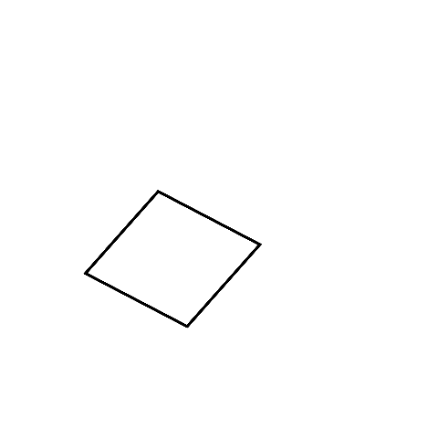
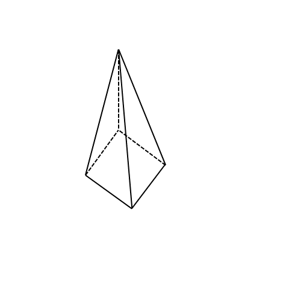
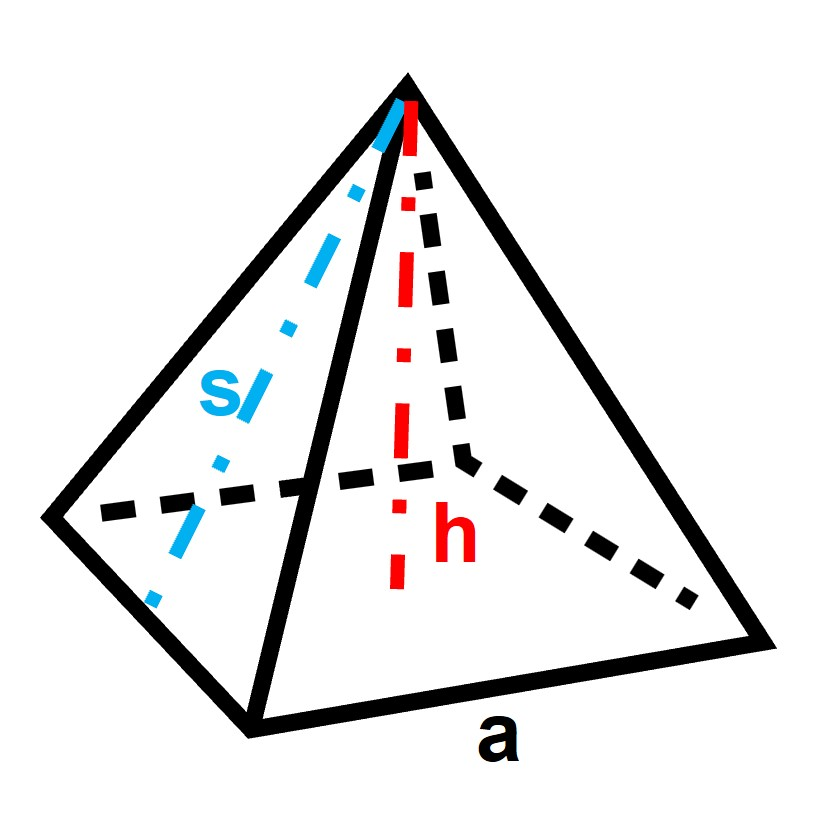
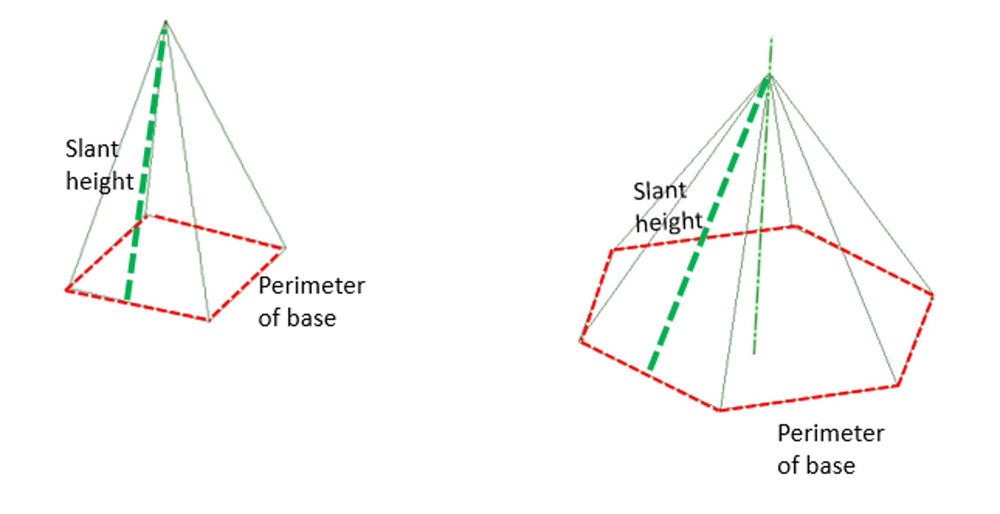
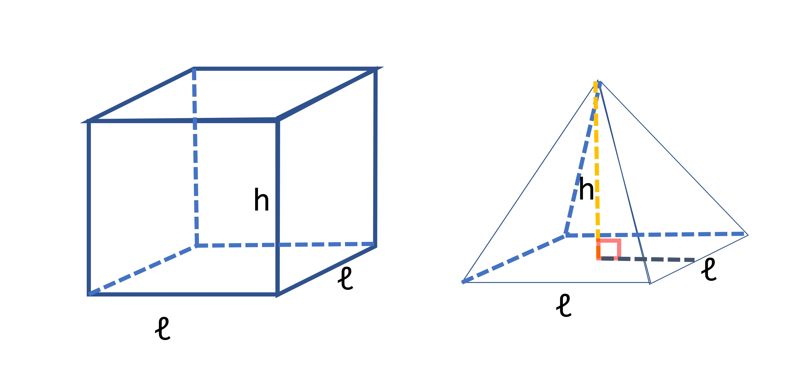

## Pyramids

Let's talk about pyramids (and not the ones in Egypt). 

The given shape shows us that it has a square base and 4 triangular faces (although we can only see two in the image) that meet at a point, which is called the apex. There are 8 edges and 5 corners in this pyramid (you should know by now what edges and corners mean). When you look at the image,  while moving from the bottom (or base) to the top, it looks like the square base gets smaller and smaller until it reaches the point at the top (the apex). This is what differentiates a pyramid from a prism. In case of a prism, the base was consistent throughout the height of the prism. 
There are other types of pyramids too, like ones with a hexagonal base. These have 6 triangular faces that connect the hexagon base to the apex. Hexagonal pyramids have 6 triangles, while hexagonal prisms have 6 rectangles.

Note: Have you noticed the dotted lines on pictures of 3D shapes? Those lines show us the faces that we can't see because they're hidden from view.

## Surface Area of Pyramids

Similar to prisms, to find the surface area of a pyramid, we need to add up the areas of all the faces. Unlike a prism though, pyramids have triangular faces and only one base. 

We learned that the more sides a prism has on its base, the more faces it will have. It applies to pyramids as well, except that instead of rectangular faces, triangular faces are added. For example, a pyramid with a base of 6 sides will have 6 triangular faces. If the base has 7 sides, there will be 7 triangular faces.

If we take a square pyramid (as shown in the image below) with equal side a for the square base, the side of the square is also the base of each of the triangles on each of its sides. The height of each triangle is also the height of the pyramid (h). Or is it? When you look at a pyramid, the triangles are slightly tilted so the tops of all triangles can meet at the apex. So the height of the triangles and the height of the pyramid is not the same. Instead, we have a new height of each triangle, called the slanted height (s) (named correctly so, right?). The height of the pyramid is the distance from the center of the base to the pointy top. But did you know that the actual height of a pyramid is usually less than the slant height? 

If the tip (or apex) of the pyramid is right above the center of the base, then it's called a right pyramid. If a right pyramid has a base where all sides are equal, then each triangle in the pyramid will have the same base and height. This applies to the pyramid shown in the image as well. 

So, the total surface area = ½ x a x s + ½ x a x s + ½ x a x s + ½ x a x s + a x a = 
= ½ x s x (a + a + a + a) + a²
= ½ x slant height x perimeter of base + area of base
 
This formula applies to any kind of pyramid with any base. 
Like for prisms, the lateral surface area of the pyramid is given by ½ x s x (a + a + a + a) or ½ x slant height x perimeter of base. Basically, the surface area of all the shapes except the base. So, to find the total surface area of the pyramid, we add the lateral surface area to the area of the one base.

Let's look at an example. If we have a square pyramid with a base side of 5 cm and a slanted height of 8 cm, we can use the formula to find the surface area. The perimeter of the base is 4 x 5 = 20 cm. The area of the base is 5 x 5 = 25 cm². So, the surface area is ½ x 8 x 20 + 25 = 85 cm².

## Volume of pyramids

There are different ways to find the volume of a pyramid. One way is to compare it to a prism with the same base. Usually, the volume of the pyramid is one-third of the volume of the prism. This is because three pyramids with the same volume can fit inside the prism. 

Let's look at an example. Imagine we have a pyramid and a prism with the same size and shape of base, which is a square with a length of 'l'. Both the pyramid and the prism have a height of 'h'. 

The volume of prism = area of base x height = length x length x height

Then the volume of the pyramid is ⅓ of that of the prism of the same base and height. 

The volume of the pyramid = ⅓ x length x length x height

