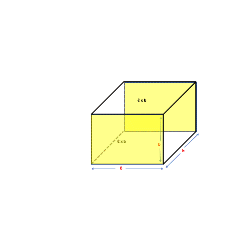
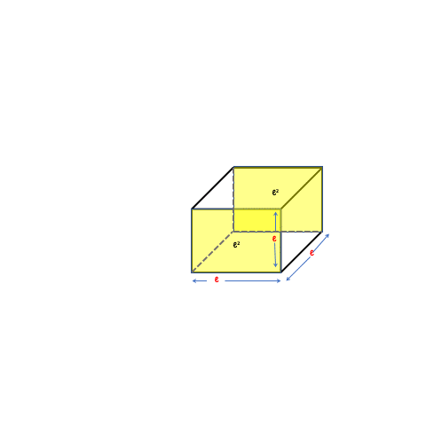
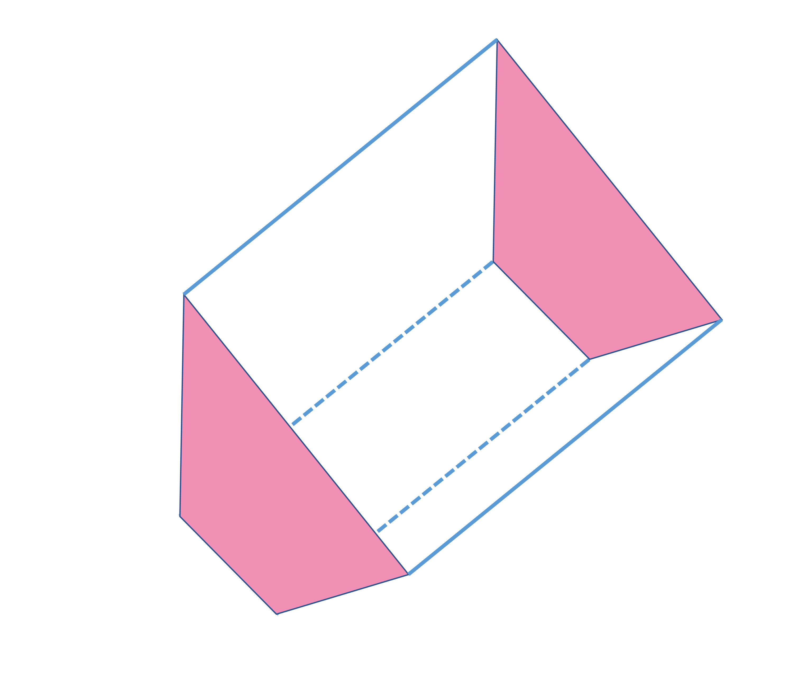
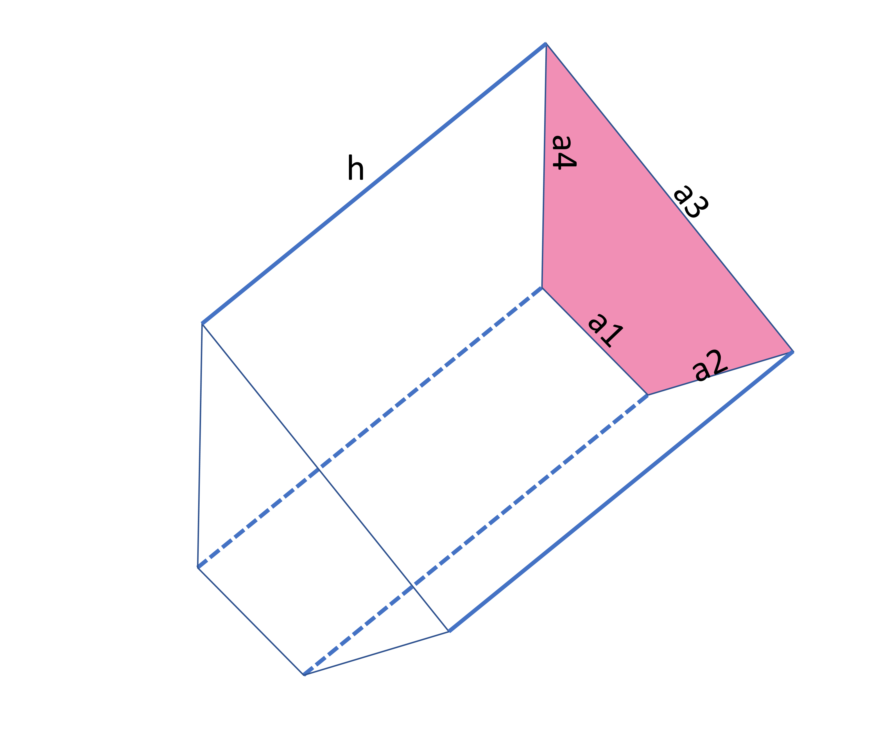
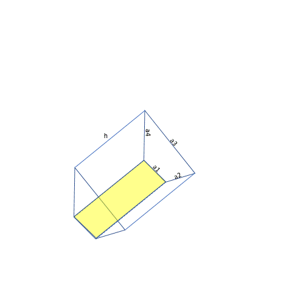
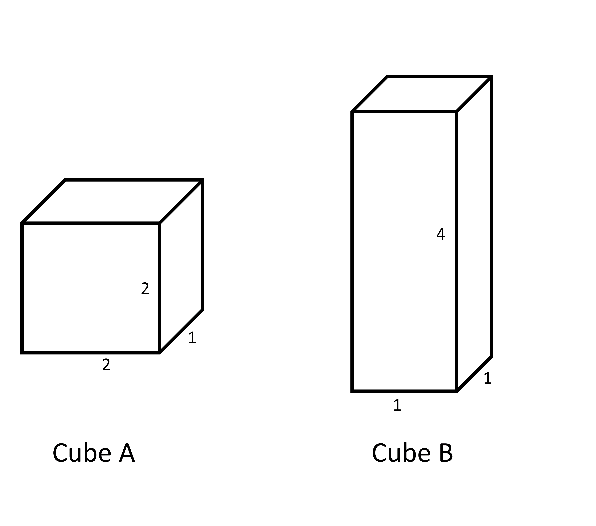
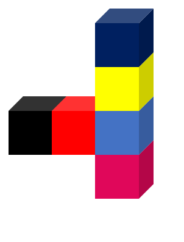
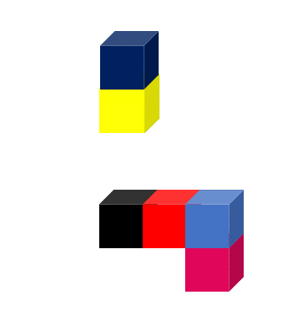
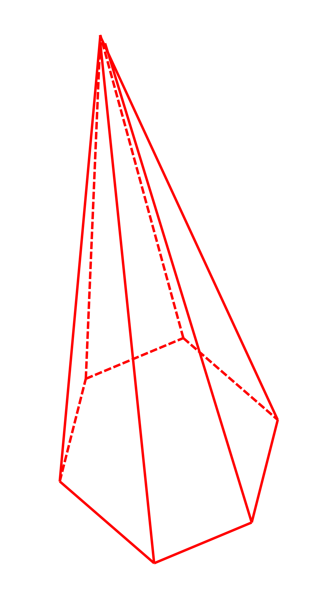

## Surface area of cuboids
We can calculate the surface area of a cuboid by analyzing the faces individually.  

2.21

There are two faces in each direction parallel to each other that cover equal areas. Two of the six rectangles have dimensions ℓ and b that are in yellow color and situated on the front and rear faces. The other two rectangles have dimensions ℓ and h that are in blue color and situated on the top and bottom faces. The remaining two rectangles are colored pink and are located at the right and left faces of the box. 
The faces that share the common dimensions are equal in the area thus,

2.22

Total surface area 
= ℓ x b + b x h + ℓ x h + ℓ x b + b x h + ℓ x h
= 2 (ℓ x b + b x h + ℓ x h)
This formula is applicable for rectangular prisms or cuboids.
In a cube, ℓ, b, and h are equal, thus
Total surface area = 2 (ℓ x b + b x h + ℓ x h) = 6ℓ2 = 6b2 = 6h2

2.23

### Prism with other bases
Here are some prisms with different bases.

2.45
 
The prism above is made with a pentagon shape that is highlighted in light pink. The two pentagonal faces are parallel to each other. There are 5 rectangular faces that join the two pentagonal faces.

2.24

The prism above is made of a quadrilateral shape that is highlighted in pink. The two quadrilateral faces (shown in pink) are parallel to each other. There are 4 rectangular faces that join the two quadrilateral faces.

2.25
 
If we are to find the total surface area of the prism, we must add all of the 6 faces that are visible in the prism. 
Total surface area = area of the quadrilaterals + area of the rectangles
Since the area of the two quadrilateral both are the base areas of the prism
Total surface area = 2 x base area + area of four rectangles

2.26

Let’s suppose that the sides of the quadrilateral are a1, a2, a3 and a4.
The rectangles have their length equal to the height of the prism ‘h’ units and width equal to the sides of the base shown in the above image with yellow color. 
Area of rectangles = a1 x h + a2 x h + a3 x h + a4 x h 
= (a1 + a2 + a3 +a4) x h
The perimeter of the base is the sum of all sides, thus a1 + a2 + a3 + a4 is the perimeter of the quadrilateral at the base. 
Area of rectangles = perimeter of the base x height
Even if the number of sides increases in the base, the area of rectangles can be found by the same formula. 
Therefore the total surface area of all prism 
= perimeter of the base x height + 2 x base area
= p x h + 2A
The expression p x h is also called lateral surface area and it includes the area of all faces of the prism except the bases.  

### Objects with same volume may have different surface areas
Cuboids that measure the same in volume may have different surface areas. 

2.27

Cubes A and B look very different from each other but occupy the same volume.
Volume of cube A = 2 x 2 x 1 = 4 cubic units
Volume of cube B = 4 x 1 x 1 = 4 cubic units
Total surface area of cube A= 2 ( 2x2 + 2x1 + 2x1) = 16 square units
Total surface area of cube B= 2 ( 4x1 + 4x1 + 1x1) = 12 square units
That means cube B would take less paint than cube A to be colored.  
It applies in reverse as well, two objects that have the same surface area occupy different volumes.  
Lets try to calculate the surface area for one of the figures seen earlier, 

2.17

We have six different cubes but all of the cubes don't have all six of their faces visible. We have to analyze each cube separately. For example the dark blue cube on the top has its bottom part hidden since it is attached to the yellow cube. 
Visible faces of the dark blue cube = 6-1 = 5
The yellow cube has two of its faces (bottom and top) hidden that are attached to dark and light blue cubes.  
Visible faces of the yellow cube = 6-2 = 4
The light blue cube has two of its faces (bottom and top) hidden that are attached to yellow and maroon cubes.  
Visible faces of the light blue cube = 6-2 = 4
The red cube has two of its faces (left and right) hidden that are attached to light blue and black cubes.  
Visible faces of the red cube = 6-2 = 4
The black cube has its right part hidden since it is attached to the red cube. 
Visible faces of the black cube = 6-1 = 5
The maroon cube has its top part hidden since it is attached to the light blue cube. 
Visible faces of the maroon cube = 6-1 = 5
Total number of faces visible in the given figure is 
= (5 + 4 + 4 + 4 + 5 + 5)
= 27 
Therefore, the total surface area of the given figure is 27 square units counting the square on each face as one square unit.
Suppose the object above is divided into two parts. 

2.28
 
In this case, the surface area of the cubes will increase because the faces that were hidden because two cubes were attached to each other whereas the total volume doesn't change because the total number of cubes doesn't change. 

## Pyramids
Let’s move to the pyramid shape mentioned earlier. 

2.29

 
This is a square-based pyramid in which there are 4 triangular faces (2 faces are at the rear side) that join the sides of the square base to a point also called the Apex. When observing from the bottom to the top, it may seem like the square gradually decreased its size to shrink itself to a point. There are 8 edges and 5 corners in this pyramid. 
Pyramids can also have base of other shapes. A hexagonal base pyramid has six triangular faces that join the base hexagon with the Apex. A hexagonal pyramid has 6 triangles whereas a hexagonal prism has 6 rectangles. 

2.30

You may have noticed the use of dotted lines in the different objects analyzed till now. That is to give an idea of the hidden faces that we can't see from the front. 

