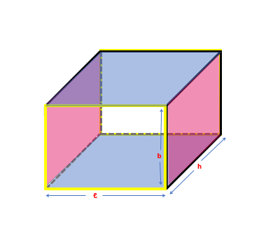
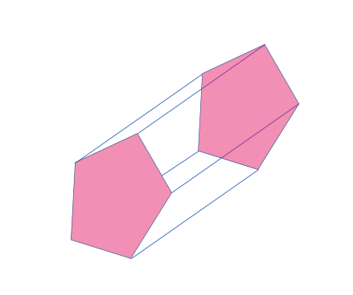
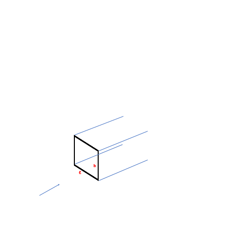
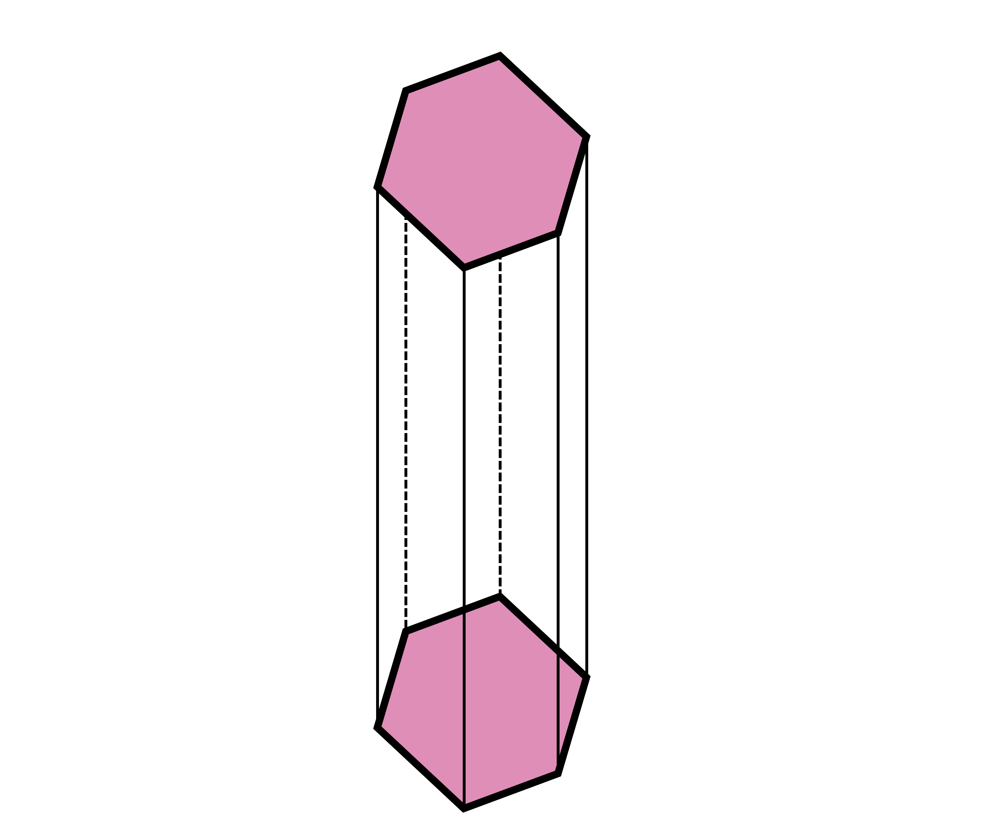

## Surface area of prism with rectangular bases

To find the surface area of a cuboid (a 3D shape with six rectangular faces), we look at each face separately. Just like how we find the area of a flat shape, we add up the areas of all the faces to get the surface area of the cuboid.

Each direction of the cuboid has two faces that are the same size. There are six rectangles in total, with two on the front and back faces (colored yellow), two on the top and bottom faces (colored blue), and two on the sides (colored pink). The faces that have the same dimensions are the same size.

To find the total surface area of the cuboid, we add up the areas of all six rectangles. 
Total surface area = ℓ x b + b x h + ℓ x h + ℓ x b + b x h + ℓ x h = 2 (ℓ x b + b x h + ℓ x h)
We use this formula for rectangular prisms or cuboids. If the cuboid is a cube (where all sides are the same length), we can simplify the formula to 6ℓ2 or 6b2 or 6h2 (simply replace two of the sides with the third). 

### Surface area of prisms with other bases

Here are some cool prisms with a different shape for their base.

This prism has a pentagon base that's highlighted in light pink. There are 5 rectangular faces that connect the two pentagonal faces.

This prism has a quadrilateral base that's highlighted in pink. There are 4 rectangular faces that connect the two quadrilateral faces.

To find the total surface area of the given prism, we add up the area of all 6 faces (basically all faces present in any prism). We can use this formula: Total surface area = 2 x base area + area of four rectangles.

Let’s say the sides of the quadrilateral are a1, a2, a3, and a4. The rectangles have the same height as the prism (h units) and their width is equal to the sides of the base shown in the above image with yellow color. 
We can find the total area of the rectangles by multiplying the length and height of each rectangle and adding them together. 
The area of the rectangles =  a1 x h + a2 x h + a3 x h + a4 x h = (a1 + a2 + a3 +a4) x h 

The perimeter of the base is the sum of all sides, thus a1 + a2 + a3 + a4 is the perimeter of the quadrilateral (the base). 
Area of rectangles = perimeter of the base x height 
Even if the shape has more than four sides, we can still use the same formula to find the area of the rectangles. To find the total surface area of the shape, we need to add the area of the rectangles to the area of the bases. 
The formula for total surface area = perimeter of the base x height + 2 x base area
=  p x h + 2A. 

The expression p x h is called the lateral surface area. This includes the area of all the faces of the shape except for the bases (essentially the rectangles). So, to find the total surface area of the shape, we add the lateral surface area to twice the area of the bases.

## Volume of prism with rectangular base 

Imagine a rectangle with length ℓ and width b. If we copy that rectangle in the direction of the arrow and stack them up, we get a box with height h. These types of 3D objects make themselves seem like a collection of the same shape and same size polygons. We call objects like this "prisms." 

We use term “cross section” to define a shape (in this case, the rectangle of dimensions l and b) that can be obtained by cutting a 3D object. If we cut the box perpendicularly to the direction of the extension (or parallel to the rectangualr shape), then we get that rectangle of dimensions ℓ and b. It doesn't matter where we cut as long as we are perpendicular we get the same rectangle. Cross sectional area is the area of that face. The cross-sectional area in any prism remains the same throughout and does not change.

If ℓ x b was the area covered by one rectangular face, there are multiple rectangles that make up the 3D shape (‘h’ rectangles in fact). Thus, the ℓ x b area has to be added h times to find space occupied by the whole shape. This new quantity gives the space occupied by a 3D object, which we know is called volume. We have,  ℓ x b + ℓ x b + ℓ x b + ℓ x b +……… upto ‘h’ units, which gives us  (ℓ x b) times h or simply ℓ x b x h. 

Thus, the formula for finding the volume of this box is length times width times height (ℓ x b x h). 

Let's say we have a box with ℓ = ⅓ cm, b = ⅓ cm, and h = 1 cm. We can use the formula ℓ x b x h to find the volume, which is 1/9 cubic cm.

We can also measure volume in terms of the number of cubes of unit length that can fit inside an object, or the number of objects that can fit inside a cube of unit length.

Before getting more into this, let’s take a side track and talk a little about units first. If a cube has equal length, width, and height (ℓ, b, and h), then we can find the volume by multiplying ℓ three times (ℓ x ℓ x ℓ = ℓ3). Since each of the sides is measured in ‘units’, the unit of volume is cubic units. This means that if we measure length in centimeters, then volume is measured in cubic centimeters (cm3). If we measure length in feet, then volume is measured in cubic feet (ft3), and so on.

Now, back to before. We can fit 6 small cubes with 1 cm sides inside a bigger cube with a volume of 6 cm3. Two objects shown below are  made of small cubes and have the same total volume, so we can count the number of small cubes to find their volume instead of using a formula. Here, both objects have 6 small cubes inside.

We know that a prism can have shapes other than rectangles. A hexagonal prism has two hexagonal bases and six rectangles connecting them. Both hexagons are the bases of the prism. 

A decagonal prism has 10 rectangles and 2 decagons as its faces. Both decagons are the bases of the prism. From before and from this prism as well, we see that the number of rectangles in a prism is equal to the number of sides in its base polygon. 

We see that in prisms, the base is perpendicular to the height. Like with a rectangular prism (or cuboid), we can use a formula to find the volume of different prisms by multiplying the area of the base (l x b in case of rectangular prism) by the height (h). The base can be any shape, and we find its area to be used in the formula. For example, a pentagonal prism with a base area of 30 square units and a height of 7 units has a volume of 210 cubic units. 
