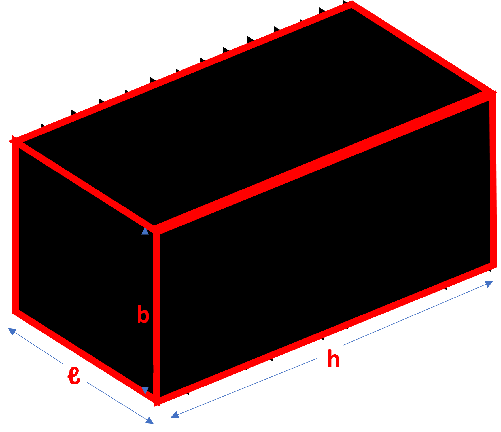

## What is a volume? 

Area is the space that a 2D object takes up, and for 3D objects, we have something similar called volume. Volume is how much space a 3D object takes up in three different directions. 

Imagine a rectangle with length ℓ and width b. If we copy that rectangle in the direction of the arrow and stack them up, we get a box with height h. These types of 3D objects make themselves seem like a collection of the same shape and same size polygons. We call objects like this "prisms." 

If ℓ x b was the area covered by one rectangular face, there are multiple rectangles up (‘h’ rectangles in fact), thus the ℓ x b has to be added h times to find space occupied by the whole shape. This new quantity gives the space occupied by a 3D object and it is called volume. We have,  ℓ x b + ℓ x b + ℓ x b + ℓ x b +……… upto ‘h’ units, which gives us  (ℓ x b) times h or simply ℓ x b x h. 

Thus, the formula for finding the volume of this box is length times width times height (ℓ x b x h). 

Let's say we have a box with ℓ = ⅓ cm, b = ⅓ cm, and h = 1 cm. We can use the formula ℓ x b x h to find the volume, which is 1/9 cubic cm.

We can also measure volume in terms of the number of cubes of unit length that can fit inside an object, or the number of objects that can fit inside a cube of unit length.

Before getting more into this, let’s take a side track and talk a little about units first. If a cube has equal length, width, and height (ℓ, b, and h), then we can find the volume by multiplying ℓ three times (ℓ x ℓ x ℓ = ℓ^3). Since each of the sides is measured in ‘units’, the unit of volume is cubic units. This means that if we measure length in centimeters, then volume is measured in cubic centimeters (cm^3). If we measure length in feet, then volume is measured in cubic feet (ft^3), and so on.

Now, back to before. We can fit 6 small cubes with 1 cm sides inside a bigger cube with a volume of 6 cm^3. Two objects shown below are  made of small cubes and have the same total volume, so we can count the number of small cubes to find their volume instead of using a formula. Here, both objects have 6 small cubes inside.

A prism can have shapes other than rectangles. A hexagonal prism has two hexagonal bases and six rectangles connecting them. Both hexagons are the bases of the prism. 

A decagonal prism has 10 rectangles and 2 decagons as its faces. Both decagons are the bases of the prism. From before and from this prism as well, we see that the number of rectangles in a prism is equal to the number of sides in its base polygon. 

We see that in prisms, the base is perpendicular to the height. Like with a rectangular prism (or cuboid), we can use a formula to find the volume of different prisms by multiplying the area of the base by the height. The base can be any shape, and we find its area to use in the formula. For example, a pentagonal prism with a base area of 30 square units and a height of 7 units has a volume of 210 cubic units. 
