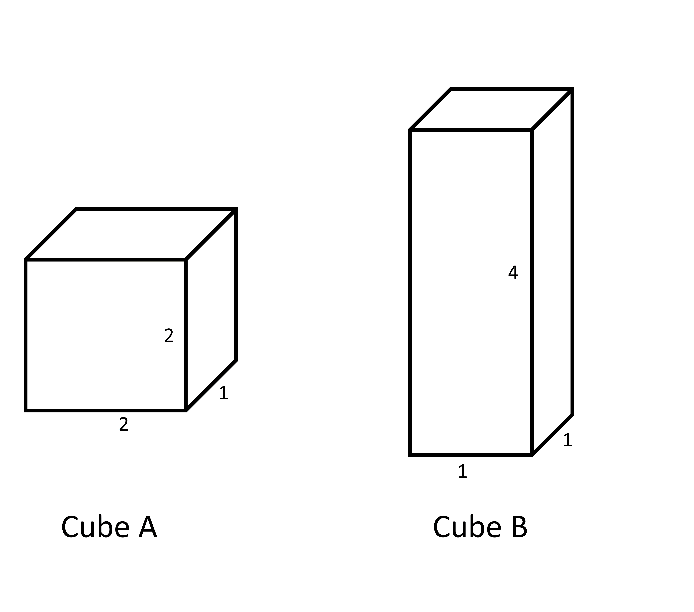
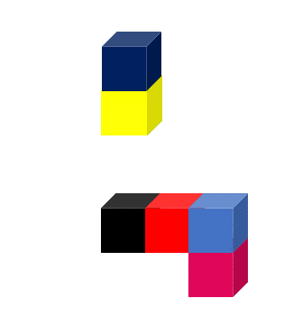
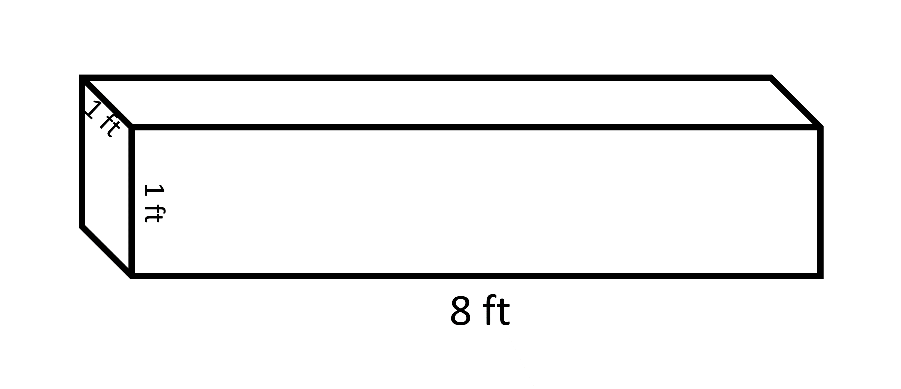

## Objects with same volume may have different surface areas

Cuboids that have the same volume can look different and have different surface areas. 

For example, Cube A and Cube B have the same volume but Cube A has a larger surface area than Cube B. 
Volume of cube A = 2 x 2 x 1 = 4 cubic units 

Volume of cube B = 4 x 1 x 1 = 4 cubic units 

Total surface area of cube A= 2 (2x2 + 2x1 + 2x1) = 16 square units  

Total surface area of cube B= 2 (4x1 + 4x1 + 1x1) = 12 square units

This means that it would take more paint to color Cube A than Cube B.  

This applies in reverse as well, two objects that have the same surface area can occupy different volumes.

To calculate the surface area of a given figure, we need to count the number of visible faces. In this figure with six cubes, not all of the faces are visible. We need to count the visible faces of each cube separately. Note that each square has a side of 1 square unit. 

Here, the dark blue cube has five visible faces because one face is hidden by the yellow cube. 
Visible faces of the dark blue cube = 6-1 = 5 

The yellow cube has two of its faces (bottom and top) hidden that are attached to the dark and light blue cubes.

Visible faces of the yellow cube = 6-2 = 4 

The light blue cube has two of its faces (bottom and top) hidden that are attached to the yellow and maroon cubes.

Visible faces of the light blue cube = 6-2 = 4 

The red cube has two of its faces (left and right) hidden that are attached to the light blue and black cubes.

Visible faces of the red cube = 6-2 = 4 

The black cube has its right part hidden since it is attached to the red cube. 

Visible faces of the black cube = 6-1 = 5

The maroon cube has its top part hidden since it is attached to the light blue cube. Visible faces of the maroon cube = 6-1 = 5 

By counting all of the visible faces as one square unit, we can find the total surface area of the figure.

Total number of faces visible in the given figure is = (5 + 4 + 4 + 4 + 5 + 5) = 27 square units

If we divide the object into two parts, the surface area of the cubes will increase because more faces will become visible. 

However, the total volume of the object will stay the same because we are not adding or removing any cubes.

## Why do we study area and volume for 3D objects?

Measuring characteristics of a 3D object is important for many things. We use it to find out how much stuff can fit inside, like water in a container or boxes in a truck. We also use it to find out how much area we need to cover the object, like when we tile a wall or carpet a floor. It is also important to know when to use which characteristics (surface area or volume). 
Think about wrapping a gift. If you have a box for the gift, you want to know how big the gift can be. The biggest gift that can fit inside the box is the volume of the box. But how much wrapping paper do you need to cover the box and the gift? That's the surface area of the box. And remember, you might need more paper than that if you fold it while wrapping.
Other examples are:
Say you have a wooden beam that's 8 feet long, 1 foot wide, and 1 foot tall. 

You want to fill it with concrete. How much concrete can you put in? To find out, you need to know the volume of the beam. And if you want to paint the beam, you need to know how much paint to buy. If 10 L of paint can cover 17 square feet, how much paint do you need to cover the whole beam? 
The concrete is filled inside the frame and that space can be defined in terms of volume. The volume of the cuboid is given by multiplying length, breadth, and height. 

Volume = length x breadth x height = 8 x 1 x 1 cubic feet = 8 cubic feet

All of the surfaces of the beam have to be painted and that is given by total surface area.

Total surface area = 2 (length x breadth +breadth x height + length x height) = 2 (8 x 1 + 1 x 1 + 8 x 1) = 2 x 17 = 34 square feet

If 17 square feet is painted by 10 L of paint then 34 (or 2 x 17) square feet is painted by 2 x 10 = 20 L