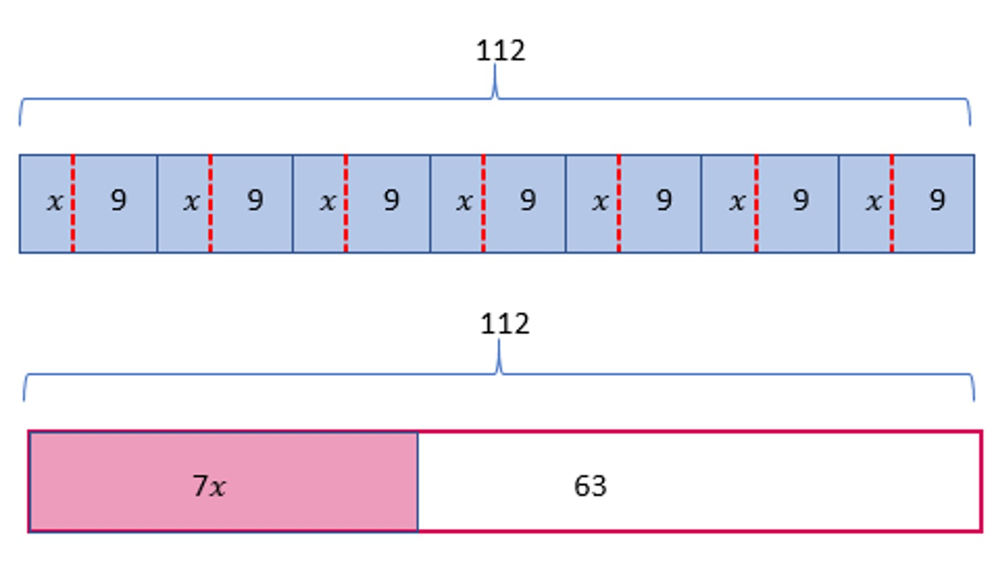
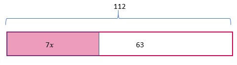
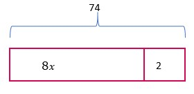
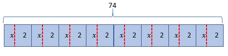
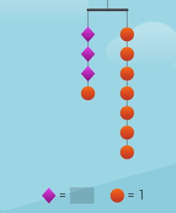
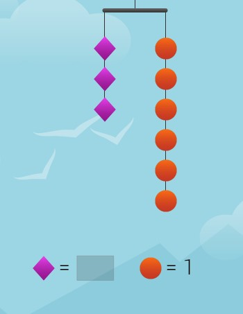
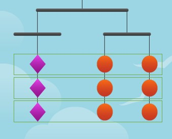
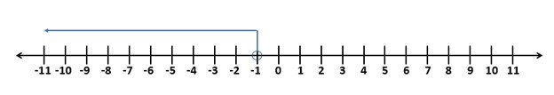
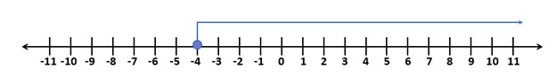

### Application of law of equalities in equation
We learned to solve two types of equations previously. 
when we have the equation of type 2𝑥 = 8, we use the multiplicative law of equality to isolate the variable. We divide both sides by 2.

2𝑥/2 = 8/2

or, 𝑥 = 4

when we have the equation of type 𝑥 + 2 = 8, we use the additive law of equality to isolate the variable. We deduct 2 from both sides. 

𝑥 + 2 - 2 = 8 -2

or, 𝑥 = 6

What happens if both types of operations are on the variable side?

Whenever the expression in the equation is of p𝑥+q or p(𝑥+q) form, then both the multiplicative and additive laws of equality have to be used. Both the forms can be transformed into each other and thus the laws can be used in any order. 

If we want to use the multiplicative law first, then we must transform the expression into the form of p(𝑥+q) and if we want to use additive law first then we must transform the expression into p𝑥+q form. The process of transformation is done based on distributive law.
For example, we have equation 7 (𝑥 + 9) = 112 which is equivalent to 7𝑥 + 63 = 112 using the distributive law. In the distributive law, we have already mentioned that 7 multiplied by 𝑥 + 9 is 7 multiplied by both 𝑥 and 9 and vice versa.  

2.9 

Both laws have to be used in these kinds of expressions and using them in any order will give us the same answer. However, sometimes one law may be suitable more than the other. 
If we start with the equation of the first figure, we have to use the multiplicative law first.

7 (𝑥 +9) = 112

or, 7 (𝑥 +9)/7 = 112/7

or, 𝑥 +9 = 16

After that, the additive law of equality is used.

or, 𝑥 +9-9 = 16-9

If we started with the second figure, the additive law has to be used for the equation of the second figure

2.10

7𝑥 +63 = 112

or, 7𝑥 +63 - 63= 112 -63

or, 7𝑥 = 49

And then the multiplicative law has to be used
or, 7𝑥/7 = 49/7

or, 𝑥=7 

### Law of equality in tape diagrams
Let's try to solve one more problem with a given context. If a pizza delivery company charges 8 dollars per pizza and 2 dollars fixed charge for delivering any number of pizzas, then the total bill will be equal to 2 more than 8 times the number of pizzas. 
For example the total cost of ordering 1 pizza is 8 x 1 +2
the total cost of ordering 2 pizzas is 8 x 2 +2
the total cost of ordering 3 pizzas is 8 x 3 +2
The general expression for this context can be written as 8𝑥+2 where 𝑥 is the number of pizzas. If the bill for a certain order on Tuesday is worth 74 dollars then how many pizzas must have been ordered?

2.11

The solution to this question is pretty simple. It is asking us what number multiplied by 8 and increased by 2 becomes 74. 
Or, 8𝑥+2= 74

2.12

There is a fixed algorithm for solving these types of problems. Firstly, the part added in the expression is eliminated using the additive law of equality.

Or, 8𝑥+2-2=74-2

Or, 8𝑥=72

Then, the multiplicative law of equality is used to divide both sides of the equation using a factor so that only the variable remains on one side.
Here, that factor is 8.

Or, 8𝑥/8=72/8

Or, 𝑥=9 

However, if the problem said that on a certain festival, the delivery charge is discounted and there are two pizzas free while buying 8 pizzas, then the expression giving the total price will be 8(𝑥+2). For the total cost given as $74, the tape diagram becomes:

2.13

Again, there are two ways to solve this equation. 
One way is to use the distributive property and transform it into an earlier type (p𝑥 + q) in which the additive property of equality is used first followed by the multiplicative property of equality. 
Another way is to keep the equation as it is and use the multiplicative law of equality first.

[8(𝑥+2)]/8=72/8

Or, (𝑥+2)=9

Then, using the additive property of equality;

𝑥+2-2=9-2

Or, 𝑥=7

### Hanger diagrams
Hanger diagrams can be used as a medium to solve any linear equation.

2.14

The hanger diagram given above represents the equation 3𝑥+1=7. 
Look at the index at the bottom of the diagram. The purple diamond's value at the bottom of the image isn't shown so it is an unknown quantity. The orange circle's value is 1. There are three diamonds on the left-hand side that amount to 3 times 𝑥 (because it is unknown). Also on the left-hand side, there is one circle that is added as 1 to 3𝑥. On the right-hand side, there are 7 circles each having the value of 1. So, 7 circles equal 7. 

𝑥 + 𝑥 + 𝑥 + 1 = 1 + 1 + 1 + 1 + 1 + 1 +1

3𝑥 + 1 = 7

How can this diagram be useful in solving the given equation?
We carry out the symbolic transformation visually here. First, the unknown entity is isolated on one side and the remaining on the other side. 
Here, one circle is present on the left-hand side which is less than seven circles on the right-hand side. One circle is removed from both sides to get three diamonds on the left-hand side and six circles on the right-hand side. 

2.15

Then the unknown and known quantities separated on the two sides are grouped in a way as given below. 

2.16

That shows that a diamond is equal to the quantity of two circles. Since a circle is 1 unit, the diamond has to be of 2 units. 
Equations can be represented in the form of hanger diagrams that are similar to that of the beam balance. It has two arms extending from the suspension point and generally gives the idea of which side is heavier among the two. The two sides are basically the quantity that is located on either side of the equal to sign. If the top bar (with two arms) is completely horizontal, then the two quantities are known to be equal. If the bar isn't horizontal, then one of the sides is heavier, or quantities on one of the sides are more than the other. 
Inequalities with negative coefficients
We have already known about inequalities and that they are formed when the equal sign in an equation is replaced by signs like greater than, less than sign, etc. 
Take an example of the equation
2𝑥 + 3 = 5

We looked for that one value of 𝑥 that truly satisfies both sides of the equation. There is only one value of 𝑥 that satisfies the given condition. But if this equation was converted into inequality such as

2𝑥 + 3 > 5

Then there are several values for 𝑥 that will make the inequality statement true. 
Take for example when 𝑥=2, 

2𝑥 + 3 = 2 x 2 +3 = 7> 5 (True)

when 𝑥=3, 2𝑥 + 3 = 2 x 3 +3 = 9> 5 (True)

All the values that satisfy the inequality can be found by solving it. 
The processes of solving inequality and equation aren't very different from each other. The laws of equality are both applicable. There is a slight difference when using the multiplicative law of equality. The difference is only when using the multiplicative law of equality with a negative number. 

To understand that, let's take a numerical inequality.
5>3
If both sides are multiplied by -1,
-5 is less than -3 instead of -5 is more than -3. 
Therefore, -5<-3.

For example, we have an inequality that states that a number deducted from 7 is less than 8. If the assumed number is “a”, then 7-a<8.

How do we solve this inequality?

To use the additive law of equality, deducting 7 from both sides, we get,

7-a-7<8-7

-a<1

To use the multiplicative law of equality, multiplying both sides by -1, this is what we get generally,
a<-1

Now, let's check the solution found. If we put any number that is less than -1 in the given inequality such as a= -2 then,
7-(-2)=9 which is greater than 8. But we have the inequality as; 7 - a < 8.

This shows that the solution is not true. The actual solution is the opposite of what we have assumed.

To avoid confusion, the inequalities are solved as an equation by replacing the inequality sign with an equal sign and then later checking the solution with testing points.

That means firstly 7 - a < 8 is converted into 7 - a = 8 
Which gives us a = -1

This value is known as the boundary point because its solution is either less than -1 or greater than -1. 

To find which side of -1 the solution lies, we take testing points other than a= -1 so that we can test on the given inequality. 
If we take a= -2 which is less than -1 as the testing point 
7- (-2) 

= 7+2

=9< 8 (true) 

Thus the solution to the inequality is all numbers that are less than -1. 
a < -1

2.17

We can choose whatever number we like for the testing point. if the testing point had been chosen more than -1 such as 0, then the result would have been false. If the testing point greater than -1 proves the inequality to be false, then it means the solution is less than -1. 
There are cases in number lines where the circle shown above is darkened instead of the open circle as seen in the previous solution. One example is:

2.18

In such cases, the solution is x≥-4 instead of x>-4. The difference is that the solution includes -4 as well along with all values greater than -4 while in x>-4 there are all values greater than -4 but not -4.  
The process of testing with a test number becomes very important in inequalities that contain negative coefficients of the variables. 