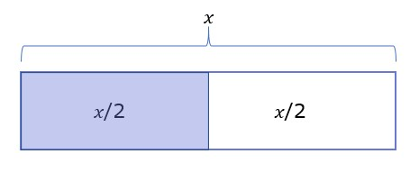
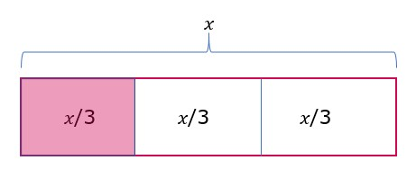
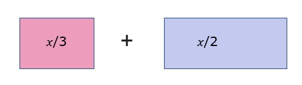
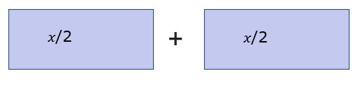
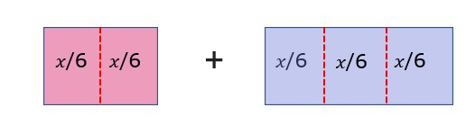
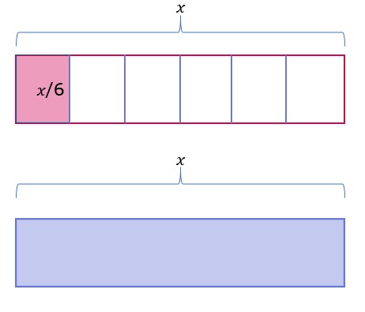
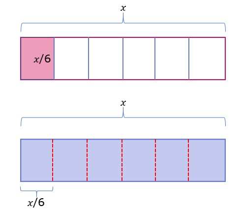

### Symbolic transformation with rational coefficients
We use symbolic transformation as the method by which we simplify a given expression. Coefficients of the algebraic terms are very important in symbolic transformations. When the coefficients are integers, the transformation process was very simple. 

Consider an expression; 6𝑥 - 4𝑥
Using distributive law, it was equivalent to 

= 𝑥(6-4)

= 2𝑥

If the coefficients are rational, then the process is similar to the one above. If the rational coefficients are given in terms of fractions then we have to make the denominators of the fraction the same by multiplying. Based on the distributive law, we perform operations like addition and subtraction and in this case its not possible because in one of the parts 𝑥 is divided by 1/2 and in the other part it is divided by 1/3. For example, we have the expression,

𝑥/2 + 𝑥/3

We can interpret 𝑥/2 as 1/2 of 𝑥 which is the half part of 𝑥

2.1

Similarly, We can interpret 𝑥/3 as 1/3 of 𝑥 which is one- third part of 𝑥

2.2

Taking the two parts we get,

2.3

How can we add them? 
It may seem straightforward but we do not know how much 𝑥 is to be certain thus we have no idea of the actual value of the two blocks. 
It would be much more helpful if the blocks were of the same size. For example, if it was 𝑥/2 + 𝑥/2

2.4

That is half of 𝑥 plus half of 𝑥 means two halves make one full. 

= 𝑥/2 + 𝑥/2

= 2(𝑥/2)

= 𝑥

Now let's get back to 𝑥/3 + 𝑥/2

2.3

We have to divide 𝑥 into equal parts to add them. 

What is the common multiple of 2 and 3 which we can get? There are many answers such as 6, 12, 18, etc. But the lowest one is 6. (Remember lowest common multiple?)

So we have to divide 𝑥 into 6 parts. For doing that, we have to divide each one-third into half because to make 1/3 into 1/6 we have to divide by 2. Similarly, we have to divide each half into three parts because to transform 1/2 into 1/6 we have to divide by 3.

2.5  

What we see from the figure is that we have to add two 𝑥/6's and three 𝑥/6's. The answer to that is 

2.6

2 x 𝑥/6 + 3 x 𝑥/6

=5𝑥/6

We show that whole process numerically by

(𝑥 x 3)/(2 x 3) + (𝑥 x 2)/(3 x 2)

=3𝑥/6 + 2𝑥/6 

=5𝑥/6

It can also be said that when 𝑥/2 and 𝑥/3 are added it becomes the same as 5/6 times 𝑥.  

When one of the operating coefficients is in the form of a fraction and the other is an integer, we divide that interger coefficients into number of parts equal to the denominator of the fractional coefficient. 

For example 
𝑥 +  𝑥/6 means we need to add a full part of 𝑥 and one-sixth of 𝑥

2.7

To add the two we need to divide 𝑥 term into 6 parts.

2.8

We see that we have six 𝑥/6's and one 𝑥/6's. The answer to that is seven 𝑥/6's or 7𝑥/6

Often, the convention about the order of operations like PEMDAS helps to clarify the expression. Using parentheses to make your expression clear for your teacher and your friends is always a good idea. Parenthesis can also be used to change the order of operations. 

For example; 3 x 2 + 4 is 10. However, if you wanted to do the sum first, you could write 3 x (2+4).

### Percentage in expressions
Percentages as we learned in previous classes are one way of expressing quantities that are not integers but rational numbers. writing 𝑥/4 in fraction means we divide 𝑥 into 4 parts and take one of them. In the case of percentage, we divide 𝑥 into 100 parts and take 25 of them. thus writing 25% of 𝑥. 25% of 𝑥 is same as 𝑥/4. 

For those of you who are wondering where did 25 come from, one-fourth of 100 or 100/4 is 25. 
We can convert any fraction into a percentage by simply multiplying it by 100. We did that in arithmetic and we do the same here even though there are variables involved. 

What is 20 percent of 𝑥/6?

Here 20 percent is given which means 20 out of 100 or 1 out of 5 parts. That means if we have to find 20 percent of 𝑥/6, then we have to divide each 𝑥/6 into 5 parts. Each part is worth 𝑥/30. 

𝑥/30 + 𝑥/30 + 𝑥/30 + 𝑥/30 + 𝑥/30 = 𝑥/6

That same quantity can be expressed in terms of decimals. It would be 20 percent of 0.17𝑥. That means one-fifth of 0.17𝑥. You divide 0.17𝑥 into 5 parts and each part is worth 0.0333𝑥.

We have expressions that have operators along with percentages in some algebraic expressions. 
Example:
Let's say there is an 8 percent discount on the price of a haircut that is 40 dollars normally, then 40 has to be decreased by 8 percent, 8 percent of 40 is calculated at first and then the quantity is deducted from 40. 
That is 40- 8% of 40

= 40- (8/100) x 40

=  40- 0.08 x 40

=  40 x (1-0.08)

=  40 x 0.92

This shows that when a number is decreased or increased by a certain percentage, it can be found by multiplying the given number with a particular factor. If a number has to increase by 5 percent, we multiply it by 1+0.05 or 1.05. On the other hand, if it has to be decreased by 5 percent, then  we multiply it by by 1-0.05 or 0.95. Here the number 0.05 is found by dividing the given percentage 5 by 100. (5/100 = 0.05) 

What happens when 70𝑥 is increased by 30%?

= 70𝑥 + 30% of 70𝑥

= 70𝑥 + (30/100) x 70𝑥

= 70𝑥 + 0.3 x 70𝑥

= 70𝑥 x (1 + 0.3)

= 70𝑥 x 1.3

= 91𝑥

This calculation could also have been carried out as follows:
= 70𝑥 + 30% of 70𝑥

= 70𝑥 + (30/100) x 70𝑥

= 70𝑥 + 0.3 x 70𝑥

= 70𝑥 + 21𝑥

= 91𝑥

There is no hard and fast rule. We can use the strategies as per our convenience.

