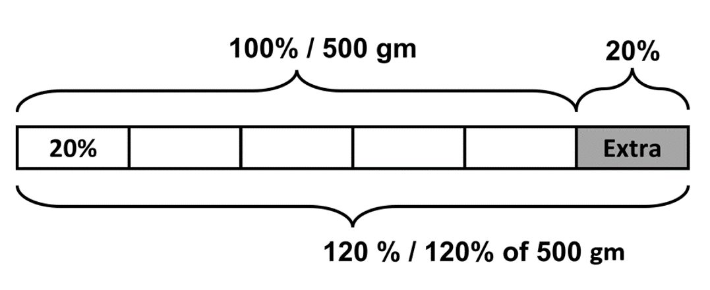
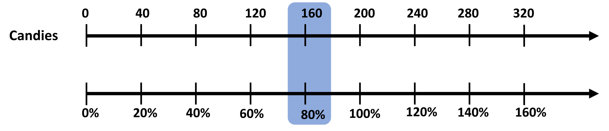

## Percentage increase or decrease of a value

To understand what a percent increase/decrease is, and how to find such values, let’s first start with fraction problems that we are already familiar with.

Say Dina runs 5 km in her morning run on Sunday. On Monday, she plans to run the same distance plus half of the said distance. How much does she run on Monday?

It’s pretty straightforward right? We add the distance from Sunday to half the distance of Sunday. This gives us 
5 + ½ x 5 
We can directly solve this, so use the distributive property (in case we do not know the original distance in other types of questions!). 
Since 5 is common in both cases, we take that to be common, giving us (1 + ½) x 5. We can write it as 1 (w)½ x 5 or convert it into decimals as well, giving us 1.5 x 5. This works because they are all equivalent expressions (go back to algebra if you’re confused about what equivalent expressions are).
Visualizing this gives us:

If we generalize, we can thus say that multiplying a number by ½ and adding it to the original is the same as simply multiplying the number by 1.5 OR 1(w)1/2!

This applies to other fractions as well. It also applies to situations where we need to subtract some amount. Let’s mix the two and look at another example. 

Say on Tuesday Dina wants to only run ¾ less than the distance than on Sunday. How much does she run?

We know that we simply need to subtract ¾ of Sunday’s distance from Sunday’s distance itself. 
5 - ¾ x 5
Using the distributive property, we have 
(1 - ¾) x 5
¼ x 5
0.25 x 5
 
So, we either subtract the reduced amount (¾ x 5) or simply multiply the original amount of 5 km by ¼ (or 0.25)!

Now that we are familiar with increase/decrease in value based on fractions, we will see how we can do the same using percentages. 

Say Andre takes 15 minutes to get to school. Lin takes ¾ more time than Andre to get to school. The time Lin takes is 15 + ¾ x 15 or 1(w) ¾ x 15 or 1.75 x 15 minutes. 

Here, 1.75 can be converted into a fraction if we multiply it by 100%. This gives us 175% of 15 minutes as Lin’s time. This also means that 100% of time, which is Andre’s time, is 15 minutes. So, Lin’s time is 75% more than Andre’s time (which is true since ¾ is equal to 75%!).
 
Note that this is not the same as saying Lin takes ¾ of the time that Andre takes. Here we simply find ¾ x 15 minus rather than add 15 and ¾ of 15 like before. 

We have thus seen a percent increase from 100%. Same would apply for a decrease case as well. The terms percent increase and percent decrease describe and increase or decrease in some quantity as a percentage of the original starting quantity. Here, it was 75% of the original. 

Let’s look at an example for this:

A cereal box has 500 gm of cereal in it. For a limited amount, the company advertised that they will be selling 20% more than the original amount of cereal. How much do you think that is?

Like we did with fractions, we can easily find the percentage of the original as well. We need to find 20% of 500, which is the extra amount. This is added to the original amount to find the final amount. 

500 + 20% of 500 
500 can also be written as 100% of 500, since it simply means 500. 

100% of 500 + 20% of 500
Using the distributive property here as well, we have
(100% + 20%) x 500
120% x 500 grams
120/100 x 500 = 600 grams

This is our answer. 
20% more than 500 grams is 120% of 500 grams, which is equal to 600 grams!
This is the same as if we found 500 + 0.2 x 500 (20% is simply 0.2). 
(1 + 0.2) x 500 = 1.2 x 500 = 600 gm!

## Double number line and equation

Having found the answer to a percent increase or decrease numerically (and with some help from visual tap diagrams), let’s see how we can use the double number line to find the answer as well. Do not worry! It is practically similar to the previous cases of using such double number lines. 

A packet of candies has 200 candies in it. For Christmas, the company decides to see 40% more candies than usual. How many candies will there be?

We can make two number lines from this information - the percent one and the number of candies one. 

Since the percent increase is from 200 candies, this acts as our 100%, so 200 candies aligns with 100% in the diagram. Now, we are asked to find how much is 40% more of the original. To find this, we can do the same thing we did earlier:

100% of 200 + 40% of 200 
We need to add 40% of candies to the original 100% of candies.
(100% + 40%) x 200 = 140% of 200 candies

In the diagram, we see that 280 candies coincides with 140% of candies. So, our answer is 280 candies. 
Numerically as well, we get 140/100 x 200 = 140 x 2 = 280 candies. 

The company later decides to decrease the amount of candies by 20% (to make a profit), how many candies are there now?
A 20% decrease in candies means that we decrease 20% of candies from 100% of candies that we have.

100% of 200 - 20% of 200 = 80% of 200

So, a 20% decrease is the same as 80% of the initial amount.
Using the same number line, we can find the answer as 160 candies! 

Using the double number line, we can also find out what our initial 100% value is, if we are given the new increased or decreased value. 

For example, suppose there are 20 students in grade six. This is an increase of 25% from last year’s grade six. This means that the initial number was last year's number which coincides with 100%. We have an unknown initial amount (100%) and the final amount, which corresponds to 125% (100% + 25% increase). 

We can use the double number line to find the amount that coincides with 100% to find our initial number of students. 

We see that 16 students coincides with 100%, meaning that initially there were 16 students and a 25% increase led to 20 students!

You could have also found this numerically:
100% of Initial students + 25% of initial students = 20
125% of initial students = 20
125/100 x Initial students = 20
Initial students = 20 x 100 / 125 = 16 initial students!

As we have already seen before, numerically solving percent increase and decrease problems is easy and straightforward. 

Let’s form a generalized equation that can help us solve any kind of percent increase/decrease problem. 

You have a certain value, say ‘a’. You need to find 25% of a, which you can write as ‘b’. How would you find ‘b’?

b is simply a added to 25% of a
b = a + 25% of a
b = 125% of a (a can be written as 100% of a)

b = a + 0.25 x a (25% is also 0.25)
b = (1 + 0.25) a
b = 1.25a

Say Dan saves some money in a savings account and gets an interest of 5%. His final amount came out to be 1250 dollars. What was his initial amount?

Using the equation, we have b = (1 + 0.05)a
1250 = 1.05 x a 
a = 1250/1.05 = 1190.5 dollars

Let’s try one more example, this time of a percent decrease.

A water tank has ‘p’ amount of water initially. After the morning use, the water decreased by 30%. How much water is now present in the tank?

We can let the water in the tank now as ‘q’. 
‘q’ is original minus the reduced about. 

q = p - 30% of p
q = 70% of p

q = p - 0.3p
q = 0.7p

If the water initially was 550 L, what is the amount of water now?

q = 0.7 x 550 = 385 L

You could have solved any of these using double number lines. But equations are more efficient and are more convenient when we have awkward percentages like 54% 29%, etc, and are difficult to show on the number line.
We will look at another type of awkward example in the next chapter. 
