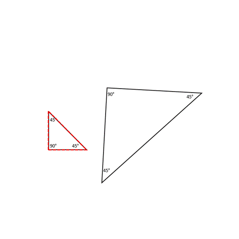

## Construction of Triangles

To make a triangle, we need certain information about its characteristics. How big is it? What shape is it? We find this out by looking at the length of the sides and the angle between them. A triangle has three sides and three angles, which are called its "dimensions." We need to know at least three of these dimensions to make a triangle. Let's look at them one at a time. 

1. Three Sides

Sometimes, even if we know the length of all three sides (or even if we have three measurements for length), we can't make a triangle. Why? We’ll see some examples below. But, we can check if a triangle can be constructed with three different given length measurements using a rule called the "triangle inequality."

### What is triangle inequality?

The triangle inequality is a rule that says if you want to make a triangle with 3 lengths, the sum of two sides must be bigger than the third side. If the sum of two sides is the same or smaller than the third side, you can’t make a triangle. For a triangle, look at the following triangle with sides a, b, and c.

a + b > c

b + c > a

a + c > b

If b is the longest side, then adding a to it will always be bigger than c because we are making b even bigger.

b+c will also be greater than a because b on itself is greater than a.

The above two are pretty obvious when we work with the longest side. But what about the two smallest sides?
One of the main things to check using the triangle inequality is whether adding the smaller sides will be greater than the remaining side or not. i.e. c+a > b. It;s true! Hence we can make a triangle with the given sides a, b, and c.

Let's say we have a triangle with sides that are 4, 5, and 10 units long. If we just draw the sides without worrying about making a closed shape, we might get some weird shapes. 

3.42

### Testing triangle inequality with the construction of circles

We can check if the three given sides (10, 5, and 4 units) could make a real triangle by drawing circles. Sounds weird, but trust me, it works. 

What we do is, we first draw a circle at each end of one of the sides, 10 cm for this case. Then we draw circles at the two ends with radii equal to the length of the other two sides.

Let's see if we can make a triangle with sides 5 and 4 and a line that's 10 units long. Nope, we can't! The radii of the two circles are the two remaining sides (5 and 4 units). The circles don't cross and so the triangle is not closed, meaning the triangle inequality rules don't work. 

But if we make one of the sides 6 instead of 4, we can make a triangle!

The circles cross and we can use sides 5, 6, and 10 to make a triangle. There are two places where the circles cross that match our measurements. When we add up the two smaller sides, 5 and 6, we get 11, which is bigger than 10. That means the triangle rules work! Both red dots correctly form the third point of the triangle.

Even though the triangles seem different, they are the same triangle, they are just oriented in different directions.

We tried making a triangle in two different ways and still got the same triangle! So when we make a triangle with the same three sides, the triangle constructed is always unique! Interesting, right? (This will be an important idea for us later)
Let's try an example to test the circle method to form triangles. We have three sides with lengths of 24, 8, and 32. Can this form a triangle?
First, we need to find the two smaller sides. Those are 24 and 8. Then we add them together: 24 + 8 = 32. Is the sum greater than the third side, which is 32? Nope, it is equal to the third side. That means the triangle inequality isn't verified and we can't make a triangle with those side measurements.

We see that the circles just meet at one point and that point lies on the 32 unit line. This means that there is no third point for the other two lines to meet, hence no triangle can be formed. 

2. Two sides and 1 angle

Have you ever wondered what would happen if (instead of three sides of a triangle) we had to make a triangle with only two sides and one angle? Let's say we have an angle of 60° and sides that are 7 units and 8 units long. 

We see that we can make two different triangles with these measurements, but they are not exactly the same (see image below to confirm). So unfortunately, we can't make a unique triangle when two sides and an angle are provided to us. 

Why do the shapes look different even with the same dimensions being used to construct it? It all depends on the order in which we use the dimensions to construct the shape. In the first figure, we used 7 units for one arm forming a 60° angle, while in the second case, we used 8 units for the same. And in a third, we used both 7 and 8 units for the arms of the 60° angle. 

3. Three angles

Finally, what would be the triangle drawn when three angles are provided?  We have two triangles here with the same angles of 90°, 45°, and 45°.

Even though two triangles may have the same angle measurements, they can still be different sizes because of their different side measurements. In fact, one can look like an enlarged version of the other! Cool, right?

## Use of compass in constructing triangles

We used the triangle inequality to draw two circles at the ends of a line and check if a triangle could be formed or not. To draw the circles, we used a tool called a compass. You could have used a circle shaped object to help you (like a bottle’s cap), but then how do you know that the radius is 5 units? 10 units? But a compass solves that problem. 

A compass has two arms, one with a sharp needle and the other with a pencil attached. 

We can use it to draw circles by keeping the distance between the needle and pencil the same. Then, we fix the needle at the center and rotate the pencil around the center to form a smooth curve.

Let’s revisit the case earlier where we needed to construct a triangle with 6, 5, and 10 units length sides. 

We started with a line that was 10 units long as the base. Our task was to locate a point that was 5 units away from the left end and 6 units away from the right end of that line (we could have done the opposite as well). We drew two circles to figure out where that point could be and a circle was used to draw the circles (with a compass). But, we didn't need the entire circle, just the possible part where the third point (of intersection) could be. The compass is really useful in helping us find where that point might be. You can see the process below.

Let's start on the right side. We want a point 6 units away from it. If the 10 unit line is 10 cm, we make the compass 6 cm wide and put the pointy part on the 10 cm line (on the right). Then we draw a little arc. We do the same thing with a 5 cm line on the left side of the 10 cm line. The two arcs have to meet up (obviously!). That's our new point for the triangle. Cool, right? No unnecessary circles, but the same results! If you wanted the triangle to be upturned, you would just draw both arcs below the 10 cm line.

The point where the two circles (or just arcs) meet actually depends on how big the circles are, which in turn is dependent on the length of the two sides. When the circles or lines get bigger, the meeting point moves farther away from the third line (the base). 
 

