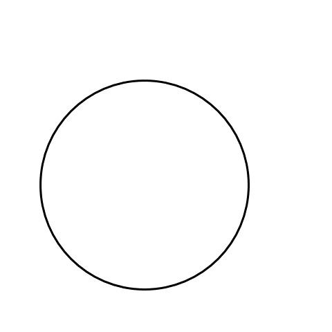

## Types of Lines

Get a piece of paper and draw two lines. They can be as long as you want. Look at the lines you drew. Do they look like one of these pictures? 

1. The two lines go on forever without ever meeting. 

2. Two lines that meet at one point when you extend them. 

3. Two lines that meet at one point.

Think back to when you drew those lines. Did you draw them so they never touched each other? Or did you draw them so they crossed? Well, when there are two lines on a flat surface, like a piece of paper, these are the only two possible outcomes. They either meet at a certain point (with some extension where required) or they never meet at all. The former are called intersecting lines , because they intersect at some point (obvious name).  The latter is what we call parallel lines. Parallel lines are everywhere around us, and they never cross each other (possibly might meet at infinity, but we can’t know that for sure).

The red lines on a train track (highlighted in the image and called rails) extend on a very long track and never meet each other, even when the track turns. This is why trains don't fall off the track. The yellow lines that connect the rails are called sleepers and as you can see, they are also parallel lines that never meet. In the picture, the sleepers are short but they still don't touch each other. 

But the sleeper and rail do cross/meet and if two lines cross each other they are intersecting lines.

Below are the examples for the two types:

## Formation of angles 

There are different ways lines can intersect. In the picture below, you can see two ways that lines can cross or simply ‘meet’. For simplicity, the lines are drawn to a point where they meet. 

What's different between the two pictures? In the left picture, the lines are almost pointed in the same direction. In the right picture, they're not. This is due to the orientation of the lines. We can also say that the lines in the left picture are oriented in a similar way (more close together), but the lines in the right picture are not (farther apart). We use the word "angle" to talk about the difference in orientation between two lines or simply to tell us how far apart the two lines are. The angle in the left picture is smaller than the angle in the right picture. Why? Because the lines are closer together, hence a smaller angle.

If the lines don’t meet at all, the angle is minimum. i.e. 0.

## Unit for measuring angles

We cannot keep saying more far apart and less far apart when we talk about angles. So, let's talk about angle measurement! There are three ways to measure angles: sexagesimal, centesimal, and circular. The sexagesimal system uses degrees (written as °), the centesimal system uses grades (written as g), and the circular system uses radians (written as c). Here, we will focus on the sexagesimal system and use degrees to measure angles. Angles are formed when two lines intersect, and the point where they meet is called the vertex. 

We saw by this figure that the angle increases when the arms move more and more away from each other.

Let's take a closer look at the angles. One of them has a bigger space between the lines than the other. If we keep one line still and move the other line so that the space between them gets bigger and bigger, eventually the lines will match up perfectly. Let's think about this like a laptop. You can move the screen on a laptop to different angles (the 360 degree ones can completely bend all the way!).

When we look at the laptop from the side, the keyboard and screen look like two straight lines at an angle. In the picture, the screen and keyboard are first lined up when the laptop is shut. Then the screen is opened up a little bit, giving us a small angle. After that, the angle gets bigger as the screen is pushed farther until they are side by side in a straight line. If we keep going further, the screen and the keyboard align again in a straight line. That's the biggest angle that can happen between two lines. The line showing the screen goes all the way around in a circle when it turns to align with the keyboard (from the back). 

In different systems, we use different numbers to talk about how much the line turned. In the centesimal system, a circle is divided into 400 parts and each part is called 1g. In another system, a circle is divided into 360 parts and each part is called 1° (this is what we will be using going forward). In the circular measurement third system, a circle is divided into 2π parts and each part is called 1c. 

Let’s go back to our sexagesimal , where we use degrees. We use 360 in this system because 360 can be divided by lots of different numbers (2, 3, 4, 5, 6, 8, 9, 10, 12, 15, 18, 20, 24, 30, 36, 40, 45, 60, etc., to name a few). This makes it easy to divide the circle into a certain number of parts while making it easy to measure the size of each angle. For example, if we want to divide a circle into 2 parts, we can make each part 180° (360/2). If we would have chosen a standard number other than 360 then the answer might have been in fractions. If we want to divide it into 3 parts, each part is 120°. 

Let’s see an example. If we have 8 people and a circular table, we can divide 360 by 8 to get 45°. Each person should sit 45° away from the others.

If we divide 360° into 12 divisions, each angle measures 360°/12=30° degrees. 

We can get 60° by dividing a circle into 6 divisions.

If we keep splitting the circle into more and more pieces, we get teeny tiny slices that are 1° each. We do this by dividing the circle into 360 parts.

So basically, measuring angles means we measure how many such 1 degree divisions are present between the two arms of the angle. We usually use a protractor to measure angles. 

## Naming angles

We name angles on the basis of the arms and vertex. ∠ is used at the start of an angle name. The given angle is ∠AOB or ∠BOA.

The point or the vertex is in the middle of the name. AO meets BO (the two arms) to form an angle so O is the common point, it is the vertex of the angle and is written in the middle whereas the other points A and B are written on either side of O. ∠AOB is the same as ∠BOA. The angles are also identified on the basis of the small arc near the vertex O that can be seen in the figure. Additionally, to make it short, we could also use an alphabet to name the angle, like a, b, x, y, etc.

## Angles in closed figures

When we look at different shapes like triangles and rectangles, the way they look depends on the angles inside them. Since they have lines that intersect, it is inevitable that they have angles as well. 

What exactly is the difference between the angles of a general parallelogram and a rectangle?
Even though a rectangle and a parallelogram have opposite sides that are equal and parallel, they look different. 

The main difference is that all the angles in a rectangle are the same, while only opposite angles are the same in a parallelogram. That's why the angles in a rectangle and a parallelogram don't match up.

The type of angle present in a closed shape has a lot of implications going further. 
