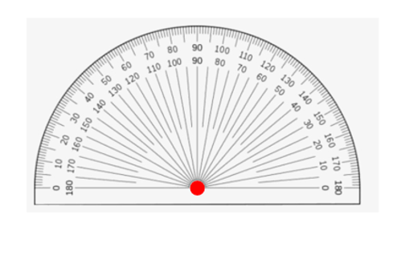

## Measuring angles with a protractor
Protractor is graduated with degree markings using the 1° standard. Generally, it can measure a maximum of 180° because of its semi-circle shape but there are protractors available in the market that can measure 360° obviously in a full circle shape. The markings are available in both directions (anticlockwise and clockwise) in both types of protractors. 

3.18
  
Let's observe the figure used earlier. 

3.10

We mentioned that it is the same thing to name this angle ∠AOB or ∠BOA. ∠AOB means that the arm rotates from A to B  which is in an anti-clockwise direction. Anti means opposite, thus anticlockwise means opposite to the direction of the clock. In a similar way, ∠BOA means that the arm rotates from B to A which is the clockwise direction or the same as the direction of the clock. 
It doesn’t matter the direction we choose to name the angle, in the end, both denote the same angle and must have a single value regardless of the direction of rotation. That is why, the markings are printed in both directions in the protractor.
It is important that we place the center of the protractor at the vertex of the angle during angle measurement. 

3.19

Suppose we have to measure ∠AOB, then

3.20

Now we rotate the protractor clockwise such that the horizontal line coincides with OA.

3.21

The line OA becomes zero degrees measurement aligns to OA and then when we have to measure OB, we have to go in the anticlockwise direction. 

3.22

We look at the lower readings since the direction from 0 degrees matches our direction as well, the angle is measured as 30 degrees because OB coincides perfectly with the 30-degree line. 
If we had coincided OB with zero-degree line, then 

3.23

Moving anticlockwise from this orientation doesn’t cover the given angle, so we rotate the protractor and try to measure in the other direction. 

3.24

We find that when we move from arm OB to OA, we have to follow clockwise direction and that is why take the measurement readings given in that direction. 

3.25

We see that when OB coincides with the 0° line, OA coincides with the 30° line. We start measuring from 0° and get 30° in both directions.  
### Types of angles based on magnitudes
The size of angles helps us categorize them into different types. The range of angles that fall under a particular angle type is shown below. 
Acute angle: Angles between 0° and 90° 

3.26

Right angle: Exactly 90° 
Instead of an arc, the right angle is shown with a small rectangle at the vertex. 

3.27

Obtuse angle: Angles between 90° and 180°

3.28

Straight angle: Exact 180° 

3.29

Reflex angle: Angles between 180° and 360° 

3.30

Full rotation/full circle angle: Exactly 360°

3.31 

There seems to be only one arm at 360° degrees, it is because the two arms are overlapped with each other. 

