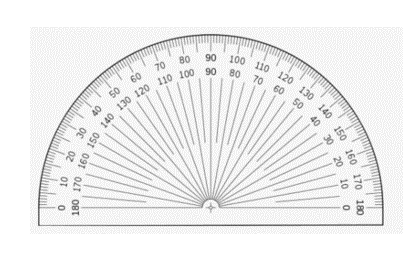
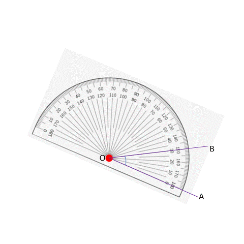
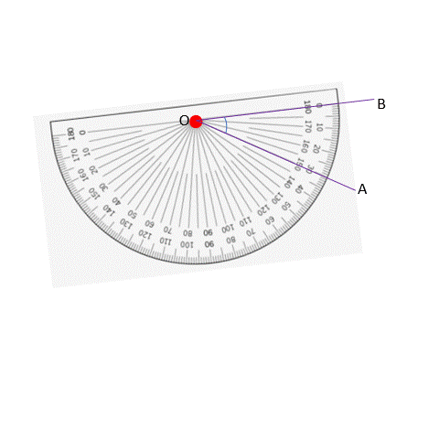
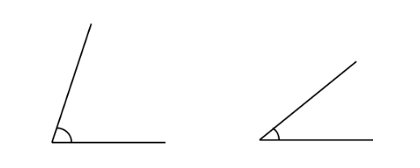
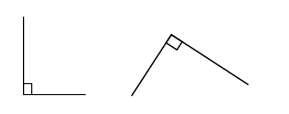
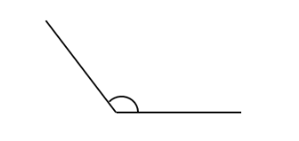
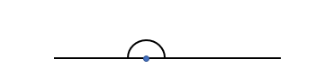
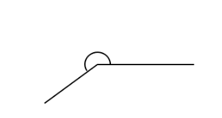
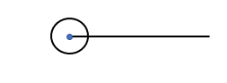

## Measuring angles with a protractor

We have discussed earlier the way we measure angles using degrees units and the use of protractors to measure them (like we would use a scale to measure the length of a line). 

So what exactly is a protractor, and how do we use it?

A protractor is kind of like a scale (but it definitely does not look like one) that has numbers on it to show you how many degrees an angle is. It has small marlins like a scale does with degree markings using the 1° standard (the smallest measurement on the tool). Most protractors can measure up to 180 degrees because they are shaped like a half-circle. But, there are some protractors that can measure a full circle of 360 degrees. You can read the numbers on the protractor in both directions, either clockwise or anticlockwise.

Let’s look at the angle given below.

We talked about how we can call an angle by different names, like ∠AOB or ∠BOA. If we say ∠AOB, it means the arm moves from A to B in a counterclockwise direction. Counterclockwise means the opposite way of a clock. If we say ∠BOA, it means the arm moves from B to A in a clockwise direction, which is the same as the direction of a clock. It doesn't matter which way we name the angle, it still has the same value. That's why the markings on a protractor go both ways. When we measure an angle, we need to put the center of the protractor (marked in red below) right at the point where the two lines meet.

If we have to measure ∠AOB, we rotate the protractor so that the horizontal lines coincides with OA. 

This is our starting point, and is considered to be 0 degrees. To measure the gap from OA to OB, we have to go in the anticlockwise direction.

We have two different readings on the protractor, but we look at the lower reading in this case since we need to start with 0 degrees and the lower reading matches this. 
The measurement where OB coincides is at 30 degrees. 
If instead we had coincided OB with the zero-degree line, we would get the following:

Here, the angle is not overlapped by the protractor, so is measuring this way impossible? No! We would just have to rotate the protractor so the angle we want to measure is overlapped by the protractor. 

In this case, when we move from arm OB to OA, we have to move in the clockwise direction and that is why we take the measurement readings given in that direction (which is the upper reading since that starts with 0 degrees in this case). 

We see that when OB coincides with the 0° line, OA coincides with the 30° line. 
Turns out that the way we measure does not matter! Whether we start at OA or OB, we get 20 degrees. We start measuring from 0° and get 30° in both directions.

## Types of angles based on magnitudes

As we have seen, we can have 360 different angles. Can you imagine learning about possibly every single one of them? A nightmare if you ask me. 
So instead, the different size of angles helps us categorize them into distinct categories based on their characteristics. 
We categorize angles based on the range of angles that they fall under.

1. Acute angle: Angles between 0° and 90°

2. Right angle: Exactly 90° 

Instead of an arc, the right angle is shown with a small rectangle at the vertex.

3. Obtuse angle: Angles between 90° and 180°

4. Straight angle: Exactly 180° 

5. Reflex angle: Angles between 180° and 360° 

6. Full rotation/full circle angle: Exactly 360°

While it may look like 360° only has one arm, this is because the two arms overlap on top of each other.
