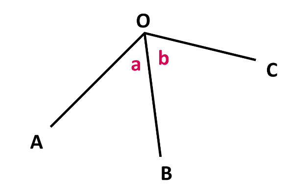
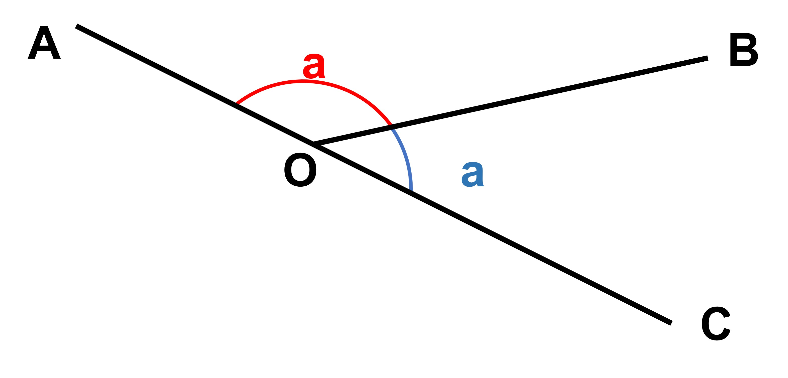
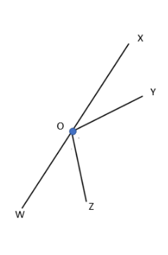
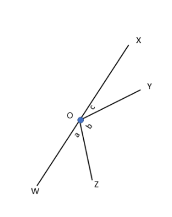
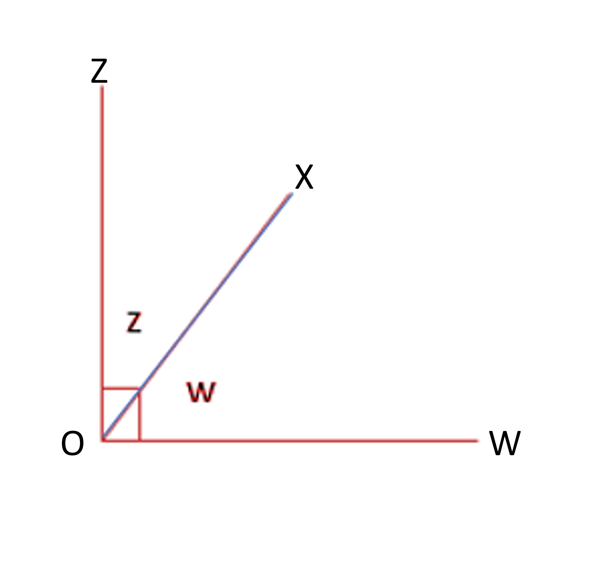
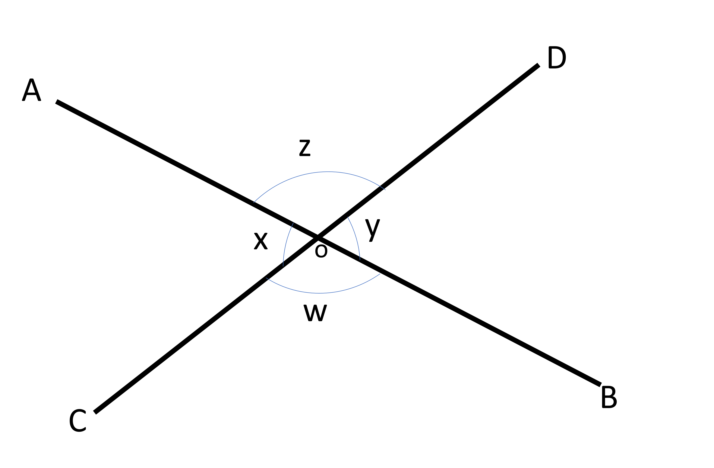

## Adjacent angles

Angles can have special relationships based on where their arms and vertex are. If two angles have one arm and one point in common, they are called adjacent angles. In this picture, a and b are next to each other because they share the arm BO.
 

## Supplementary angles

In the following pair of adjacent angles, the common arm is OB, while OA and OC are the other arms not shared by the two angles. 

When arms OA and OC form a straight line, the angles next to each other are called supplementary angles. Their sum is always 180°. 
If we know that two angles, say 35° and 145° are supplementary (because when we add them we get 180°), we can also say that 35° is the supplementary angle of 145° (and vice versa). If we want to find the single supplementary angle to a specific angle, we just subtract that angle from 180°. For instance, the supplementary angle of 40° is 180°- 40° or 140°. Let's look at a group of angles formed in a straight line.

Supplementary angles don't always come in pairs. Any number of angles that add up to 180° are supplementary. For example, 100, 10 and 70 are supplementary angles as well. 
 

In the following image, ∠XOY and ∠YOZ share the same arm OY, ∠YOZ,= and ∠ZOW share the same arm OZ. The only arms that are not shared between the angles are OX and OW. However, OX and OW are in a straight line and a straight line equals 180°. Therefore, ∠XOY, ∠YOZ, and ∠ZOW are supplementary angles. If the given angles are denoted by a°, b°, and c°, then, a° + b° + c° = 180°

## Complementary angles

Unlike with supplementary angles, if the two uncommon arms of adjacent angles make up a right angle, we call them complementary angles. 

In the figure, ∠XOZ, and ∠XOW share the same arm OX while arms OZ and OW make 90°. 
Here, let’s say ∠XOZ= z° and ∠XOW= w°. Since z and w are both part of a right angle, adding them must give 90°.
If we are to find the complementary angle of 58°, we subtract it from 90° (similar to how we subtracted from 180 to get the supplementary angle). The complementary angle of 58°= 90° - 58° = 22°

## Vertical angles

Vertical angles are created when two straight lines intersect and form a sort of an ‘X’ shape. This shape gives us two pairs of angles on each side of the intersection point, as shown below.  

In the figure, lines AB and CD intersect at point O. There are four angles formed: ∠AOD, ∠BOC, ∠AOC, and ∠BOD. When two angles are directly opposite each other, they are called vertical angles or vertically opposite angles. In this figure, ∠AOD and ∠BOC are vertical angles, as are ∠AOC and ∠BOD. 
Here’s the cool part: vertical angles are always equal to each other! That means if ∠AOC is 70°, then ∠BOD is also 70°. So, vertical angles come in pairs and are always the same size.

