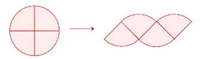
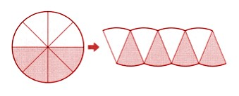
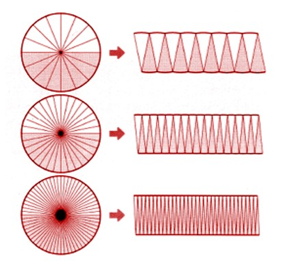
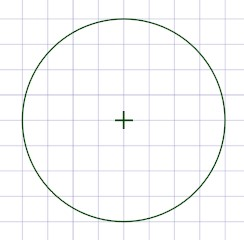
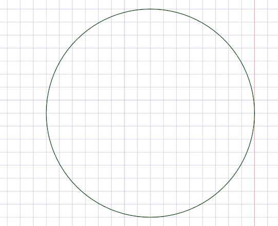

### Calculating the area of a circle

Just like other shapes, circles also take up space or circles also have an area that it occupies. We can find the area of a circle by dividing it into four equal parts, or quarters, and rearranging them to a shape as shown. 

It's not a perfect parallelogram, but pretty close, right? To make it even more like a parallelogram, we can divide the circle into 8 parts and rearrange them to get the following parallelogram-like shape. 

The two horizontal sides are still slightly curved. It looks like adding more parts could help us. Let's give it a try! We can break the circle down into 16 or 32 or 64 pieces and see what happens. As we make the pieces smaller and smaller, we start to notice that our shape starts to look more like a rectangle. Don't you think that's pretty cool? 

The length of the resultant rectangle is half the distance around the circle (its circumference), and the width is the radius of the circle. If we multiply the length and width together, we get the area of the rectangle. Now, here's the fun part. Since we made the rectangle by cutting up the circle, the area of the rectangle is the same as the area of the circle! 
So, area of rectangle = area of circle = Length x Width = πr x r = πr^2

Let's say we have a circle with a radius of 8 units.

The area of the circle is π x 8 x 8 = 201.06 square units. Now let’s assume another circle that has double the radius, which is going to be 16 units.

The area of this circle is π x 16 x 16 = 804.24 square units. 

When we compare the areas of the two circles, we find that the bigger one is 4 times bigger than the smaller one even though the radius is only doubled. This is because the formula asks for us to square the radius.So, in the same way, if the radius is tripled then the area will be 9 times the original circle (3^3). Therefore, if a circle’s radius is increased by ’n’ times, then the area becomes n^2 times bigger.
