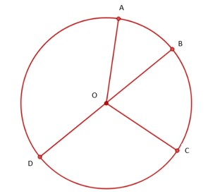

### Identifying circular things and circle

Among the following shapes, what is common between them?

These shapes all have a curved shape that we call round. But what does "round" really mean? 

Imagine holding a thread with chalk on one end and holding the other end tight on the ground. Then, you move the thread around while keeping it tight and mark the points on the ground with the chalk. That's how we make a circle! The chalk always stays the same distance from the center, making a round shape. And that's how a compass works too!

### Attributes of a circle

Circles have their own characteristics, like other shapes do. They have a fixed point called the center (which is, of course, at the center), which is marked as "O" in the picture. This is the point where the needle of the compass is fixed. 

Radius is one of the most important parts of a circle. It is the distance from the center to any point on the circle. In the picture, "OA," "OB," "OC," and "OD" are all radii. This defines the size of the circle since it tells us how far the center is from the curve path, which is essentially the circle. 

There's also a line that goes through the center and connects any two points on the circle. This line is called the diameter of the circle. In the picture, it is denoted by "BD." Every circle has an infinite number of diameters, but they're all the same length. Why do you think that is? 

If we use "d" for diameter and "r" for radius, we see that when we add OB and OD, we get BD. 

So, d = r + r 

or, d = 2r 

This is why all diameters of a circle are the same, since all radii are the same as well. Do keep in mind that the diameter needs to pass through the center. 

Throughout this process, have you wondered if we could measure the length of the path around the center? This path is called the circumference! This is really useful when you want to make something circular with rope or wire. For example, if you want to make a circle with a 5-meter diameter, you need to know the minimum length of the material you'll need to make a full circle. And that's where the circumference comes in!

Note: Can you say that the circumference is the perimeter of a circle?

