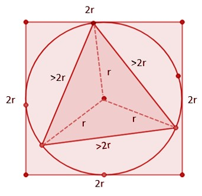
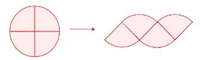
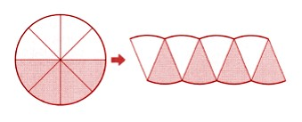
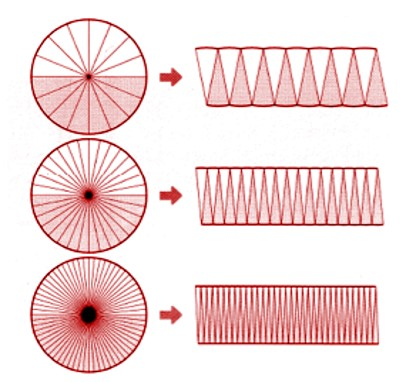
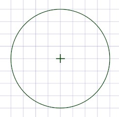
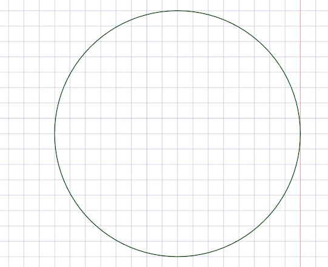

## Identifying circular things and circle
What is common between these shapes?

4.1

They all have a distinct curved shape that we also refer as round. What does round actually mean?

You can imagine attaching chalk on one end of the thread while holding the other end tightly at one point on the ground. After that, you rotate the thread keeping it tight, and mark the traced points on the ground with that chalk. This is the same principle that we use to construct a circle and That is how a geometric compass works. All the points traced by the chalk will always be at a constant distance from the center and that is how a round shape or circle is constructed. 

4.2

### Attributes of a circle
Circle has many attributes. First is the center of the circle which is the fixed point marked as O in the figure below. It is the point on which the needle of a geometric compass is fixed. 

Then there is a line that passes through that center and joins any two points on the circumference. It is shown as BD in the figure below. BD is a diameter of a circle. There are infinite such diameters in a circle but all of them are of the same length.

A line that joins the center with any point on the circle is the radius of the circle. The radius of the circle is always half of the diameter.OA, OB, OC, and OD all are radii (we don't write plural as “radiuses”)
If we denote diameter with “d” and radius with “r” then

d= 2 times r

or, d=r+r=2r

4.3

We can also measure how long the path around the circle is and that is termed as the circumference of the circle. It is important when we have to make a circular object with some material such as rope or rod.
We have to bend a rod into a circle having 5-meter diameter? what must be the length of that rod in minimum so that we can complete a full circle? 
The answer to that question is given by a new quantity known as the circumference of the circle. 
—-------------------------

### Estimating the circumference of a circle

Let's observe a triangle circumscribed in a circle of radius ‘r’ and the same circle inscribed in a square. From observation, we can see that the three vertices of the triangle are at ‘r’ distance from the center.Triangle is inside a circle, circle is inside the square. 

4.4

We see that there are three small triangles that are formed inside the large triangle. In each small triangle we know two sides are equal to the radius of the circle. Furthermore, Triangle Inequality Theorem tells us that one side of the triangle must always be more than the sum of the other two sides. That means the third side of the small triangle (each side of the larger triangle must be more than the sum of the two known sides).

Each side in the triangle>r+r

or, Each side in the triangle>2r

If each side is greater than 2r then the perimeter of the triangle is
perimeter of the triangle > 2r + 2r + 2r
or, perimeter of the triangle > 6r

Since the center of the circle and square are the same, the side of the square is equal to 2r, equal to the diameter of the circle. So, the perimeter of the square is 2r + 2r + 2r + 2r = 8r.

Now, the path of the circle is in between the triangle and the square, so the distance traveled around the circle will be more than 6r and less than 8r.  

The distance traveled around the circle can be measured by using a thread to make a circle. From experiments, it is found that the circumference is around 6.2832 times the radius which is more than 8r and less than 6r as analyzed earlier. lets denote circumference with C. 
C=6.2832 times r
or, C=3.1416 times 2r
or, C= 3.1416 times d
Where r is the radius and d is the diameter of the circle. 

This relation holds true for circle of any size. The factor 3.1416, that relates the circumference “C” and diameter “d” is denoted by a Greek letter π, read as pi. Since the circumference of ‘pi’ times the diameter, we can say that ‘pi’ is the ratio of circumference to diameter. 

Pi is an irrational number, hence the digits after the decimal point go on forever and do not repeat. We can thus write the circumference as:
C = πd
or, C = π x 2r
or, C = 2πr
This is the formula to find the circumference of a circle, where the value of π is roughly 3.1416. We generally use 3.14 or 22/7 to make the calculation simpler. Note that this is the case for all circles!
—-----
### Calculating the area of a circle
Like other 2D shapes, a circle also has an area that it occupies. 
To find the area of a circle, we first divide it into four equal parts or quarters. We then try to rearrange it as shown below: 

4.5

This sort of looks like a parallelogram, doesn't it? Not an exact one. but close. So, let's try to make it look more like a parallelogram.
Let's break the circle into 8 parts next. We then get another parallelogram-like figure by arranging them as shown.

4.6 

The two horizontal sides are still curved a little and not as straight as we want it to be. This means we probably need more parts. Let's try it out. 
When broken down into 16 or 32 or 64 parts, we see that as the size of the pieces gets finer and finer, the parallelogram starts to seem like a rectangle. 

4.7

We see that the resulting rectangle formed has a length equal to half of the circumference of the circle. This is because the whole circumference has been divided into two parts. The width of the rectangle is equal to the radius of the circle. 
The area for a rectangle is given by length times width.
Area = Length x Width = πr x r = πr^2
Since we made the rectangle by decomposing the circle, the area of the circle will be equal to πr^2 as well!
—--------- 
Let's assume we have a circle with a radius of 8 units.

4.8 
 
The area of the circle is π x 8 x 8 = 201.06 square units. 
Now let's assume another circle that has double the radius, which means 16 units.

4.9

The area of the circle is π x 16 x 16 = 804.24 square units.
When we compare the areas of the two circles we find that the bigger one is 4 times bigger when its radius/diameter is double of the smaller circle. 
In the same way, if the radius/diameter is tripled then the area will be 9 times the original circle.
Therefore, if a circle's size is increased by 'n' times; then the area becomes n^2 times. 