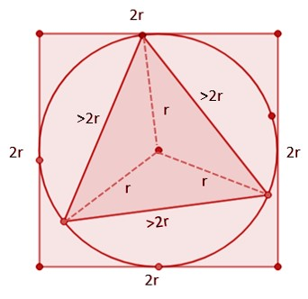

### Estimating the circumference of a circle

Like all things in math, there is a formula to find the circumference of the circle, but before that, let’s try and see if we can maybe estimate it. To estimate the circumference of a circle, we need to do some math. Don’t worry, it’s pretty straightforward. 

First, look at a triangle inside a circle (of radius r) and this circle being inscribed inside a square. Basically, the triangle is inside a circle, and the circle is inside a square. It looks pretty cool, right? 

Starting out, the radius of the circle is r. This means that the three vertices of the triangle are all the same distance away from the center of the circle (at a distance r). Inside this big triangle, there are three little triangles. Each of these little triangles has two sides that are the same length as the radius of the circle. And because of the Triangle Inequality Theorem, we know that the third side of each little triangle has to be longer than the other two sides added together. The third side in each of the smaller triangles are the three sides of the big triangle. So, side of big triangle > r + r
Side of big triangle > 2r
If each side of the triangle is greater than 2r then the perimeter of the triangle given as:
Perimeter of the triangle > 2r + 2r + 2r 
or, perimeter of the triangle > 6r
Since the center of the circle and square are the same, the side of the square is equal to 2r, which is the diameter of the circle. So, the perimeter of the square is 2r + 2r + 2r + 2r = 8r.
Now, the path of the circle is in between the path of the triangle triangle and the path of the square, so the distance traveled around the circle will be more than 6r and less than 8r.
Evidently, the circumference of any circle depends on its radius and it lies somewhere between six and eight times the radius. . 
Practically, we can also measure the distance around a circle by using a thread to make a circle and measuring the length of this rope. Scientists did some experiments and found out that the distance around a circle is about 6.2832 times the radius. That's more than 8 times the radius, but less than 6 times the radius as we found out earlier! 
We can use the letter C to represent the circumference. 
So, C = 6.2832 x r
or, C = 3.1416 x 2r
or, C = 3.1416 x d 
Here, r = radius and d = diameter of the circle.

We now have a relationship between the circumference and diameter of a circle. This relationship (which tells us that the circumference is a little over 3 times the diameter) works for any size of circle. The number 3.1416 that relates the circumference and diameter is called pi, which is a Greek letter. If we rearrange the equations, we get C/d = 3.2416, hence pi is the ratio of the circumference to the diameter. So, if you multiply pi by the diameter, you get the circumference. Easy enough right? And it applies to all circles! Pretty convenient. 

Pi is just an estimate and is an irrational number, hence the digits after the decimal point go on forever and do not repeat. But it remains the same and thus we use a symbol to denote it -> π. 
We can thus write the circumference as: C = πd
or, C = π x 2r 
or, C = 2πr 
This is the formula to find the circumference of a circle, where the value of π is roughly 3.1416. We generally use 3.14 or 22/7 to make the calculation simpler. 