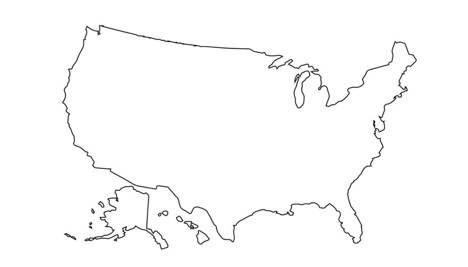
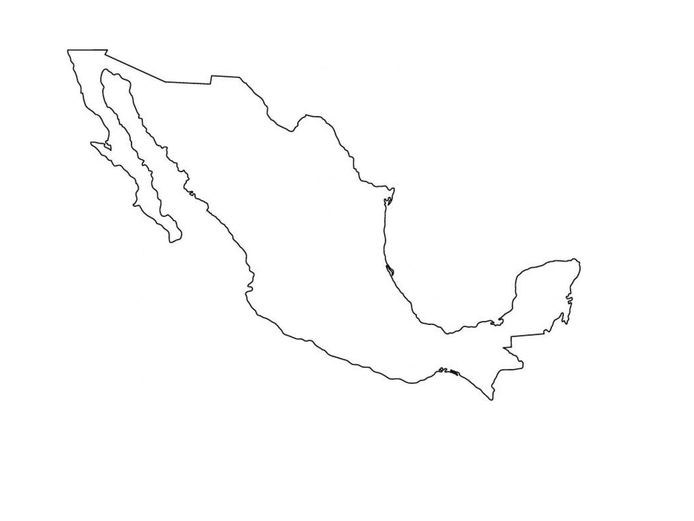
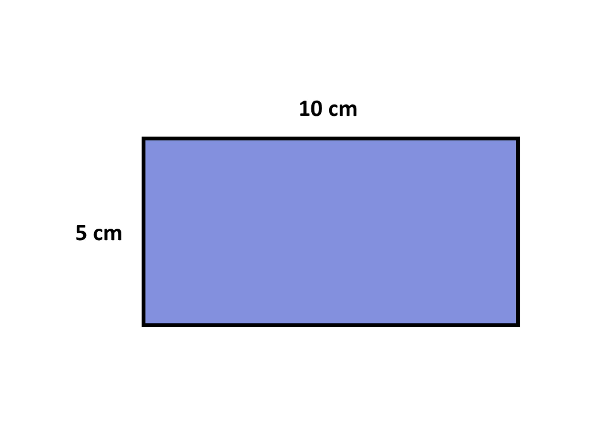
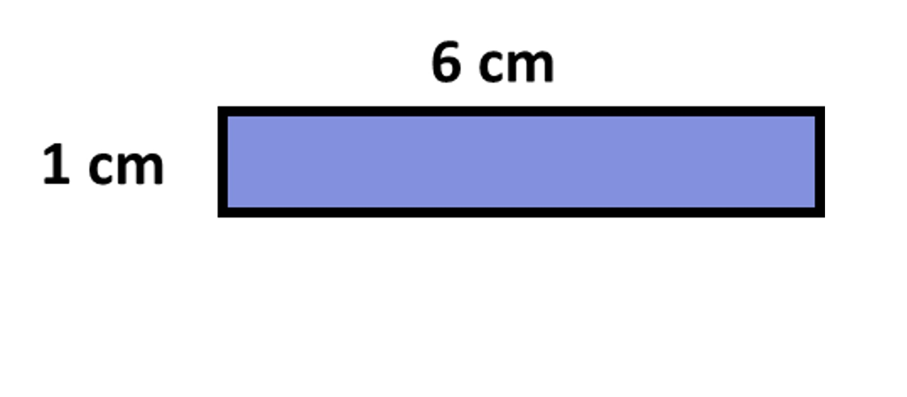
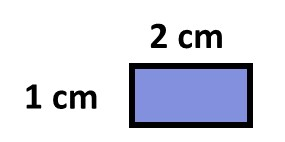
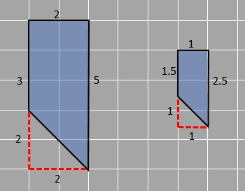
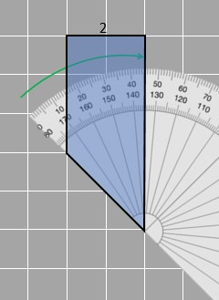
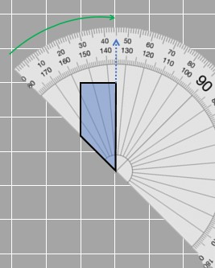

## Introduction to Scaled figures
Have you noticed the map of countries in the atlas or the world map on the globe? How can countries of huge areas be fitted on such small sheets of paper?  Or rather, when we see two papers of the same size fitting the map of Mexico and the United States, do we feel like they are of comparable size? Is Mexico as big as the USA as shown below?

5.1 and 5.2

Of course not! We know that Mexico is much smaller than the USA.  
When maps or any other huge objects are drawn on a small piece of paper, the size of the objects has to be reduced to fit the paper size. If an object has to be downsized, all of its dimensions must be downsized by the same amount/factor. This is what scaling is. The new image formed is the scaled copy of the original.
So, can the size reduction be done through subtraction?
One way we could try downsizing might be to subtract the same amount from all the dimensions of the object to fit into the paper. Let's try it out using a simple rectangle as an example.

5.3

Given is a rectangle of dimensions 10 cm x 5 cm. We reduce each side by 4 cm and get the following diagram:

5.4

For scaling to work, it would not make sense for the scaled-down diagram to look completely different from the original. In this case, the scaled-down rectangles look different from the original one. We know that because the ratio between the length and width isn't the same in the two rectangles above. The initial figure had its length double its width, whereas, in the rectangle formed after that, the length is 6 times the width. Hence, subtracting does not work.
Another way to try it out is to divide all dimensions by the same number. This gives us the following when we divide each side by 5:

5.5

This is smaller and similar in shape to the original. We can figure that out because the length is double the width of the rectangle.

5.3  

5.5

So, we can get scaled-down diagrams if we divide all dimensions by the same number (5). You can also think of it as being multiplied by the reciprocal (⅕). This is the same as when we worked on proportional relationships! The ratio of original length to breadth is equivalent to the scaled-down length and breadth! 
While looking at the scaled figure compared to the original one, we see that it is smaller than the original. It is obvious since we divided the length and width of the rectangle by 5. 

### Scale factor
The term scale factor is used to describe the scaling process. 
If two similar figures are of the same size as well, then the scale factor is 1. 1 is the quantity multiplied by the original is the scale factor. If the original and the copy is of the same size, the scale factor is 1, since it changes nothing.
If the scale factor is less than 1, then the original is being multiplied by a value smaller than 1, so the scaled figure is smaller than the original one.
In the case described above, the scale factor is 1/5 because the dimensions are divided by 5 (or multiplied by ⅕). The length is changed from 10 to 2 and the width is changed from 5 to 1. 
Similarly, if the scale factor is larger than 1, then the scaled figure must be greater than the original. This is upsizing. When objects are very small and need to be drawn in detail, we repeat the same process. Can you imagine how many times the size of the cell is magnified to get its image as shown in your science book? In such cases, the drawing must be larger than the object itself so that all the features of the drawing can easily be seen. For this, we multiply by the same number, this time greater than 1.
The need for scaling arose when very large or very small objects had to be drawn on small pieces of paper without missing any of their intricate details. The most important requirement to scale a figure is that the shape of the original and the drawn figure must be similar otherwise there is no point in illustrating the object in a drawing.
Properties of scaled figures

5.6
So, for images to be similar, they need to have corresponding sides that change with the same ratio and corresponding angles that are equal to each other. 
We can see that in the given figures, 2 of the four angles are 90 degrees and then the third corresponding angle is measured. We can see that the measurements in the blue scale are measured. The angle in both figures is 45 degrees as seen in the figure.

5.7

5.8

The concept of scaling also helps in unit conversion. For scaled figures, the scale factor defines how many times the size of a particular object increases or decreases, which means the scale factor is applied to all dimensions. If you have already done the ratio course or are familiar with it, you should know that this is basically how you form equivalent ratios as well!