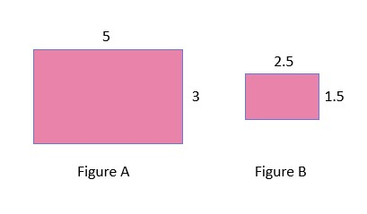
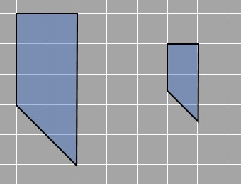
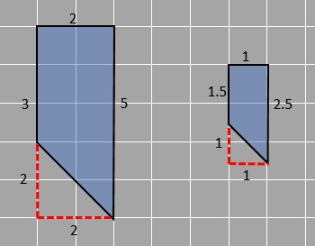
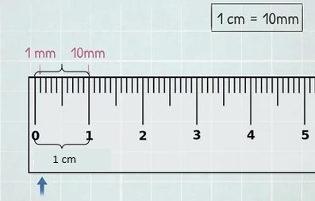
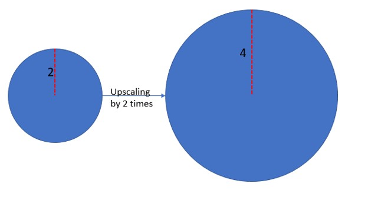
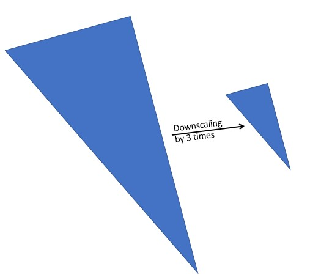

### Area of scaled figures
Let's compare two rectangles. 

5.9

There are two rectangles and one is the scaled figure of the other. The length of the bigger rectangle is 5 units and the width is 3 units. The length and width of the smaller rectangle are half than that of the bigger rectangle i.e. 2.5 and 1.5 units respectively.  We know that the area of the rectangle is given by length multiplied by breadth.

Area of bigger rectangle= 5 x 3 = 15
Area of smaller rectangle = 2.5 x 1.5 =  3.75

When we have a look at the ratio of the two areas, we get that the larger rectangle covers 4 times more area than that of the smaller one. 
=15/3.75=4

Therefore what can be concluded is that when the dimensions of the rectangle were halved, the area became 1/4 of it. Similarly if we think in reverse, if the length and width of a rectangle are doubled then the area will be 4 times larger than that of the original.

Let's check the same case with one of the previous examples. 
Here are two figures. We need to decide if one may be a scaled figure of the other.

5.10

The two figures have similar shapes on observation. We also see that all sides of the smaller figure are half of the larger shape as shown in the figure.

5.6

To maintain the shape, scaled figures must have the same angles even though the sides change with the same ratio. We know that the dimensions of the shape on the left are double the shape on the right. Have a look at the images, 5 is double 2.5. That is why there are two sides measuring 5 and 2.5 units in the figure. Similarly, 3 is double of 1.5 and 2 is double of 1. In all the cases the ratio is the same, one side is twice the other. They are corresponding sides.

Using this information, we can find how the area changes when we scale diagrams. The larger figure is a trapezium with parallel sides measuring 3 and 5 with the distance between them 2 units. The area of the trapezium is given by=½ x sum of parallel sides x distance between them

Area of larger trapezium=½ x (3+5) x 2 = 8 square units

The smaller trapezium has parallel sides of 2.5 and 1.5 which are a unit distance apart. 
Area of larger trapezium=½ x (1.5+2.5) x 1 = 2 square units

We see as the ratio between the sides of the two trapeziums is 2, the ratio of thier areas is 4 times or 22. That means if the ratio between the sides is 3, then the ratio between the areas will be 32. Try it out with an example and check if it's true. 

### Scaling and units
Unit conversion is also established on similar concepts since we can form a ratio of the two units, and changing one in any way means we change the other in the same way. We 'scale' the measurements. For example, the ratio of length to breadth is 10: 8. when we scale length by 2, we do the same for breadth and get the new ratios as 20:16.

If 10 mm is equal to 1 cm, then 50 mm is 5 cm. We scale both by a factor of 1/5. Or downsized by 5.

5.11

Now, if we know that an object is 8 meters in length, that is 800 cm and we need to downsize it by factor 100 to draw on paper, the scaled-down length of the object is 8 cm.

Scaling 800 cm downsizing by 100

=800/100=8 cm

This concept is followed for all kinds of unit conversion in which only the factor of unit conversion is important.

In the earlier part, we learned about scaled factors and scaled factor can also be expressed as a ratio. Just like 2 can be written as 2:1.   
If the first part of the ratio is greater than 1 just like in 2:1 then the scaled figure must be greater than the original figure. (two times greater) If it is smaller than 1 for example in 1:3 then the scaled figure is smaller than the original figure (3 times smaller). 

5.12

The scale factor between the above figures is 2. 

5.13

The scale factor between the above figures is ⅓. 
