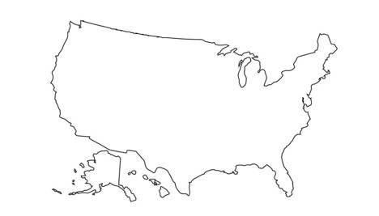
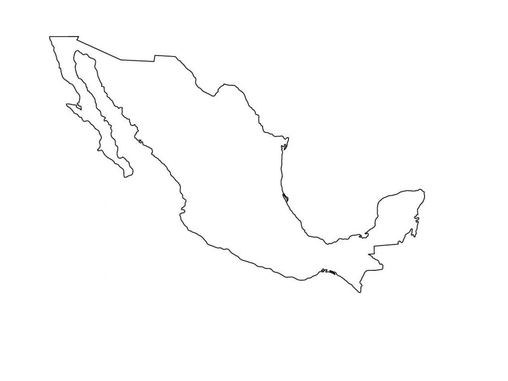
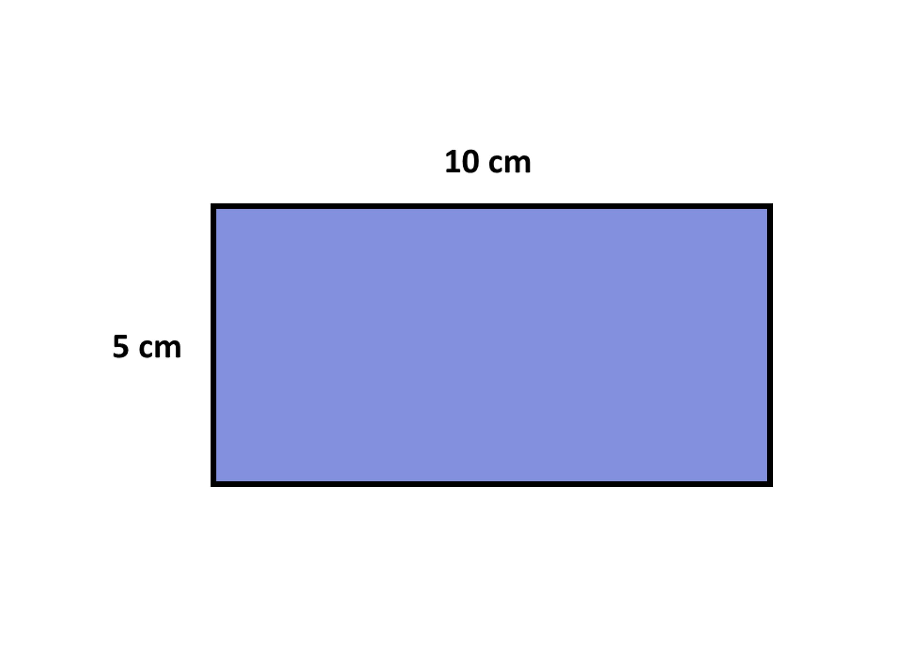
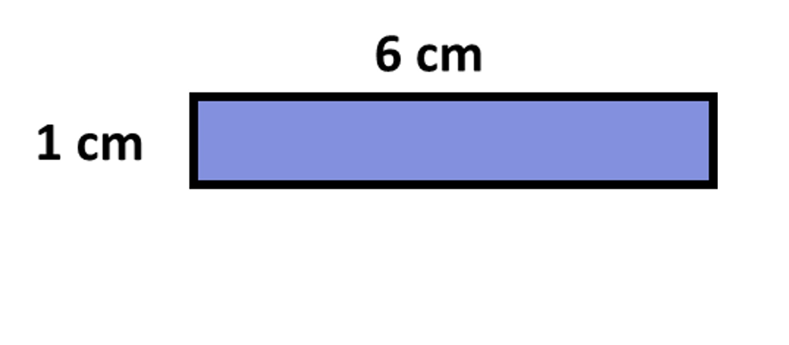
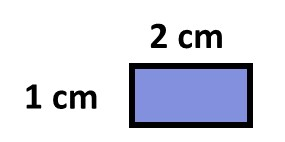
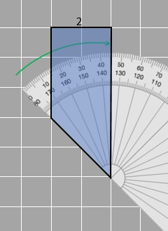
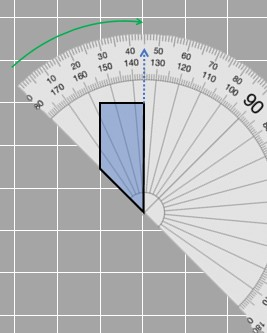

## Introduction to Scaled figures

Have you ever looked at a map of the world and wondered how they fit all those big countries onto such a small piece of paper? Let's take a closer look at two countries, Mexico and the United States. Based on the image provided, can we say that they're the same size as the real thing? 

Of course not! We know that Mexico is much smaller than the USA, and they are both much bigger than what is being shown in the image (Obviously!).
When we draw maps or other big things on small pieces of paper, we have to make them smaller to fit. This is called scaling. We also have to make sure to make everything smaller by the same amount so it still looks like the original. Why? Say we decrease the size of Texas by 5 but the size of Florida by only half. The map would not make sense at all. The new image formed is the scaled copy of the original.

Now, some people might think we can just subtract the same numbers from all dimensions to make things smaller. Let's look at a rectangle as an example and see if its gives us scaled copies or not.

Given is a rectangle of dimensions 10 cm x 5 cm. We reduce each side by 4 cm and get the following diagram:

When we scale something, we want the smaller version to still look like the original. But in this case, the smaller rectangles don't look the same as the original one. We can tell because the ratio between the length and width is different. The original had a length that was twice its width, but the smaller one has a length that is 6 times its width! So we can't just subtract the same amount from the dimensions to make a scaled version. 
Another way to try is to divide all the dimensions by the same number. We tried that and got a new image as shown:

This is smaller and similar in shape to the original. We can figure that out because the length is double the width of the rectangle.

While looking at the scaled figure compared to the original one, we see that it is smaller than the original. It is obvious since we divided the length and width of the rectangle by 5. So, we can get scaled-down diagrams if we divide all dimensions of the original by the same number (5). You can also think of it as being multiplied by the reciprocal (⅕). 
Does this sound familiar to you? This is essentially the same as when we worked on proportional relationships! The ratio of original length to breadth is equivalent to the scaled-down length and breadth!

## Scale factor
Scale factor is used to describe the scaling process. By using the scale factor, we can tell if the new figure is bigger or smaller than the original one. If the scale factor is more than 1, then the new figure is bigger than the original one. For example, if we want to study the parts of a cell, we need to make it bigger.
If the scale factor is 1, then the new figure is the same size as the original one. This should be obvious since  multiplying by 1 does not change the number in any way. 

And if the scale factor is less than 1, then the new figure is smaller than the original one. When we make a map of a country, we are scaling it down to make it fit on a piece of paper. 

In the previous example, the size of the object is made smaller by dividing its dimensions by 5 or multiplying by 1/5. This 1/5 is the scale factor. The length goes from 10 to 2 and the width goes from 5 to 1.

Have you ever seen a picture of a cell in your science book that is obviously much bigger than the actual object? This is because the picture needs to show all the details clearly. To make the picture bigger, we use a scale factor that is greater than 1. It could be 100 or even 1000. 

Scaling became important when people needed to draw very big or very small things on small pieces of paper. The most important thing is that the original and the drawing must have the same shape, or else the drawing won't be useful. Knowing how everyday things (like maps) connect to mathematics is fun, right?

### Properties of scaled figures

For images to be similar, they need to be of the same shape. For that, they need to have sides sharing a common ratio and corresponding angles that are equal to each other. Those pairs of sides and pairs of angles are called corresponding sides and angles respectively. 
We can see that in the given figures, 2 of the four angles are 90 degrees and if the third corresponding angle is measured (as shown in the images below), the angle in both figures is 45 degrees.

We already know about  scaled factors when we talk about scaled figures. In this case, let's say the smaller figure is being scaled to get the bigger one and the scale factor is 2.  Scaled factor can also be expressed as a ratio, just like 2 can be written as 2 : 1.
When we write it in such a form, if the first part of the ratio is greater than 1 just like in 2 : 1 then the scaled figure must be greater than the original figure (two times greater). If it is smaller than 1 for example in 1/3 : 1 then the scaled figure is smaller than the original figure (3 times smaller).
