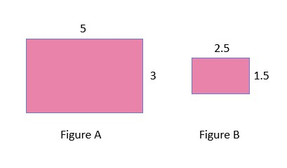
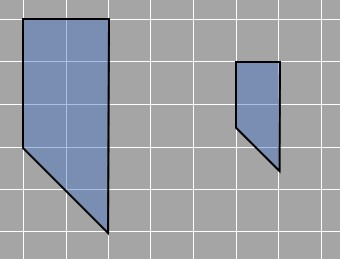

## Area of scaled figures

There are two rectangles given here and one is the scaled figure of the other. The length of the bigger rectangle is 5 units and the width is 3 units. The length and width of the smaller rectangle are half than that of the bigger rectangle i.e. 2.5 and 1.5 units respectively. We know that the area of the rectangle is given by length multiplied by breadth.

Area of bigger rectangle= 5 x 3 = 15 
Area of smaller rectangle = 2.5 x 1.5 = 3.75

When we have a look at the ratio of the two areas, we get that the larger rectangle covers 4 times more area than that of the smaller one (15/3.75 = 4).

Therefore, what can be concluded is that when the dimensions of the rectangle were halved, the area became 1/4 of it. Similarly if we think in reverse, if the length and width of a rectangle are doubled then the area will be 4 times larger than that of the original.

Let’s check the same case with one of the previous examples. Here are two figures. We need to decide if one may be a scaled figure of the other.

The two figures have similar shapes on observation. We also see that all sides of the smaller figure are half of the larger shape as shown in the figure.

To maintain the shape, scaled figures must have the same angles even though the sides change with the same ratio. We know that the dimensions of the shape on the left are double the shape on the right. Have a look at the images, 5 is double 2.5. That is why there are two sides measuring 5 and 2.5 units in the figure. Similarly, 3 is double of 1.5 and 2 is double of 1. In all the cases the ratio is the same, one side is twice the other. They are corresponding sides.
Using this information, we can find how the area changes when we scale diagrams. The larger figure is a trapezium with parallel sides measuring 3 and 5 with the distance between them 2 units. The area of the trapezium is given by=½ x sum of parallel sides x distance between them
Area of larger trapezium=½ x (3+5) x 2 = 8 square units
The smaller trapezium has parallel sides of 2.5 and 1.5 which are a unit distance apart. Area of larger trapezium=½ x (1.5+2.5) x 1 = 2 square units
We see as the ratio between the sides of the two trapeziums is 2, the ratio of their areas is 4 times or 2^2. This can also apply to when the ratio between the sides is 3. We simply square 3, to get the ratio between the areas, which is 9. Try it out with an example yourself and check if it’s true.
