## Construction of Triangles
If we need to construct a triangle, we need certain informations. 
How large is it? What is its shape? 
The answer to both the questions is given by the length of the sides and angle between the sides. There are three sides and three angles in a triangle. All these are termed “dimensions” of the triangle. Out of the possible 6, 3 must be defined in order to form a triangle. 
Let’s assume that we have to construct a triangle with the lengths of three sides given. There are cases in which triangle cant be formed even when we know about the length of all sides. Therefore, we first confirm if a triangle can be formed or not with the help of triangle inequality.

### What is triangle inequality?
The triangle inequality states that the sum of any two sides of a triangle must be greater than the remaining side.  It means that if the sum of two sides of a triangle is equal to or less than the remaining side, then a triangle can’t be formed. 
For a triangle with sides a, b and c, the triangle inequality states that

3.38

a+b>c
b+c>a
a+c>b
Now suppose b is the longest side among the three, then b+a will always be greater than c because we are increasing the value of b by a. 
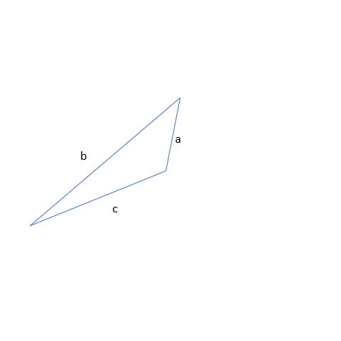
3.39

b+c will also be greater than a because b on itself is greater than a, so b+c is also greater than a. 

3.40

That is the main reason while checking the triangle inequality, we add the smaller sides and find out if that is greater than the remaining side or not. 
i.e. c+a> b

3.41

Suppose the sides of the triangle are given as 4, 5, and 10 units respectively. If we measure the sides with a ruler and draw them without worrying if the sides would form a closed figure, then we get some shapes like below.

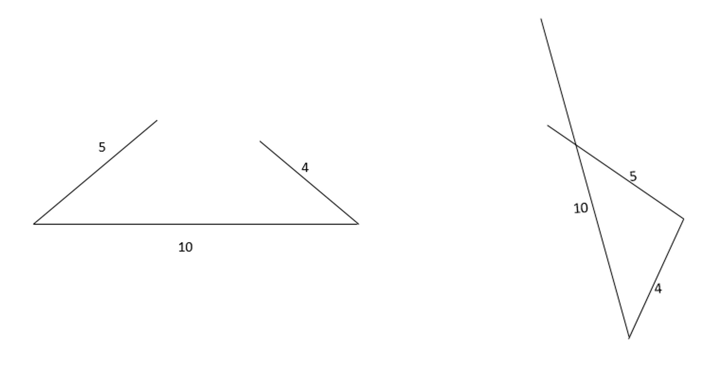
3.42

One way of checking if the sides follow triangle inequality is to draw two circles at two ends of one of the sides. The radius of the circle is equal to the size of the remaining two sides. 
### Testing triangle inequality with the construction of circles at two ends
If the triangle inequality is fulfilled then the two circles will intersect with each other. In the case of circles not intersecting, triangle isnt formed at all. 
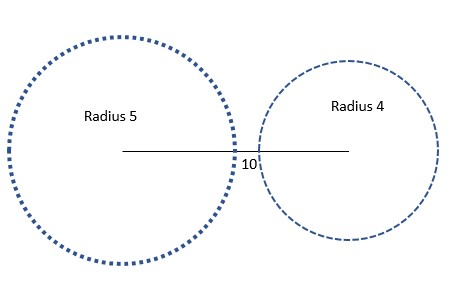
3.43

Here when we check if side lengths 5 and 4 form a triangle with a 10 units, we get that the circles don’t intersect and the triangle inequality isn’t verified and we can’t form a triangle with those side lengths. 
Let’s assume that the side length of one of the sides is 6 instead of 4. Then the above diagram becomes:
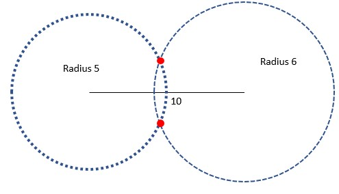
3.44
 
In this case, the circle intersects meaning we can form a triangle with side lengths 5, 6 and 10 units. There are two possible points that match the measurements.
Even when we check the sum of the two smaller sides, 5+6=11>10. 
Thus the triangle inequality is verified. 
Both red dots are correct estimations of the third point of the triangle.
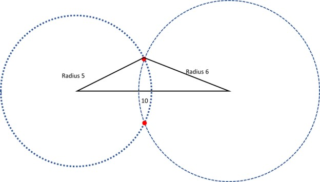
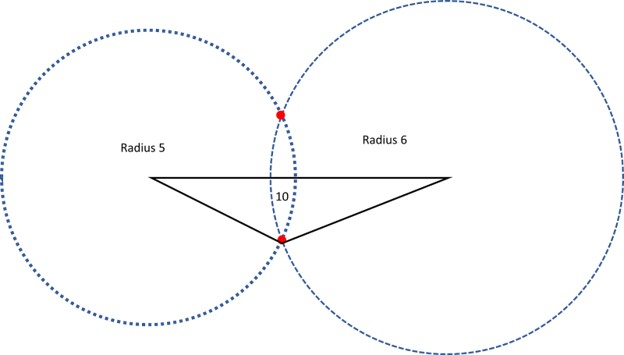
3.45 3.46 
 

Even though the triangles seem different, they are the same triangle. They are just oriented in different directions. 
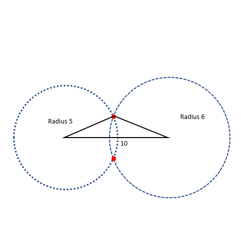
3.47

Did you observe?
We tried making a triangle in two different ways but got the same triangle. So we can say that the triangle that we make from known three side lengths is unique. 
For example, we want to check if side lengths 24, 8, and 32 forms a triangle.  
Which are the two smaller sides?
24 and 8
What is their sum?
24+8=32
Is the sum greater than the third side?
No, the sum is equal to the third side. Therefore the triangle inequality isn’t verified and a triangle cant be formed from the given side measurements.
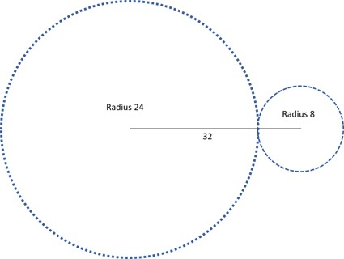
3.48

The circles just meet at the line and no triangle can be seen. 
What happens when we have to construct a triangle with lengths of two sides given along with one angle?
For example, we have got an angle and two sides of a triangle as 60°, 7 units, and 8 units respectively. 
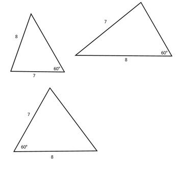
3.49

Each of the triangles has two sides as 7 and 8 units along with one angle of 60°. But we can clearly see that these triangles are different from each other because one triangle isn’t a copy of the other. That means a unique triangle isn’t formed in this scenario. 
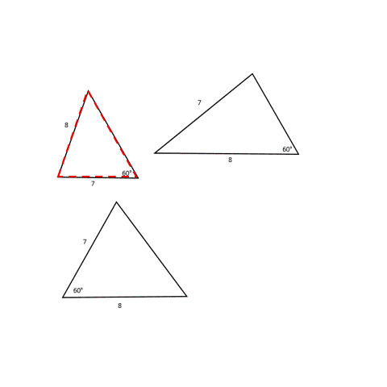
3.50

How are the shapes different when the same dimensions are used? That is because, in the first figure, 7 units is one of the arms forming 60°, in the second figure the order is 8 units is one of arms forming 60° and in the third figure 7 and 8 units both are the arms of 60°. In short it can be said that the order of the dimensions while constructing the triangle are different. 
If we have to construct a triangle of three angles only. For example, we have two triangles having angles of 90°, 45°, and 45°. 
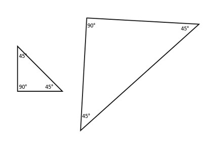
3.51  

Both triangles have the same angle measurements thus they are of the same shape but they're not of the same size, one is a bit larger than the other. The reason for that is the side measurements being different in the two triangles. If we analyze the two, it feels like the triangle on the left is enlarged to form the one on the right. 
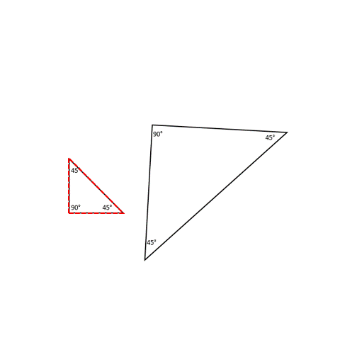
3.52

### Use of compass in constructing triangles
We applied triangle inequality by drawing circles at two ends of a line and observing if they would meet at any point. We use a compass for drawing a circle. It is a geometric tool that has two arms. One arm has a sharp needle at one end and the other has a pencil. 

3.53

It is useful for marking a finite distance from one point and that is why it can be used for making circles. 
For making a circle, we first maintain the distance between the needle and pencil to be equal to the radius of the circle. Then, we fix the needle at the center and rotate the pencil around the center to form a smooth curve.
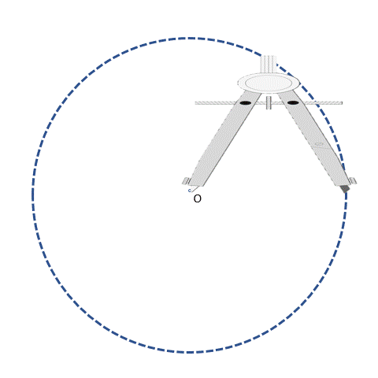
3.54

3.45

Let’s revisit the case earlier, we needed to construct a triangle with 6, 5, and 10 units length sides. We placed the 10 units side horizontally. We needed to find a point that is 5 units away from the left end and 6 units far from the right end of that horizontal side. We found that there were two possible locations of the third point by drawing two circles. We need a compass to draw the circles as well. 
However, we don’t need to draw the whole circle at both ends. We just need to find the probable location of the third point based on its distance from the two ends and for that compass is very helpful. 
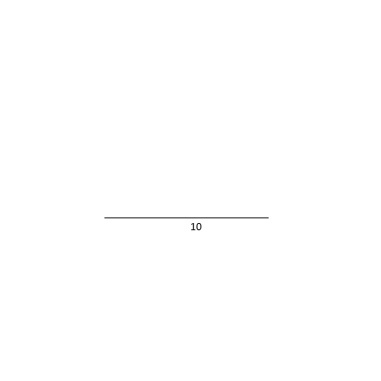
3.55
 
We can follow the same process for the other point as well. The probable point where the two meet is dependent on the size of the circles or the length of the two sides. As the length of the sides increases, the circles become larger and larger, the intersection point goes far and far from the third side. 

3.56
