## Formation of angles
Draw two lines on a piece of paper. You can draw them as long as you want. 
What type of lines did you draw? I am sure the lines drawn must look similar to one of the diagrams below. Either the lines won't meet at any point even though they are extended.
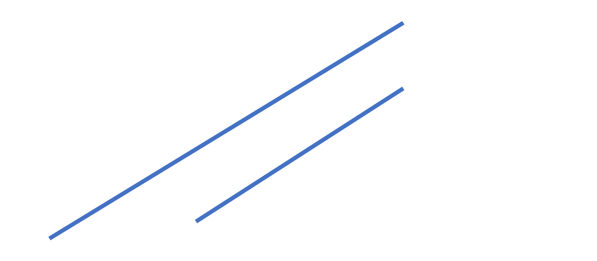
3.1
 
Or the lines will meet at one point when they are extended.
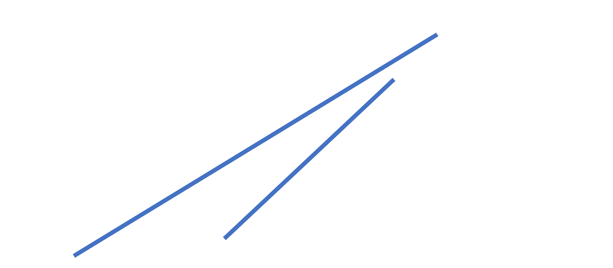
3.2
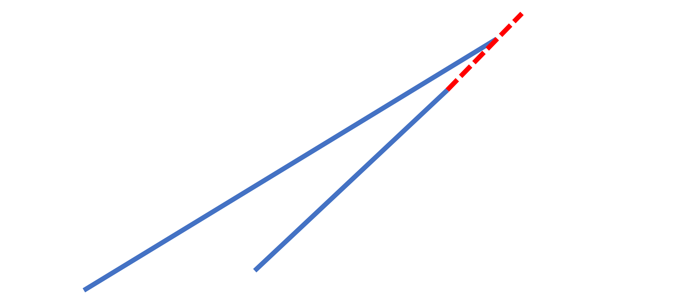
3.3

OR you draw the lines that meet at one point.
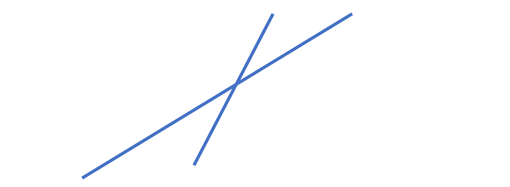
3.4 

If you drew the first one, what made you think that the lines must not be touching each other even if we extend them infinitely? What made you think that the lines must be crossing each other if you drew one of the bottom two figures? 
That is the main conclusion when there are two lines on a plane, either two lines meet at a finite distance or they never meet. Finite means that it can be estimated or calculated. 
The lines that never meet or meet at infinity are called parallel lines. We see examples of parallel lines everywhere.
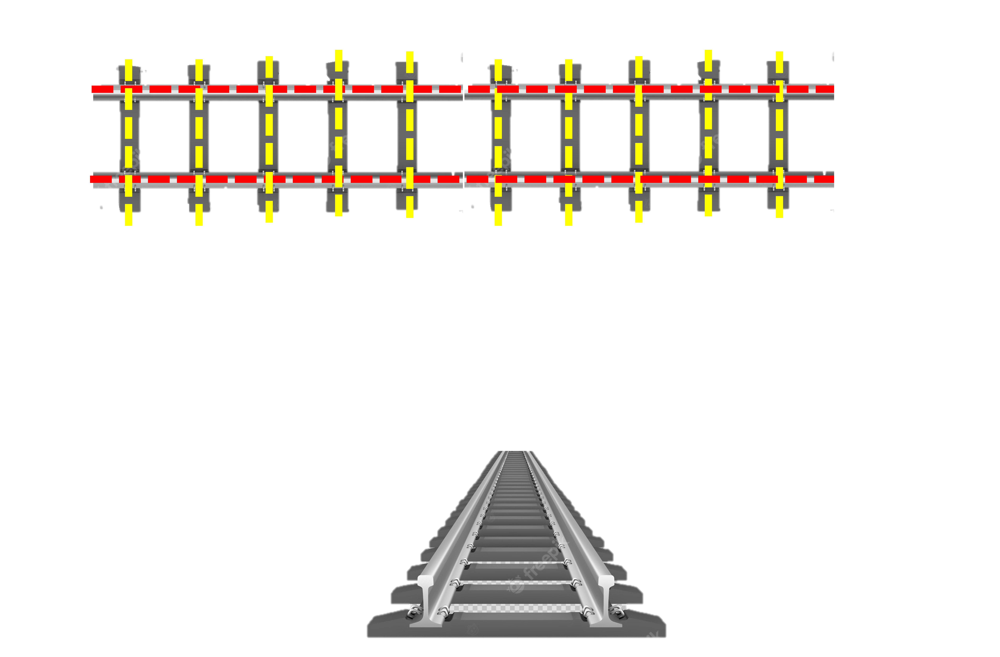
3.5 

The rails (highlighted in red) on a railway track extend very long on the track but they never meet. That is the reason trains don’t fall off their tracks even when there is a sharp turn. Numerous sleepers that connect them (shown in yellow) also have a similar case. The sleepers shown in the diagram are short but don't meet each other even when they are extended. These are the two examples in which parallel lines are used. 
If two lines cross each other at a finite distance, they are called intersecting lines. The sleeper and rail in the above diagram also intersect as seen in the above diagram. 
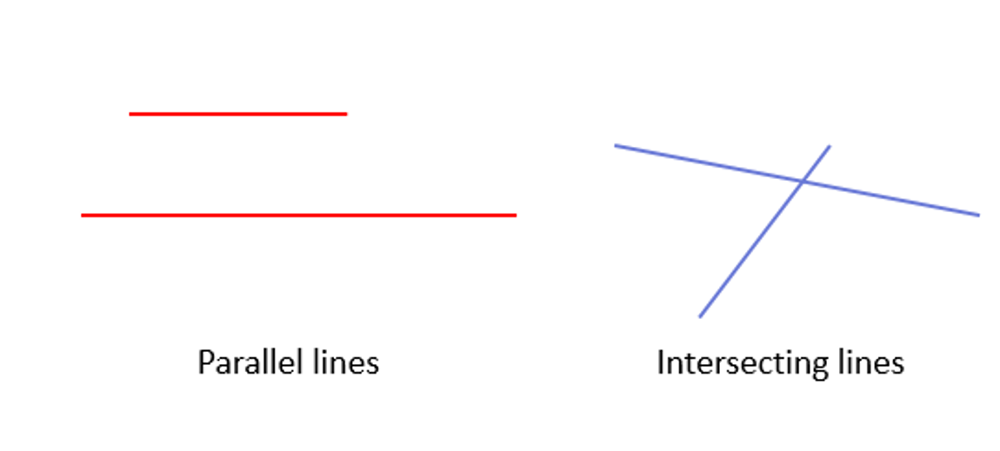
3.6  

There are different types of intersecting lines. Two of the ways in which the lines intersect are shown in the figure below. For simplicity, the lines are drawn to a point where they intersect.
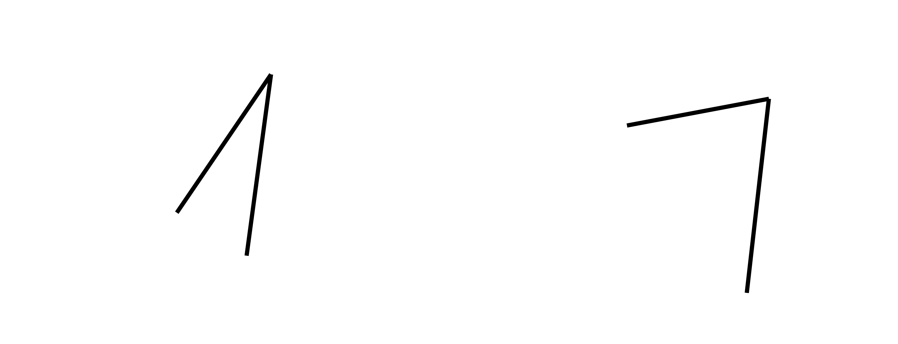
3.7 

What is different between the two figures?
We can see that the two lines are pointing nearly in the same direction in the left figure compared to the one on the right. That is defined by the orientation of the lines. We can also say that the lines are oriented in a similar manner in the left figure compared to the right one. 
Angle is used as a term here that gives the difference in orientation between two lines. The angle for the figure on the left is lesser than the angle on the right. 
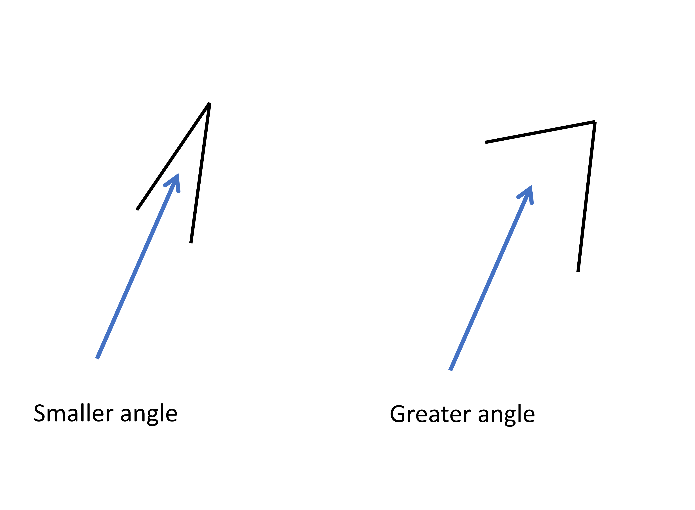
3.8

If the lines don't meet at all, the angle is minimum. i.e. 0. 
### Unit for measuring angles
There are three systems of angle measurement; sexagesimal, centesimal, and circular. The sexagesimal system uses ° (called “degrees”) to measure angles, the centesimal system uses g (called “grades”) and the circular system uses c  (called ‘radian”).
The chapter mostly deals with the sexagesimal system so you will find degrees or ° written everywhere.  
We will refer to angles mostly in terms of degrees in the sections following. 
Angles are always formed with two lines intersecting and they are called arms of the angle. The point at which the arms intersect is known as the vertex of the angle.
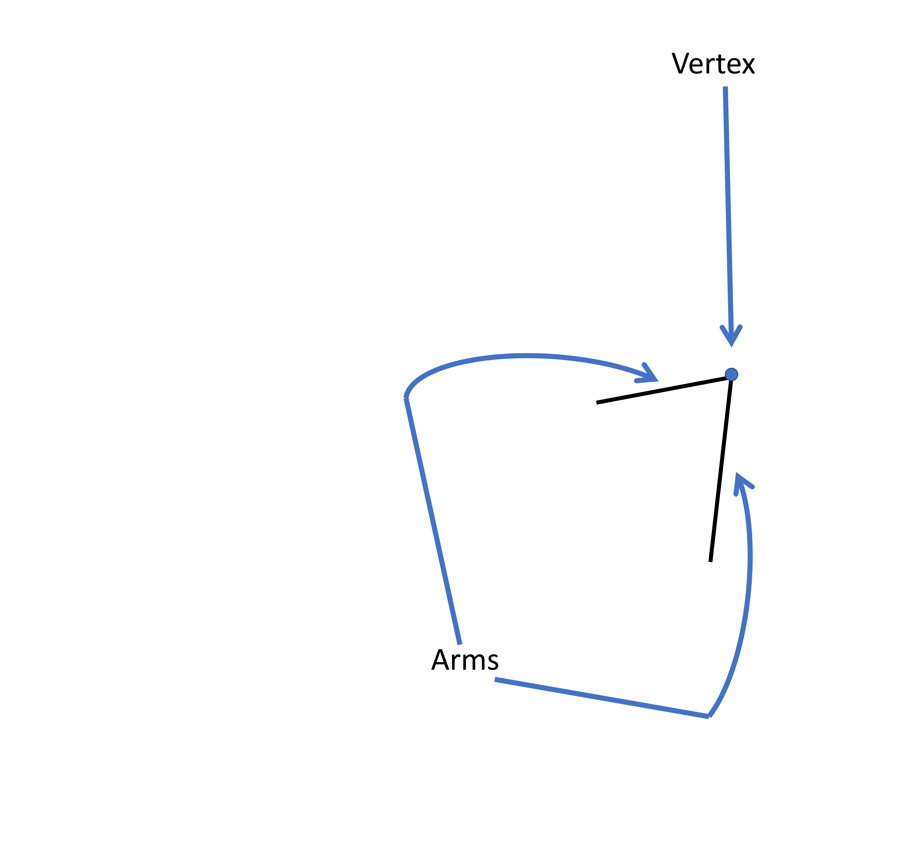
3.9

### Naming angles
We name angles on the basis of the arms and vertex. ∠ is used at the start of an angle name. The given angle is ∠AOB or ∠BOA.
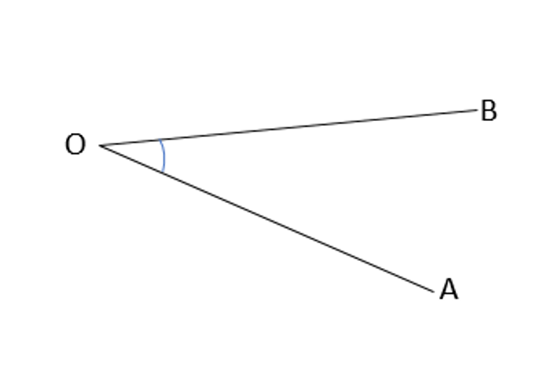
3.10 

The point where the vertex lies are in the middle of the name. AO meets BO to form an angle so O is the common point, it is the vertex of the angle and is written in the middle whereas the other points A and B are written on either side of O. ∠AOB is the same as ∠BOA. The angles are also identified on the basis of the small arc near the vertex O that can be seen in the figure. 
### How can the shape of two objects be compared?
The shape of any object is dependent on the angles forming inside it. 
We are familiar with some shapes like triangles, and quadrilaterals (square, rectangle, parallelogram etc.) 
What is different between a general parallelogram and a rectangle? 
Both of them are quadrilaterals that have opposite sides equal and parallel to each other but they look different when we observe the two shapes.  
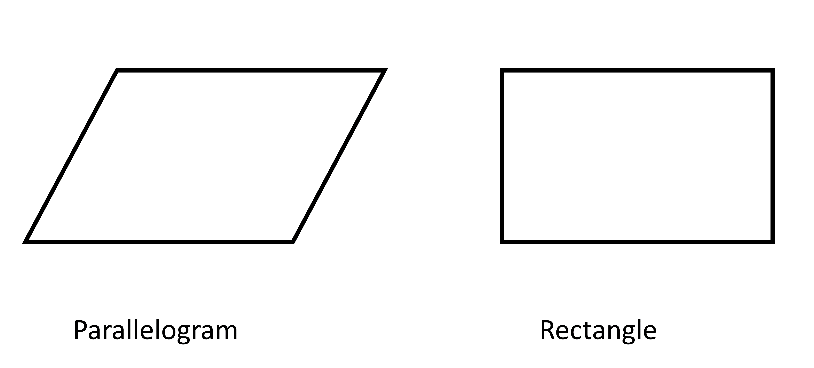
3.11

We can point out many differences but the most important difference is that all angles are equal in a rectangle while only opposite angles are equal in a parallelogram. That is the reason why the angles of the rectangle and parallelogram don’t match each other.

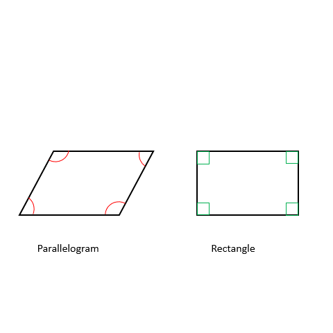
3.12

### How large can an angle be?
We saw by this figure that the angle increases when the arms move more and more away from each other.

3.8

We can analyze the angles from before. We can see that one of them has a wider gap in comparison to the other. 
If we fix one of the arms and rotate the other arm such that the gap between the lines widens more and more, we get to a point where the lines will coincide with one another. 
Let’s try to understand that with the example of a laptop. A laptop has a screen that can be rotated. 

3.13 

When we view it from the side, both the keyboard and the screen seem like two straight lines at an angle. In the image, firstly the screen and keyboard are aligned with each other, then when the screen is first rotated, the angle is lesser. After that, the angle keeps on increasing till they meet again in a straight line from the backside. That is the largest angle that can be formed between two lines. 
The line denoting the screen completes a full circle by rotation. In each measurement system, a particular value is assigned to denote this full circle rotation after which we are able to define how much is 1°, 1c , or 1g. 
In the centesimal system, a circle is divided into 400 parts and each part is 1g. Likewise in a sexagesimal system, a circle is divided into 360 parts and each part is equal to 1°. In a circular measurement system, the full circle is divided into 2π ( pronounced as “two-pi”) parts and each part is equal to 1c. 
360 is the number chosen in the sexagesimal system because 360 is divisible by many numbers such as 2, 3, 4, 5, 6, 8, 9, 10, 12, 15, 18, 20, 24, 30, 36, 40, 45, 60 and so on. This makes it easy to divide the circle perfectly into a certain number of parts as we have a whole number in this system. For example, if we need to divide a circle into two parts, we can take the angle between them to be 360°/2 or 180°. If we would have chosen a standard number other than 360 then the answer might have been in fractions. Likewise, if we divide a circle into 3 parts we know that each part measures 360°/3 or 120°.
Let's take an example; When we need to put 8 people around a circular table, we divide 360 by 8, making each division to be 45°. So each person has to be placed 45° apart from the other. 
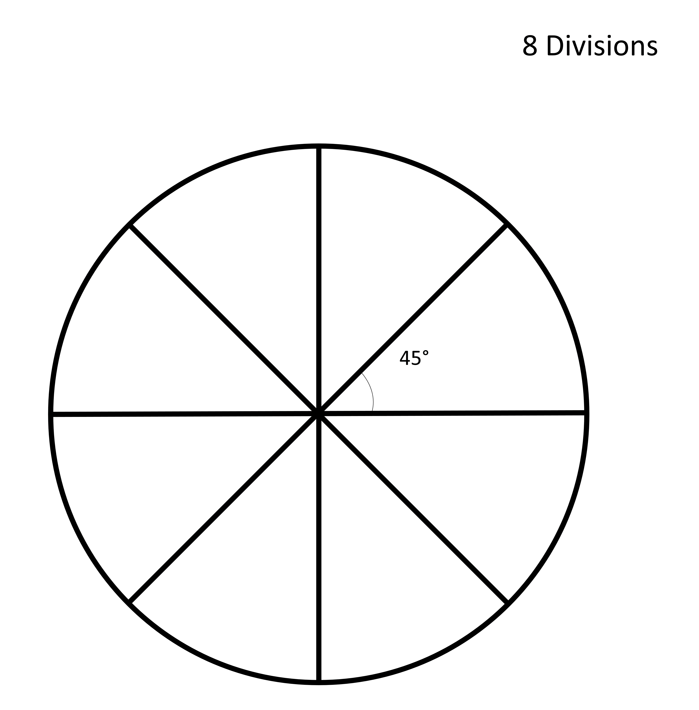
3.14

If we divide 360° into 12 divisions, each angle measures 360°/12=30° degrees. 
Similarly, angles of different measurements can be formed such as 30° can be formed by dividing the full circle angle into 12 divisions. such that 360°/12=30° degrees.
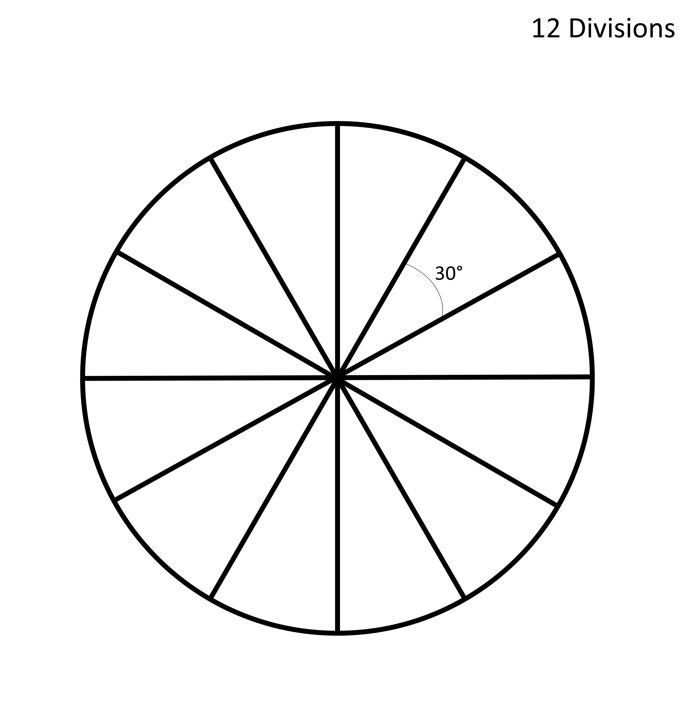
3.15

We can get 60° by dividing a circle into 6 divisions. 
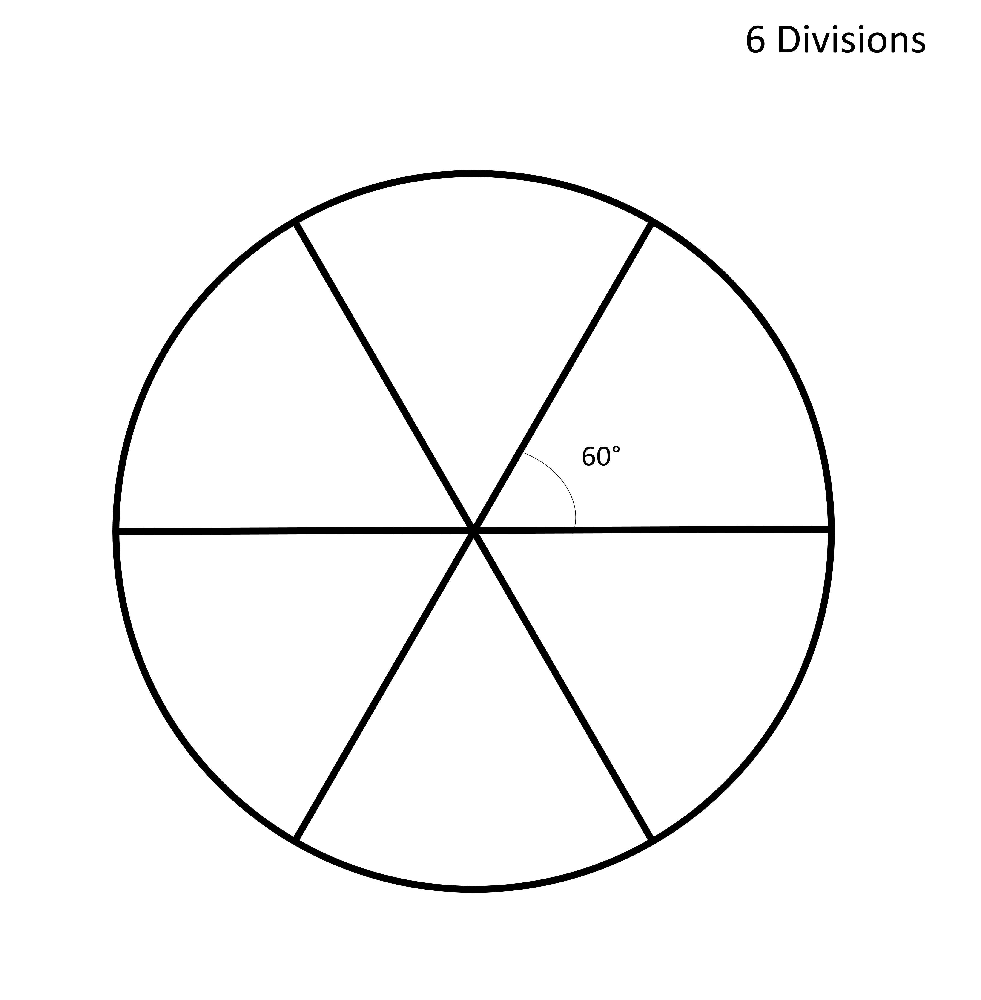
3.16

The same process is repeated dividing the circle into more and more parts so that we can get finally get 1° when we divide the circle into 360 parts. 
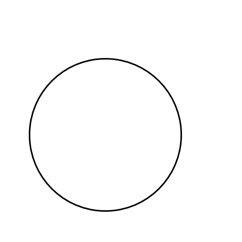
3.17
 