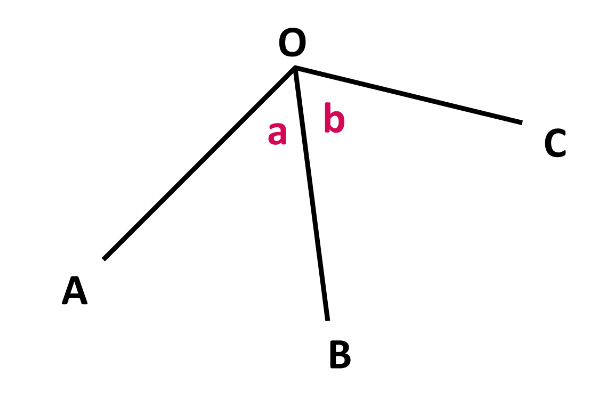
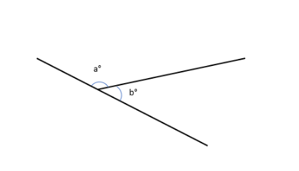
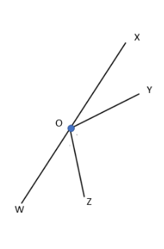
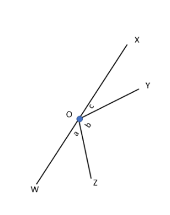
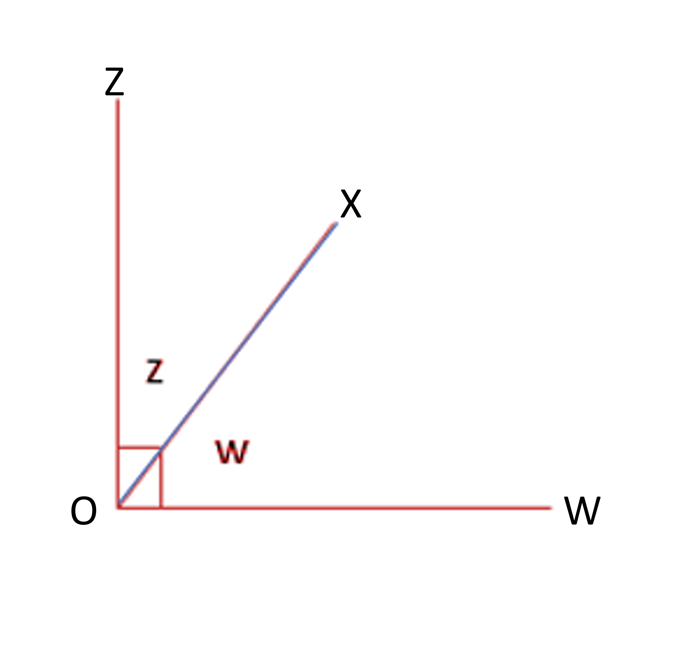
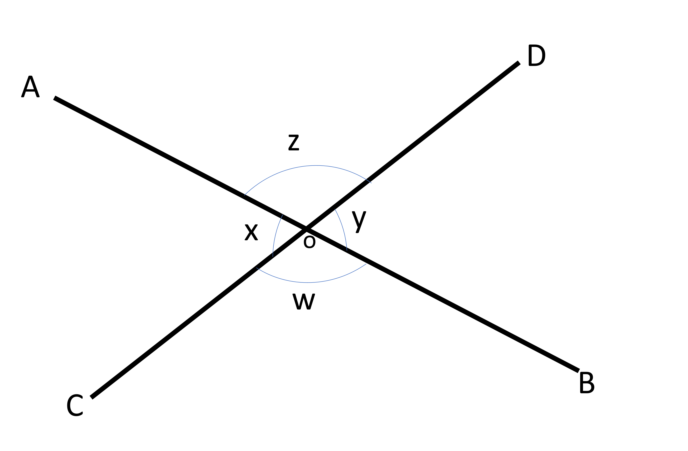

## Relation between Angles
### Adjacent angles
Angles share relationships based onmp the arms and vertex they are formed in. For example, if two angles share one arm and the vertex, then they are known as adjacent angles. In the given figure, a and b are adjacent to each other. They share the arm BO. 

3.32

### Supplementary angles
OB is the common arm and OA and OC are the arms not shared by the two angles. If arms OA and OC form a straight line, then these adjacent angles are called supplementary and the sum of supplementary angles is 180°. 

3.33

Supplementary angles need not always be in pairs. Any number of angles that have their sum as 180° are supplementary angles. 
If we are given two angles that sum to give the result of 180°, then they are supplementary. For example, 35° and 145° are supplementary because when we add them we get 180°. We can also say that 35° is the supplementary angle of 145°. 
If we are to find the single supplementary angle to a particular angle, we have to subtract that angle from 180°. 
In another example, the supplementary angle of 40° degrees is 180°-40° or 140°.
Let’s analyze a group of angles formed in a straight line. 

3.34
 
∠XOY and ∠YOZ share the same arm OY, ∠YOZ, and ∠ZOW share the same arm OZ. The only arms that are not shared between  angles are OX and OW. OX and OW are in the same straight line and a straight line equals 180°. Therefore, ∠XOY, ∠YOZ, and ∠ZOW are supplementary angles. 
If the given angles are denoted by a°, b°, and c°, then 

3.35

a° + b° + c° = 180°

### Complementary angles
If two adjacent angles make up a right angle, just as in the figure,

3.36
 
∠XOZ, and ∠XOW share the same arm OX while arms OZ and OW make 90°.
∠XOZ= z°
∠XOW= w°
Since z and w are both part of a right angle, adding them must give 90°.  
If we are to find the complementary angle of 58°, we subtract it from 90°. 
The complementary angle of 58°= 90° - 58° = 22°
### Vertical angles
Vertical angles are formed by the intersection of two straight lines. The lines make ‘X’ shape and two angles lie on opposite sides of the intersection point. 

3.37

In the figure, we have 4 angles formed due to the intersection of lines AB and CD at point O. 
Here, each angle has one other angle that is directly opposite it. Such angles are called vertical angles or vertically opposite angles. 
In the figure, ∠AOD and ∠BOC are vertically opposite to each other. ∠AOC and ∠BOD are opposite to each other as well, thus they are also called vertical angles. Vertical angles are equal to each other and they come in pairs. 
That means if ∠AOC= 70° then, ∠BOD=70°. 

