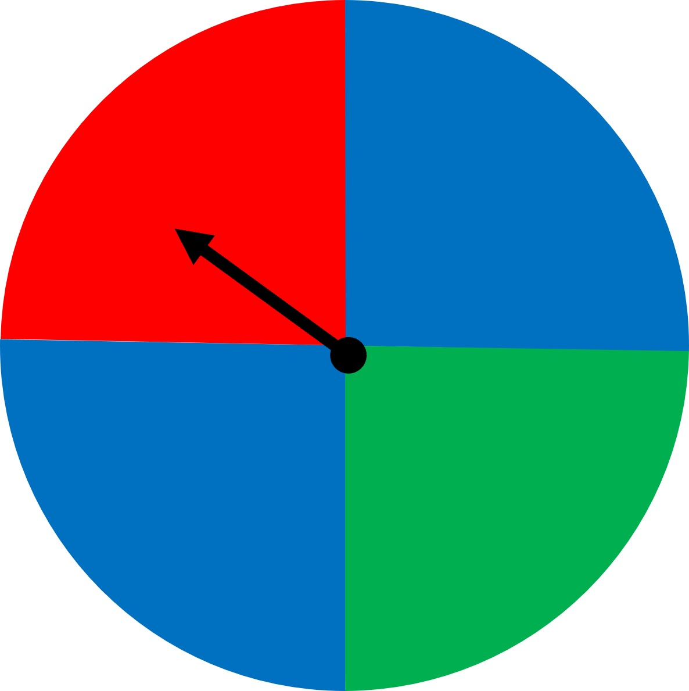
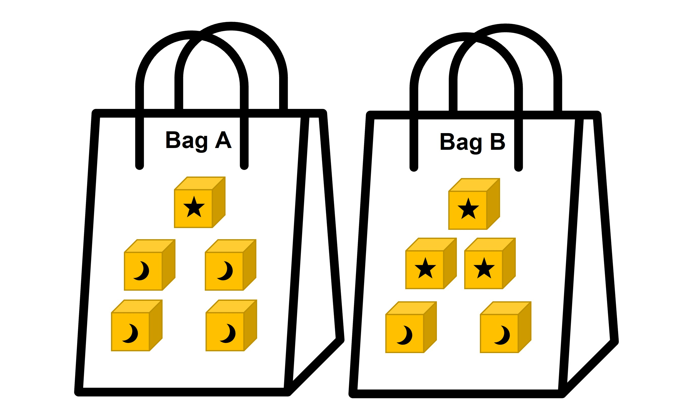
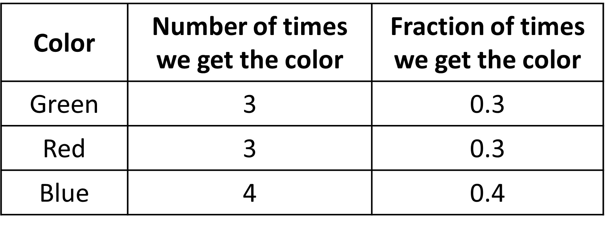
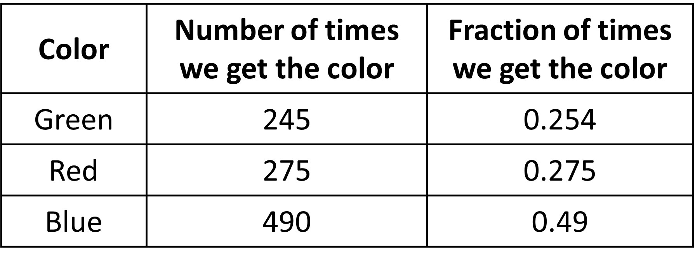
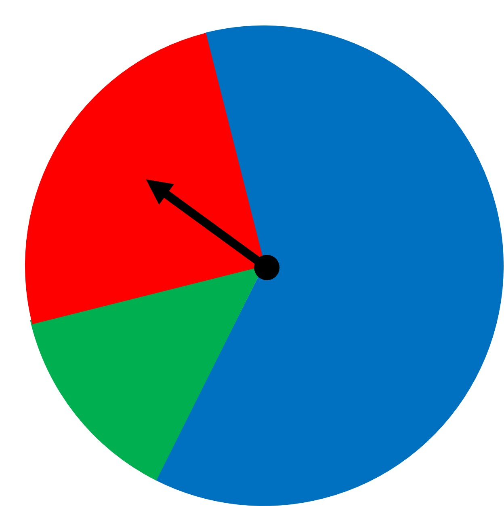
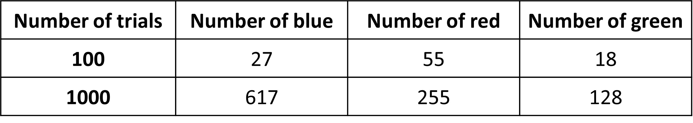
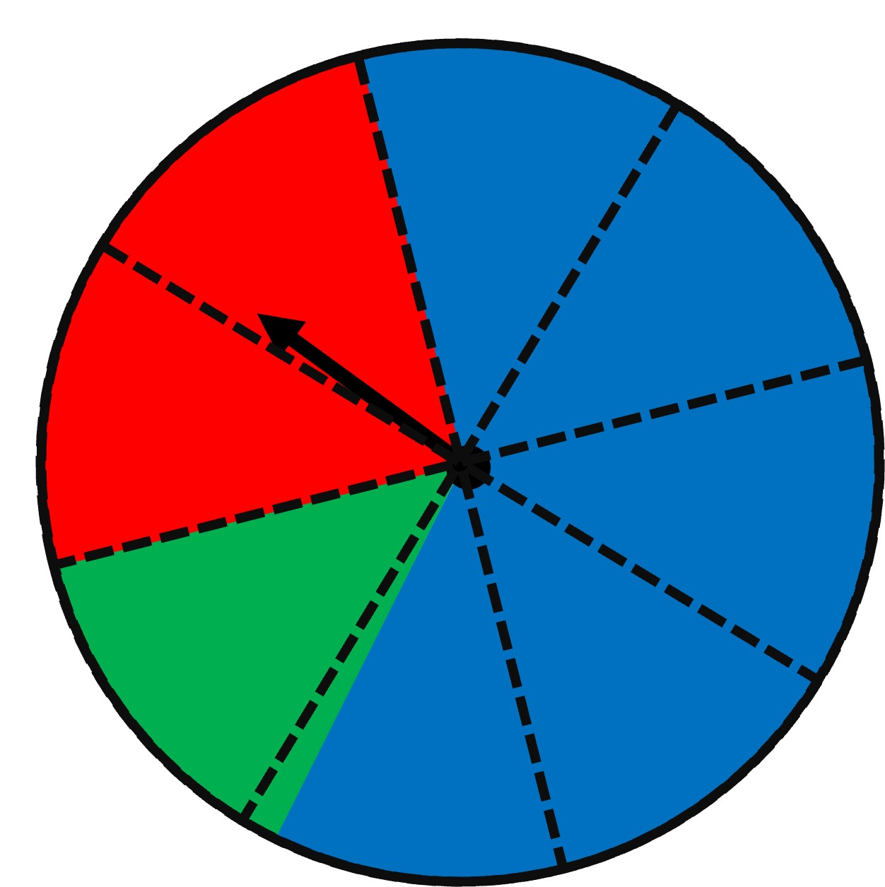
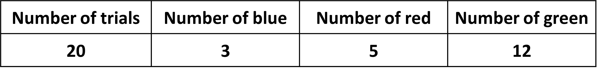
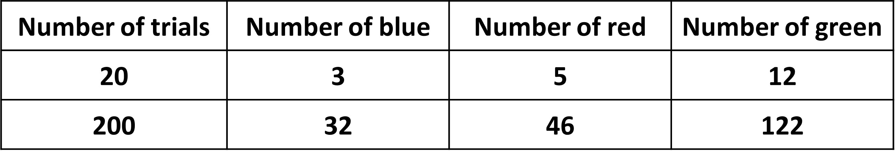

## What is the probability of an event with more than one outcome?

The same theory applies for when we need to find the probability of more than one outcome. Like when we roll a dice and we need to find the probability of getting either 4 or 5 will be 2/6. This is because the possible outcomes are either 4 or 5, meaning 2 and the sample size is 6. So we get the probability as 2/6 or ⅓. 

What if the outcomes were the same? Like two ‘fives’? Let’s see the same spinner example modified a bit and another example to understand that.

Look at a slightly modified spinner below.

What has changed? Well, we see that there are now two sections with blue and a total of 4 is the new size of the sample space. The number of outcomes for the event “blue” is 2. So the probability of the event “blue” is 2/4 = ½ or 50%.

Example two:

Suppose a bag contains 5 blocks with no shapes on them. They are all the same. If we select a block at random from the bag, then the probability of getting any one of the blocks is 1/5. Now suppose another bag contains 5 blocks as well but some of the blocks have a star, and some have a moon on them. If we select a block from this bag, then we will either get a star block or a moon block. The probability of getting a star block depends on how many there are in the bag.

Let’s see two bags with 5 blocks each but different numbers of moon and star patterned blocks. 

In this example, the probability of selecting a star block at random from the first bag is 1/5, because it contains only 1 star block. But what is the probability of getting a moon block? For this, we need the outcome of the moon block, which is 4. And since our sample size is 5, the probability of getting a moon block is ⅘. 

The probability of selecting a star block at random from bag B is 3/5, because it contains 3 star blocks. The probability of getting a moon block from this bag is ⅖, since there are two moon blocks. Easy right? 

This also shows that two experiments can have the same sample size (5 in both cases here), but different probabilities for each outcome. Even though the number of outcomes are the same, the blocks are different, which affects the probability as well. 

## Estimating Probabilities Through Repeated Experiments

Interpreting the meaning of probability - what does it mean by a probability of ½?

Let’s look at our modified spinner:

We calculated the probability of the event “blue” to be 2/4 or ½. 

But what does it mean? Does it mean that if we spin the spinner 2 times, we’ll get the event “blue” one time, or that if we spin the spinner 6 times, we’ll get the event “blue” 3 times (half the time since the probability is ½). Can we say that we always get the “blue” event half of the time?

Let’s do an experiment to see what happens. Let’s test out the spinner 10 times. Here are the results that show the number of times we get the respective colors and the fraction of times we get said colors. The fraction basically gives us the probability (since it is also found by dividing the number of said outcomes (say, blue) divided by the total number of outcomes).

We see that the number of times we get each color is pretty similar, although the number of times we get blue is slightly high. It is still not half though. So can we say that we do not get blue half of the time? Maybe 10 spins are too little?

Let’s spin the spinner 1000 times and count the number of “blue” events. Imagine doing it even a 100 times, quite long right. This is very tedious, so let’s ask the computer to do this.

We can now see that as we repeat the experiment, the estimate of the probability (the third column) for the event “blue” gets close to what is expected from the exact probability of ½ (0.49 is close to 0.5) in the long-run. 

This fraction of outcomes for which the event occurs in the long-run gives an estimate of the probability of the event occurring. For blue, it was 490 times that blue occurs divided by total spins, which is 1000. This gives the fraction that blue occurs as 0.49. Probability computed this way is called empirical probability and it is especially useful when we do not know the sample space to calculate probability analytically (which is our theoretical probability and is 0.5 for blue in this case), like if we did not know that the sample space of the spinner was 4 colors with blue repeated.

However, the outcome for a chance event is not guaranteed and estimates of the probability for an event using short-term results will not usually match the actual probability exactly (due to randomness in each spin). We saw this in the case of 10 spins. Because the number of chance events was only 10, the probability of getting blue out of the ten tries was not similar to ½. 

This is because a probability describes what happens in the long run (like with 1000 spins) but it does not guarantee that the event will occur a specific number of times after any specific number of trials. An event that has probability ½ means that the event will occur about 50% of the time in the long run, but it does not mean that it will occur exactly 50 times when the experiment is performed 100 times (like we say that we did not get 500 blue outcomes when we spun 1000 times). So, a probability for an event represents the proportion of the time we expect that event to occur in the long run.

As we repeat an event more and more (like going from 10 trials to 1000 trials), the empirical probability of the event will approach the theoretical probability. In other words, the more trials we perform, the more accurate we'll be.

This is of course true for other cases as well.

The probability of a coin landing heads up after a flip is ½ , which means that if we flip a coin many times, we expect that it will land heads up about half of the time. Not always half the time but it comes pretty close. 

An additional point to note is that even though the probability tells us what we should expect if we flip a coin many times, that does not mean we are more likely to get heads if we just got three tails in a row in order to compensate for not getting heads for so long. The chances of getting heads are the same every time we flip the coin, no matter what the outcome was for past flips.  It does not matter that we get tails 10 times in a row, it does not increase the chance of getting a tail or a head in the next toss. 

Sometimes, the fraction of time an event occurs may vary a lot from the actual possibility. Some reason for this could be:

The simulation was designed or run poorly. There was some inherent bias towards one particular event. 
Not enough trials were run. Like we say earlier, too few runs of the experiment might not give us accurate results. 

Estimating probability when we do not know the entire sample space 

So far, we have only dealt with situations where all sample spaces were obvious before actually doing the experiment. For instance, in the past, we could see that the spinner has four possible outcomes and therefore the sample space of four. Or when rolling a dice, the sample space was the 6 different numbers. 

Let’s now look at the new spinner. 

Looking at the picture, we do not know the exact sample space. All we know is that the blue area is much bigger than the green and red sections, but we don’t know how much bigger it is exactly.

We could approach such problems by estimating the probability of an event using the results from repeating trials. We can spin the wheel many times and note down the outcomes like we did before. We could then calculate the probability of the event “blue” by finding the fraction of the outcome that resulted in “blue”.

Let’s do that. Below are the observations for 100 and 1000 different spins. As we concluded before, more spins give us a better estimate of probability. 

So, using the 1000 trials answer, we could estimate the probability of the event “blue” to be about 0.6. 

We could make an estimate by looking carefully at the spinner given above. Let’s make some divisions to estimate how much area each color covers. 

We see that red covers about a quarter of the circle, so the probability of getting red is about ¼ or 0.25. Green covers about an eight of the circle, so its probability is about 0.125. Finally, blue covers the most, about 62.5, so the probability of getting green is about 0.625. All of these probabilities are similar to what the 1000 spins gave us as well - 0.128, 0.255, and 0.617. Kind of cool right?

Well, in this case, we could at least see the sample space and make estimates, even if  we did not know the exact sample space. In real life, we come across many situations where we do not know the sample space at all. 

Let’s look at an example. 

We have a bag of blocks that are of different colors. We can’t look into the bag, so we don’t know the sample space. What do you think is the probability of taking out a green block from this bag? 

Just like before, we can randomly draw an item from the bag, record it and put the block back and shuffle. Let’s make sure we don’t look into the bag and take only one block out at a time. We can repeatedly draw items from the bag and look for the patterns in this repetition. Let’s say we did it 20 times and recorded which colo we got as shown. 

Here, 12 out of 20 outcomes were green, so we could estimate that the probability of taking out a green block from this bag is 12/20. If we want a more precise probability estimate, we learnt that we can conduct more experiments.  

Let’s repeat the experiment 200 times and note down the results.  

After repeating the trial 200 times, we can calculate the probability of taking out a green block to be as 122/200 or 0.61. 

