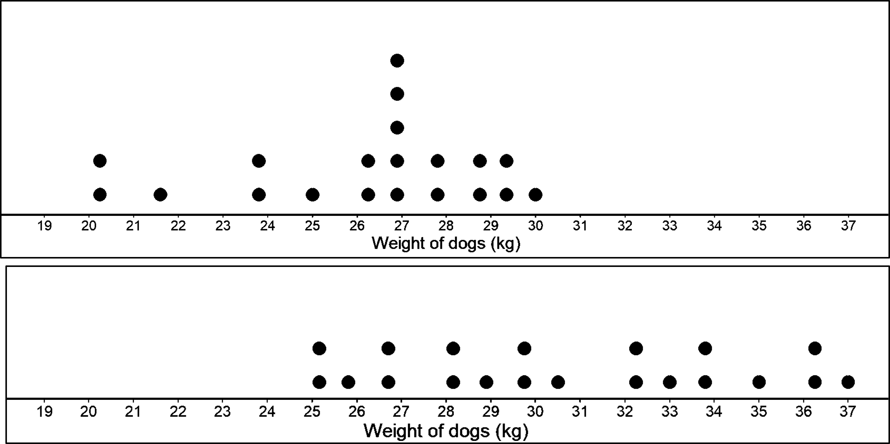
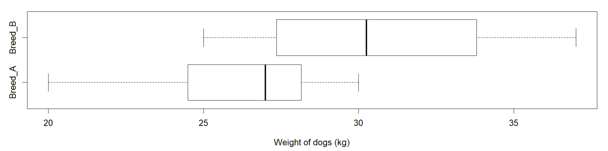
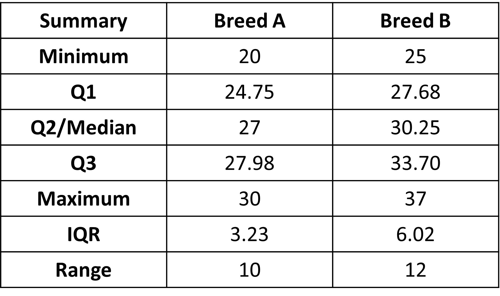
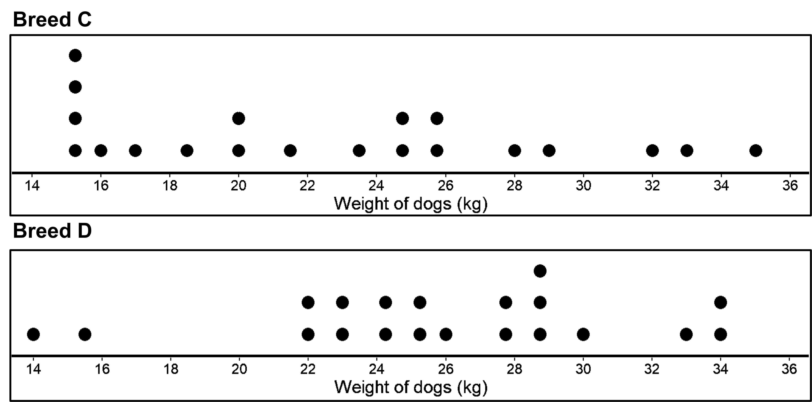
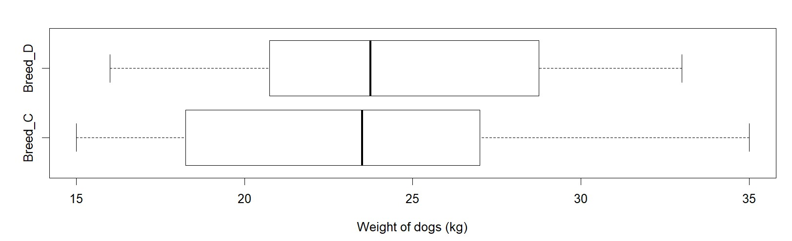
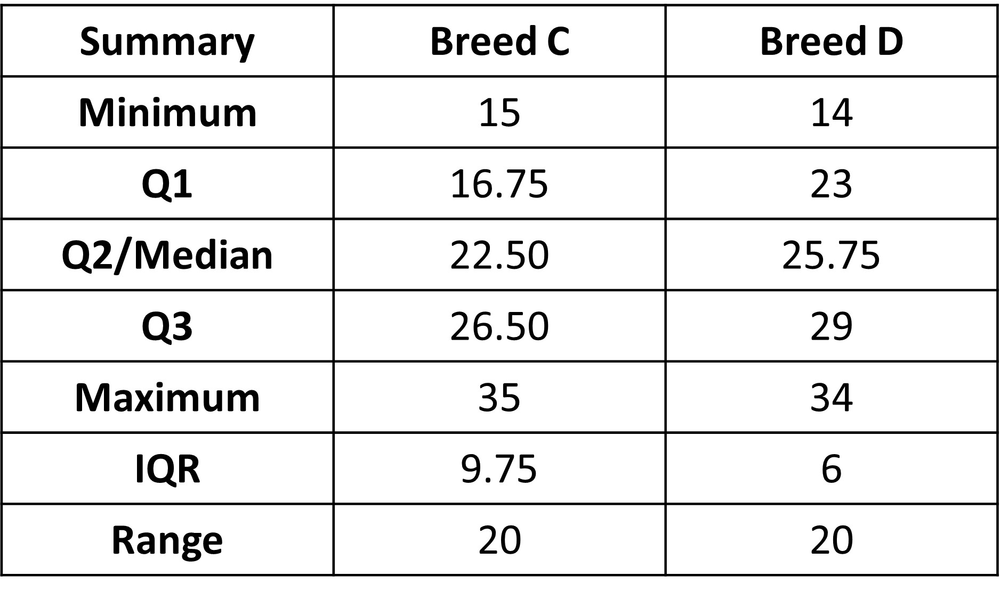
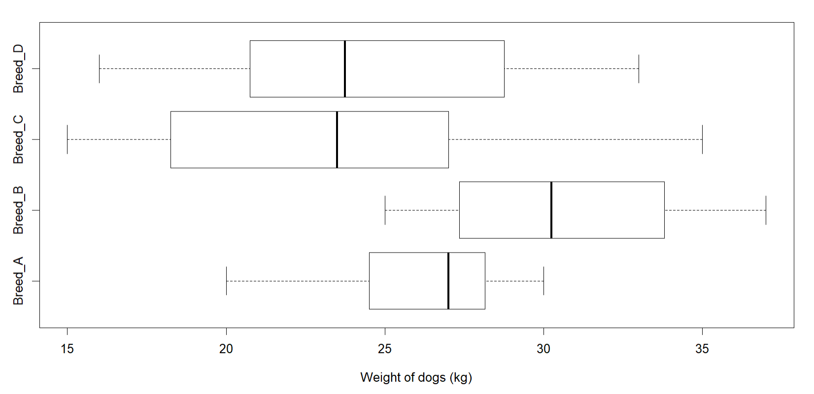

## How do we compare two different groups?

Unlike individuals, comparing groups is not easy. 

Comparing two individuals is pretty straightforward, right? Say there are two dogs and you ask,  "Which animal is taller? The dog or the cat?" It can easily be answered by measuring the heights of two dogs and comparing them directly. 

The same cannot be said for two different groups. Comparing two groups can be more challenging. We cannot simply say dogs are bigger, because there could be some cats that are bigger than dogs.

So what we need to do is to use the distribution of values for the two groups to compare them. We need to look at the similarities and differences between the distributions. Are there areas of overlap and separation on dot plots?

Most importantly, we need to look at the measure of center (mean or median) and subsequently its associated measure of variability (usually mean absolute deviation or interquartile range).  This can help determine the differences between groups.

Let’s look at an example.

Given are dot plots for two different groups of weights for two different breeds of dogs (A and B).  

To compare the two groups, we need to note the similarities in distributions by identifying where the displays overlap. 

We can see that weights overlap between 25 and 30 kg. In case of breed A, 15 weights or 75% of the weights are between 25 and 30 kg. In case of breed B, 10 weights or 50% of weights are between 25 and 30 kg. Those are pretty high values that the two have in common. 

Now, to note the differences between the two, we need to look at the areas of separations in the plots, which we see at the left end for the first plot and in the right end for the second plot (basically, where the two do not overlap). In case of breed A, 5 weights or 25%  of weights are below 25 kg, which is the smallest weight for breed B. For breed B, 8 weights or 50% of weights are above 30 kg, which is the highest weight for breed A. We can use this information to conclude that even though the two distributions have some overlap (between 25 and 30), the data that do not overlap suggest that weights of dogs belonging to breed B generally weigh more than dogs from breed A.

We can also look at the box plots of the two groups to compare. 

We can also compare the 5 number summaries for the two groups along with IQR and Range.

This table gives similar results about the overlap and separation between the two datasets. 
Do note that comparison statements based on box plots cannot be as specific as those based on dot plots, since box plots do not show the individual data values. 

The reason we look at overlap and separation in distributions is because they are important when comparing two or more groups of quantitative data. The more separation there is between distributions, the more meaningful differences between groups are considered to be. 

Comparing the summaries of the two groups, we have: 

Each of the five number summaries is less for A than the corresponding summary for B, so the distribution of weights is higher for B. 
Both the range and the IQR are greater for B, so there is a little more variability in the fizz times for B than for A.

We can also simply look at the medians for the two, which tells us that the median increases from 27 to 30.25 kg. This means that for B, the weight of dog breed’s is typically about 3 kg more than weights for A. 

Let’s look at one more example where the variability is pretty high for both cases. 

Now for the table with summaries:

We can see that the medians for the two breeds C and D have a similar difference as before, of about 3. Both the dot plots and the box plots show little separation between the two distributions. A comparison of IQRs and ranges shows that both have more variability than the distributions for breed A and B. A consequence of more variability is of course less separation between the two distributions. As a result, a difference in medians of 3 kg, which is similar to before, is less meaningful in a comparison to the previous case of breeds A and B.  

This is the reason why only using the medians (and the fact that there is a difference of 3 in both cases) is not enough, since it tells us nothing about the variability of the two sets of data. As we have seen, these different amounts of variability within each group result in more separation or less separation, and thus affect how we judge the importance of the difference between the medians.

In the previous case, we used the median to compare the different datasets. We could have used mean instead, and we would have gotten to the same conclusion ->  that the magnitude of the difference between the means is related to the amount of variability of the data. 

The amount of variability within each distribution is not the only factor that affects how we judge the importance of the difference between the medians or means. Another important factor is the sample size. For example, suppose the box plots and summaries we say before for different weights of different breeds of dogs were based on samples of size 50 instead of on samples of size 20. Because of the larger sample size, the difference between the medians would be considered to be more meaningful for the data. 
Thus, we see that the magnitude of the difference between medians (or means) is a function of both the amount of variability within each distribution and the sample size. 

But how do we quantify this? In a comparison of two quantitative distributions with similar amounts of variability, the magnitude of the difference between centers (medians or means) can be assessed “by expressing it as a multiple of a measure of variability”. What does this mean? 

Let’s use an example to make it clear. 

When comparing medians, we would divide the difference between medians by the IQR. 

In the original data with breeds A and B, the difference between medians is 3.25 kg. Because the weight for breed B has a little more variability than those for breed A, we will use the larger IQR for breed B (6.02) in determining this statistic:

Median(A) - Median(B) / 6.02 = 3.25/6.02 = 0.54

For the second set of data, this statistic is 3.25/9.75 =  0.34

Because the sample sizes for the first pair of data are the same as the sample sizes for the second pair of data and this statistic is larger for the first pair of data, the difference of 3.25 kg between medians, although same for both cases, is more meaningful for the first pair of data.

Although this approach does not take into account sample sizes, this statistic can still provide useful information about the difference. The larger the statistic is, the more meaningful the difference between the centers is. So the first pair of dog weights has a more meaningful difference between the medians. 
