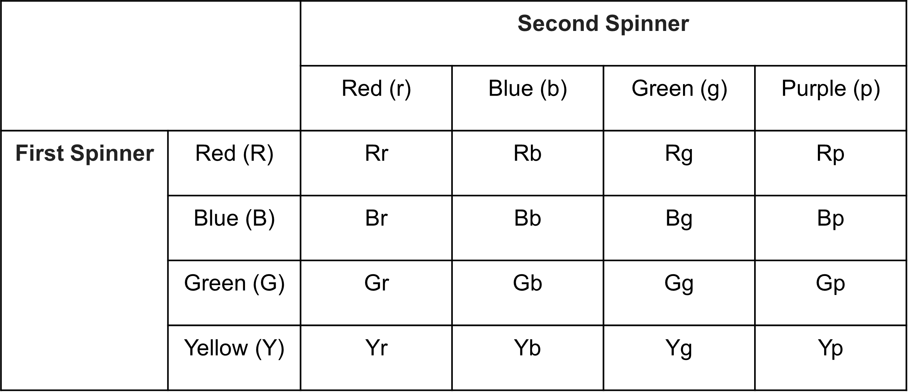

## Compound events and probabilities

All events we have seen so far are pretty simple right? A single event at a time - a flip of a coin, a roll of dice, a spin of the spinner. But such events are not the only ones that exist. We could have two or three or more events occurring one after the other. Like tossing two coins one after the other. What would the probability of such an event be?

First, such events when there are two or more events occurring are called compound events. Some examples are:

1. Flipping a coin twice or flipping two coins.
2. Flipping a coin and then rolling a dice.
3. Spinning two spinners.

So what is the probability when compound events occur? We will start with the simplest example, tossing a coin twice. 

First, like with simple events, what are the possible outcomes in this case?

We could get two heads, two tails, first head then tail and first tail then head. We can also write it as {HH, TT, HT, TH}. This is an ordered list of possible outcomes. We could have done the same for one coin toss - {H, T}. Do note that HT and TH are different since HT means the first flip gave head and second flip gave tails and TH means the opposite. We now have our sample space. 

What is the probability of getting one heads and one tails during the flip? 

First, which outcomes give a head and tail? Both HT and TH since we are not asked for any specific order. So, like with easier events, we can simply find the probability of getting a head and tail by dividing the number of said outcomes by total outcomes (sample size). 
This gives us 2/4 or ½ or 0.5. 

Finding all possible outcomes in this case was easy since we only have 2 outcomes for each flip, which gives us a total of 2 x 2 = 4 outcomes in total. But what about if each outcome was 4 or 6 or even more? Writing them out could get difficult. But we have some techniques to do that as well. 

Let’s look at an example and see how.

Look at the two spinners given below:

Let’s look at the two spinners given below. 

If we spin one after the other, what are the possible outcomes? Each has 4 possible outcomes individually so in total, and we need to pair each of the colors of the first spinner to each color of the second spinner. This means we will have 4 x 4 = 16 outcomes. Before we try writing the ordered list for this, we’ll try a visual method that makes it easier to write.

Let’s start with a simple table first. In the row, we write the colors of the first spinner and in the columns we write the colors of the second spinner. Then we simply fill in the table with the combination of colors in each row and column.

We see 16 different outcomes for spinning the two spinners with 4 colors each. Easy to find it this way right? 

We can now simple use this to write the ordered pair = {Rr, Rb, Rg, Rp, Br, Bb, Bg, Bp, Gr, Gb, Gg, Gp, Yr, Yb, Yg, Yp}

There is one other way to show the outcomes of a compound event. 

This is called a tree diagram. We have branches for each outcome of the first spinner first and for each branch we have 4 more braces which are the outcomes of the second spinner, hence covering all combinations. 

Nice to look at right? 

This is how a tree diagram and a tab;e helps us ensure that we have written down all possible combinations of outcomes, which could get difficult when we just write down ordered pairs. 

Once we have the outcomes, it is easy enough to find the probability of any compound event. Like, what is the probability of getting the same colors after the two spins?
We have 3 possible outcomes of having the same colors - Rr, Gg, Bb. 

So the probability is 3/16. 

We should also keep in mind that getting a green in the first spinner does not in any way affect getting a green or any other other color in the second spin. All outcomes are independent of each other. 

In higher classes, we will learn how to mathematically find such probabilities of compound events without having to draw tables of tree diagrams. 

