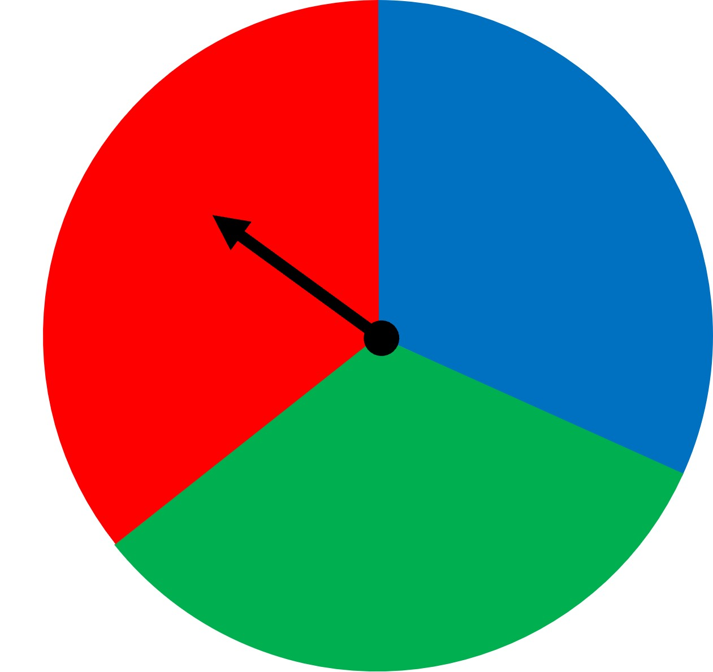
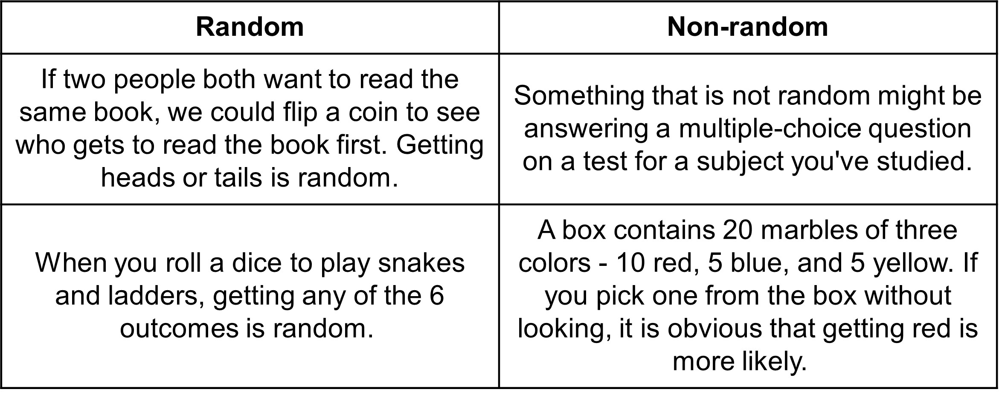

## Chance experiment, outcomes and events

Let’s learn probability in the most basic way first. Flipping a coin. 

When flipping a coin, we do not know if the result or the outcome will come out to be head or tail. Such a situation is a chance experiment, basically something where the outcome is unknown. We do know that it will be between heads or tails but we do not know for sure which one we will get. Heads or tails are the outcomes of this chance experiment. We call this an ‘event’, which is a set of one or more outcomes. 

Now that we know that flipping a coin can give us two different outcomes, can we find out which one we will get?

We can describe the occurrence of the events after flipping a coin as:

Impossible - when there is no possibility of the event occurring at all. When we flip a coin, we know for sure that it won’t give us a number 6. 
Unlikely - when there is a possibility that the event could occur but it is very slim, or like the name suggests, unlikely. When we flip a coin, it is possible for the coin to land on the edge, but we rarely see that. 
Equally likely as not - when the event is equally likely to occur as any other vent out of all the outcomes. When we flip a coin, even though we do not know what the outcome is, it is obvious that it is equally likely for us to get heads or tails. There is no bias towards getting a head. 
Likely - when the possibility of getting the event is likely, a good possibility. When we flip a coin, it is likely that we will get a head or tail.
Certain - when the possibility of getting the vent is sure, completely certain. When we flip the coin, we know for sure that we get an outcome, no matter what it is, there will be an outcome. 

So, we have seen the likelihood of getting different outcomes. Is it possible for us to express the likeliness in terms of certain numbers that we can interpret? This is exactly what probability is. The probability of an event measures the likelihood of an event occuring. Like in the example of the coin flip, what is the measure of getting a head? We say, what is the probability of getting a head when we flip a coin? We will learn how to find this later. 

Because there are so many other situations that provide an outcome, we can find the probability of all such cases. 

Here are a few example: 

Andre and his dad have been fishing for 2 hours. In that time, they have caught 9 bluegills and 1 yellow perch.The next time Andre gets a bite, what kind of fish do you think it will be? What is the probability that it is a bluegill?

There is a jar of marbles of different colors. 12 green and 5 blue. If you are to close your eyes, shuffle the jar and pick one marble at random, what do you think will be its color?

In both of these questions, we have an intuitive idea of what is more likely to happen. We can get a feeling that the next time Andre gets a fish, it will be a bluegill. Similarly, because there are many more green marbles than the red, we’ll most likely pick the green one. 

Probability is the branch of mathematics that deals with questions like these. It studies how likely an event is to occur. Unlike other branches of mathematics, probability deals with uncertainty. And in real life, most things are not certain. So, probability has risen in popularity as the world is becoming more complex and people need to make important decisions under uncertainty. 

Let’s look at what the terms we discussed earlier mean in another context along with some new ideas. 

Have a look at the given spinner with three different colors. If you spin the wheel, what do you think will happen? Where do you think the spinner will point to? We could guess red or someone else could say blue. But in math, we like precision. We don’t just want to say that the red has more chances than the blue, we also want to quantify the chances of each color. This is essentially what probability gives us.

Here, when we spin the wheel, we don’t know what the result will be. Such an act of spinning a wheel is called a chance experiment. Again, a chance experiment is the process of making an observation of something when there is uncertainty about which of two or more possible outcomes will occur. Each time a spinning wheel is spun, it’s a chance experiment.

We know that each possible result of a chance experiment is called an outcome. When you spin the wheel, one possible outcome is “blue”. This chance experiment has three possible outcomes - “blue”, “red” and “green”. Additionally, the set of all possible outcomes is called a sample space. Spinning this spinner has a possible outcome of “red” but neither “yellow” or “heads” is a possible outcome. So the sample space is made up of colors “blue” “green” and “red”.  Earlier, heads and tails made the sample space of flipping a coin.

Sometimes, we are interested in one particular outcome, and at other times we want to know about a set of outcomes. We know that the set of one or more outcomes of interest is called an event and that we can describe events using phrases such as “Impossible”,  “Unlikely”, “Equally likely as not”, “Likely”, and “Certain”. Could you think of the answer to each of these events like we did when we flipped a coin?

Note here that all of the outcomes are equally likely within each sample space. When we spin the spinner, all three outcomes/colors are equally likely. This is because the red, blue and green colored areas in the wheel area are equal. And spinning the wheel is a random process. Random process is a process of doing something so that the outcomes are solely based on chance. If the spinner has some issue whereby the pointer would land on “red” most of the times, then the spinning the spinner would not be a random experiment. 

Another random experiment could be putting the integers 1 through 20 on a spinner with each number in an equal sized section. The outcome of getting any of the numbers is a random process and depends on chance. Same goes for flipping a coin. 

Here are some more examples of random and non-random experiments.

## Measuring likelihood as a probability of an event

We established in our spinner experiment that the likelihood of “blue”, “green” and “red'' is the same. But like we discussed before as well, it is not not enough to only know that the likelihood is equal or that a likelihood of one event is higher than the other. In math, it is important to be precise and have mathematical answers. We want to have an actual numerical value rather than a vague sense of likelihood. To answer how probable/likely an outcome is to happen, we assign a probability.
The probability of an event is a measure of the likelihood that the event will occur. We should know one thing about what the probability could be. When a chance experiment is carried out, we have two possibilities of extreme events occurring. 

Either there is no chance of any event occurring or there is a chance of an event occurring all the time, at every chance experiment.

1. When there is a likelihood of an impossible event or something that cannot occur, we say that the probability is 0. The probability being 0 thus means that there is no likelihood of the event occurring. Like when you flip a coin, the probability of getting a 6 is 0, since we know that it is impossible. 
2. On the other end, when there is a likelihood of a certain event or something we are sure will occur, we say that the probability is 1. The probability of 1 thus means that there is a complete likelihood of the event occurring. Like say you have 5 blue marbles in a box. The probability of picking a blue marble out of the box is 1, since we know that we’ll get blue no matter which marble we pick. 

So, since all likelihood events lie between an ‘impossible’ event and a ‘certain’ event, the probabilities also lie between 0 and 1. 

Additionally, the closer the probability of some event is to 0, the less likely it is and the closer the probability of some event is to 1, the more likely it is. But how do we find these probabilities besides 0 and 1?

We’ll use an example to answer this. We already used the coin flip example, so let’s try one with more outcomes this time - a dice throw.

When we roll a dice, the possible outcomes are 6 numbers -> 1, 2, 3, 4, 5, and 6. The set of all possible outcomes for a chance experiment is the sample space of the experiment. So the sample space for rolling a dice is obviously 1, 2, 3, 4, 5, and 6. 
 
When each outcome in the sample space is equally likely, we can calculate the probability of a desired event by dividing the number of outcomes for which the event occurs by the total number of outcomes in the sample space. Confusing? Let’s try this out using the dice example for it to make more sense. 

In our dice example, the likelihood of getting any of the 6 outcomes is equal. One outcome has no bias over another. If we want to find the likelihood of getting 5, we know that the total of 5 in the sample space is 1. Now, we know that the total number of outcomes is 6 (which is the sample size). So the probability of getting a 5 when we roll a dice is:
Number of outcomes for which the event occurs (Number of outcomes for which 5 occurs) / Total number of outcomes in the sample space 
= ⅙ = 0.1666 = 16.6%

We see that the probability is between 0 and 1 and that we can write it as fraction, decimal, or percentage. Percentage of 16.6% works since 0 and 1 in percentage form is 0 and 100%. 

So the probability of getting 5 when we roll a dice is close to 0, meaning that it is not that likely to get 1 as an outcome, which makes sense since we have 6 total outcomes. This probability is the same for each of the 6 outcomes since the sample space has one of each of the six numbers.  

In case of a coin flip, the same size is 2 (heads and tails) and if we want to find the probability of getting ahead, it will be ½ or 0.5 or 50%! Same goes for getting a tail. Much higher than getting a 5 when we roll a dice. 

In our spinner experiment, the size of the sample space is 3, since we have three possible outcomes. Number of outcomes for the “blue” event is 1, so the probability of the event “blue” is ⅓ or 33.33%.

In general, if all outcomes in an experiment are equally likely and there are n possible outcomes, then the probability of a single outcome is 1/n.

But what does it even mean by “equally likely” outcomes?

You may think that the phrase "equally likely" means there is a 50% chance of it happening. Or maybe something else? What it means is that each outcome is equally likely if the probability does not change even when you change the question to a different outcome when we are talking about the same sample space. For example, think of rolling a dice. "What is the probability you get 5?" has the same answer as the question, "What is the probability you get 2?". The dice obviously does not have a bias towards any one outcome, making any outcome equally likely.  
