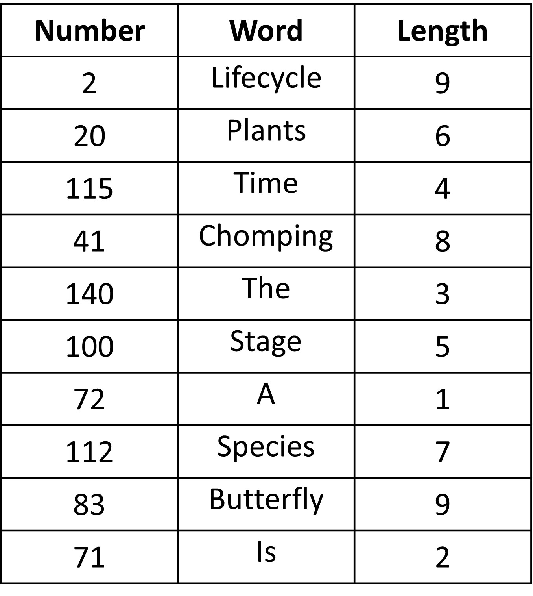
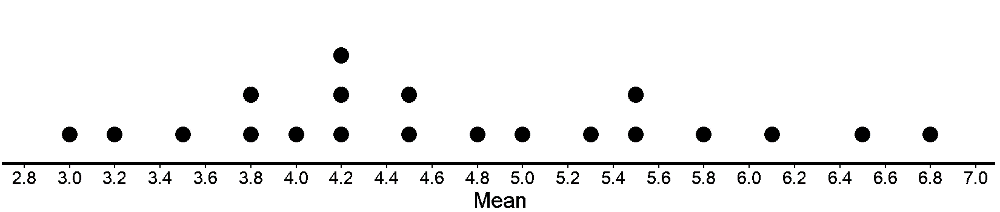
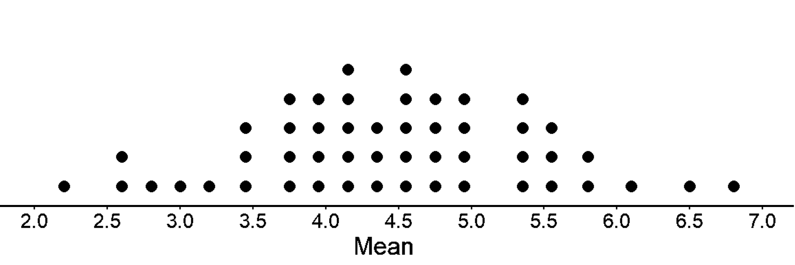
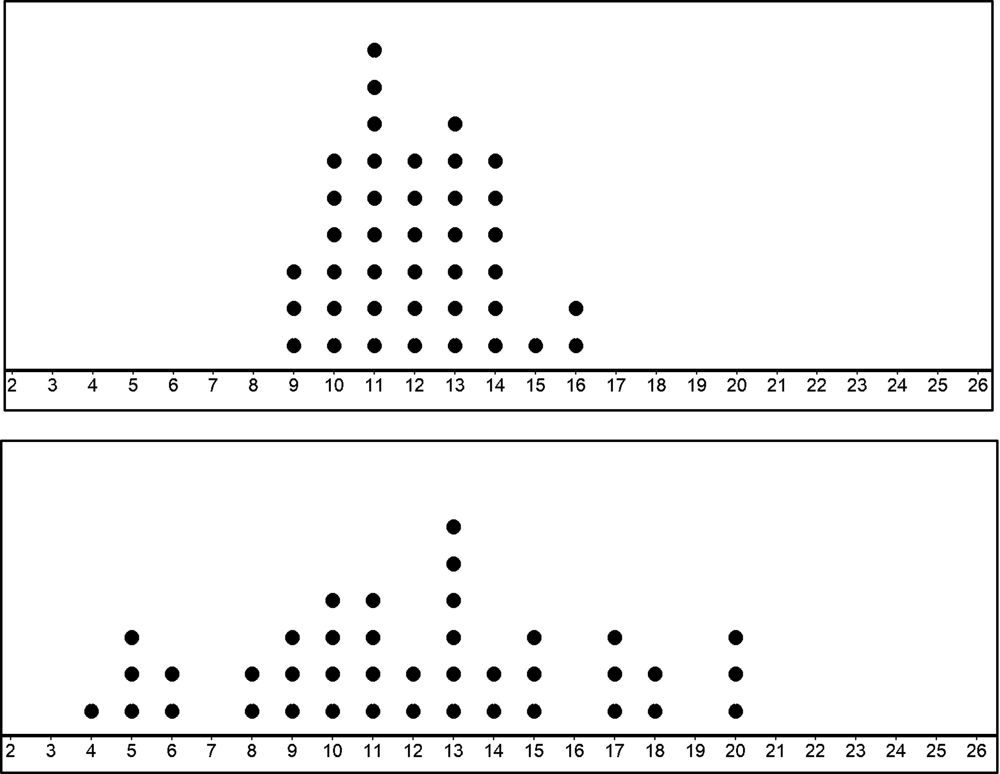
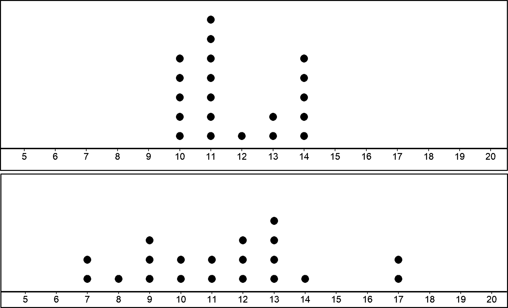

## Generating a (simple) random sample 

One of the ways to select a random sample from a population begins with obtaining a list containing every member of the population and assigning a unique number to each individual in the list. This list is called the sampling frame. This ensures some form of anonymity to the words so we are not tempted to select bigger ones (or intentionally select smaller ones to make up for the bias, which in itself will be a bias).

For instance, if we want to pick 10 words at random from “The Life cycle of Butterfly”, we'll first create the sampling frame. To create the sampling frame, the first word in the paragraph, “The,” would be listed and assigned the number 1; the second word in the address, “lifecycle,” would be listed and assigned the number 2; and so on. The last word, “again,” and the assigning of the number 209 (since there are 209 words in total). So, each word in this list is assigned a number from 1 (the first word) to 209 (the last word). To select a random sample of 10 words, a random number generator on a calculator or a computer can be used to select 10 unique integers between 1 and 209. 

So, does this method pick a sample that represents the population without bias? Let’s see an example.  

Using the random number generator, this is the list we get for 10 random numbers between 1 and 209.

2  20 115  41 140 100  72 112  83  71

Let’s see what the words are for each of the numbers and the character lengths. 

The mean of this sample is 5.4, pretty close to the range for the population (3 to 5). 

Using the same method, 20 students selected a simple random sample of 10 words, recorded the length of each word in the sample, and then calculated the mean for word length. 

We see that most of the sample means are between 3 and 5 character lengths, which is representative of the population. Thus, simple random sampling does not overrepresent (or underrepresent) the number of characters present in the population. This is why simple random sampling is fair and unbiased.

## Does a random sampling always give a representative sample?

Did you also notice that the sample mean changes from one sample to another? We mostly had different means for the 20 different samples. Every random sample is different, so the mean of the sample will also change. If they are different each time, does random sampling always give you a representative sample? 

We have mentioned this before as well - a random sample may not be a representative sample, however, a random selection is still the best method to get a random sample. 
The reason we pick a random sample is that we want to estimate the population mean and variability. And, we want to be accurate when doing so. 

So, what actually affects how close our sample is to the population mean?

Let’s look at them below.

1. Sample size

Does the sample size influence our estimation of the population mean?

In general, as the sample size gets bigger, the mean of a sample is more likely to be closer to the mean of the population. It should be obvious that this is the case since more of the data from the population are represented in the sample. 

Let’s take 50 samples of size 25 and find the means for each of the 50 samples. Below is the dot plot for the mean of 50 samples.

As you can see the spread of the sample means is now smaller and is closer to the population mean. 

2. Variability of the population

Is a random sample better at predicting the population mean when it is drawn from the population with less variability?

Let’s check this with an example. 

The first population has a mean of 12 and MAD of 1.5. The second population also has a  mean of 12 but a MAD of 3.5. Now, let’s draw 20 samples from each population and draw the dot plot with the means for the 20 samples.. 

You can see that when the population has high variability, the distribution of sample means are also more spread out. 

If the variability of sampling distribution is high, you could  conclude that the variability in the population must be high too. If not, the samples drawn from the population would have sample means closer to each other. 

To conclude, for samples of a similar size, the one drawn from the population with less variability is more likely to have a mean that is close to the population mean.

For a high variability population, we can be less confident about the sample mean we calculated from each of the samples due to high variability. However, when we take many samples and we take the mean of the sample means (i.e. the mean of the sampling distribution), then the sampling mean is close to the population mean. 

(Basically, means of all the samples and then the mean of those as well.)

In the previous cases, the two means of the sample means of 20 samples is 11.75 and 11.35, which are pretty close to our population mean of 12!

So, after everything we have done so far, if you did not know about the population mean or variability (or it is too difficult to find since there are a lot of values), how would you be able to estimate it? 

Like we have been doing so far, we could simply take many samples, create a sampling distribution and use the mean of the sampling distribution to predict population mean. 
