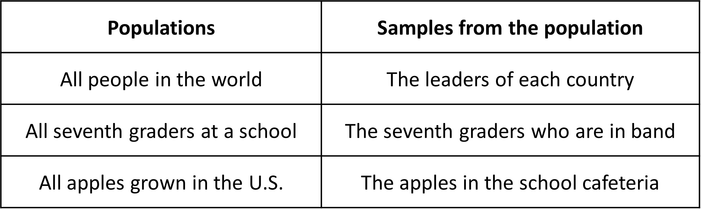
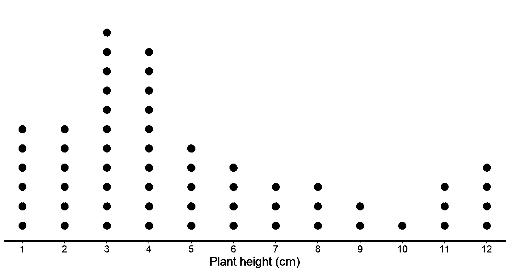
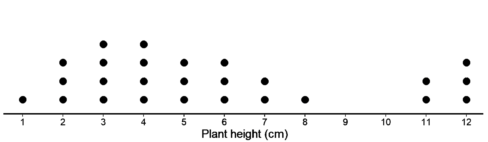
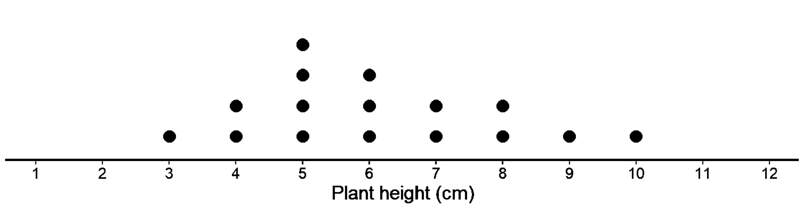

## Sample and population

In all previous examples, we have only used a few countable numbers of data. For instance, we analyzed a dog height for a data set of 14 dogs or cookie weights for 30 cookies. Through graphs (dot plots, histograms, etc) we described the relevant characteristics of the distribution such as the shape, center and spread and we also calculated them numerically. 

However, we might have unknowingly extended our conclusion beyond the given data set to the larger data set. For instance, if the mean weight for the group of 30 pugs were 5.5 kg, then we might have unknowingly concluded that the mean weight of all the pugs in the US is also 5.5 kg. But, are we right to do so? Are we absolutely sure that this is the case? Can we extend our analysis of a smaller data set to make conclusions beyond the data to a larger data set?

It appears that we can and this process of making inferences about populations based on samples is called inferential statistics. 

But what is a population and what is a sample in this case?

A population is a set of people or things or values that we want to study. A sample is a subset of the population we want to study, so it is obviously smaller than the population itself. Basically, a sample is a small group taken out of the population. Here are some examples of populations and samples from the listed populations:

When we want to know more about a population, ideally we would collect data on the whole population. Doing so however will be time-consuming, expensive and often not possible. Imagine weighing all the 90 million dogs in the US! When it is not feasible to collect data from everyone in the population, we often collect data from samples so we can derive information from it and apply it to the population it belongs to. 

Can we draw conclusions about a population by examining any sample?

Here is the given scenario. You are to estimate the average height of adult men in the US. Which of the following processes do you think makes the most sense?

1. You measure the height of 5 men in your family including  your father, brothers and cousins. 
2. You measure the height of 5 basketball teams. 
3. You measure The height of 30 random men walking in the streets.   

Do you think all the above samples generated from the population are good representations of the population? In other words, can we use any sample from the population to answer the questions of our concern about the population? 
We know that basketball players are generally taller than the average population, so this sample is probably not a good representation of the total population of adult men. Same goes for the 5 men from the same family. Maybe the particular family has shorter adult men. Just looking at their heights would not be a good representation of the whole population. 

Or think of other situation as given:
What would happen if you tried to estimate the mean weight of all the dogs in the US by using a sample of 30 chihuahuas? How about estimating the salary of average Americans by taking a sample of software engineers in Silicon Valley. Of course, the conclusions will not be correct because the sample taken is not a good representation of the whole population that matters to us. 

So, how do we take a sample out of a population in the correct way? Let’s learn more about how to pick a sample that can help answer questions about the entire population.

As we have seen, to answer the question about the entire population, we need to pick a sample that is representative of the population. A representative sample is the one that has a distribution that closely resembles the distribution of the population in shape, center, and spread. A representative sample “represents” the population. 

Let’s look at an example to see how the shape , center, and spread of the distribution of a population and sample could be similar. 

Consider the distribution of plant heights, in cm, for a population of plants shown in the dot plot below.

This is the population distribution since it describes the variability in the values of a variable for all individuals in the population.

The mean for this population is 5.06 cm, and the MAD is 2.64 cm. 

If we want to take a sample out of this population that is representative of the population, it should have a larger peak on the left and a smaller one on the right, like this one.  It should also have similar values for mean and MAD.

Which of the two do you think is the best choice?

Clearly, the first one has a distribution similar to our population. The mean is 5.69 and MAD is 2.72, which are pretty similar to the population as well! 

In the second case, the shape looks completely different. The mean is 6.12 and MAD is 1.53, plenty different from our population. 

So, we can look at both the graph as well as the numerical values.

These two are the sample distributions as they describe the variability in the values obtained for a variable by using data in a single sample selected from the population. 
