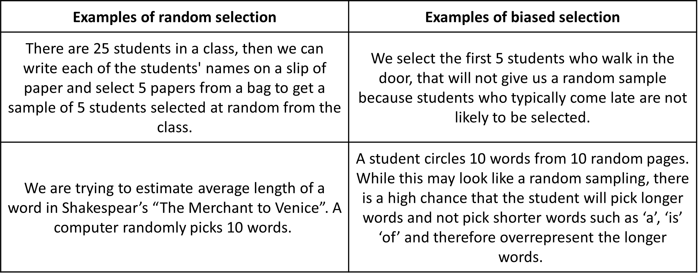
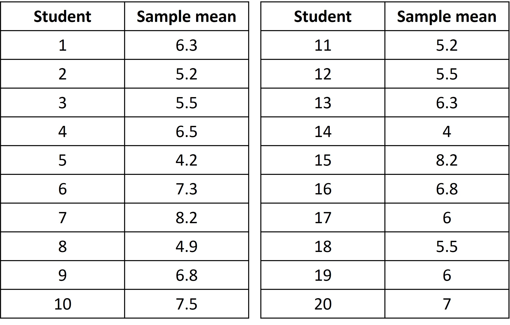
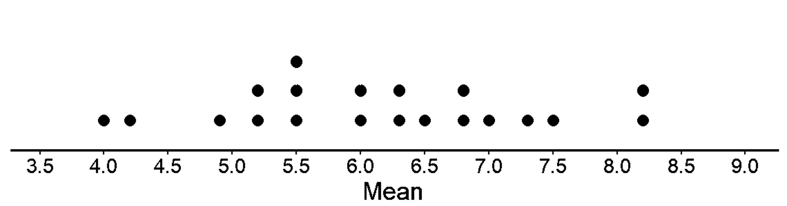

## Using representative sample to answer questions about the population

We now know that a representative sample can be used to answer questions about the population. The obvious question that follows is “How do we pick the representative sample”? Picking out randomly or from a certain group did not seem to work out since they are not representative (the adult men and dog weight examples). 

You might be thinking there must be some crazy sophisticated procedure to select a representative sample. Surprisingly, the most effective way to pick a representative sample is one of the simplest. Randomness! Obviously since we choose randomly, it’s called random selection. 

So what does random selection entail and what does it actually mean?

1. A sample is said to be selected at random from a population if it has an equal chance of being selected as every other sample of the same size. 
2. In simple random sampling, each individual in the population also has the same chance (probability) of being selected. 

Thus, simple random sampling provides a fair way to select a sample. 
It’s kind of a mouthful, but what it’s saying is that if you pick a sample without any bias for any particular values, it’s likely to be a representative sample of the population. 

Say you want to pick five of your friends to go to Disney World out of 20 friends. To be completely fair, you would write down their names on pieces of paper (of the same size), fold them, put them in a bowl, and shuffle them. You’d then close your eyes and pick five of the names. This small sample is representative of the population, which is your friend group.  If you shuffled it again and picked 5 names from it, the chance of picking these new 5 names is the same as picking the previous 5 names. This is what the first point means. There is an equal chance of selecting any sample of the same size. Since all pieces of paper are the same size and we do not know which name is written in which paper, there is an equal chance for any name to be picked. This is what the second point means. 

Most other methods of selecting a sample from a population are likely to be biased/unfair (inclined towards a particular value). This means that it is less likely that the sample will be representative of the population as a whole. A sampling method is biased if it tends to produce samples that systematically over-represent or under-represent various features of the population. A sample that is selected at random may not always be a representative sample, but it is more likely to be representative than using other methods.

Given are some examples of random sample selection along with other sampling methods with bias. 

Say you want to find the average length of words in the description of ”The Life cycle of a Butterfly”.

The lifecycle of a butterfly starts when a female butterfly lays her eggs, usually on leaves or stems of plants. Inside these tiny eggs, caterpillars grow. Once ready, the caterpillar eats its way out of the egg and immediately starts chomping on the leaves of the host plant. During this stage, they shed their skin four or five times. Once fully grown, the caterpillar forms itself into a pupa. It is a kind of vessel in which the caterpillar changes into a butterfly. They usually do this on twigs or safe, hidden areas around the host plant. The pupa stage may last a few weeks to several months depending on the species. During this time, a hardened case forms around the pupa to protect it from predators and extreme weather conditions. And inside, the tissue, limbs and organs of the caterpillar transform into a butterfly. Once the butterfly is ready to emerge, the case around the pupa splits open. The wings are at first wet, soft, and wrinkled against its body. Once fit for flight, this brilliant bug then takes to the air in search of flowers to feed on and for other butterflies to mate with. And that’s the cycle complete and ready to start all over again!

[The butterfly life cycle! - National Geographic Kids](https://www.natgeokids.com/uk/discover/animals/insects/butterfly-life-cycle/)

Suppose that one student selected the following 15 words: 

inside   starts   or     	host 	hardened     	predators     	caterpillar        	wrinkled       	safe 	stage   few  	butterfly       	flowers         	conditions    	the

Let’s see the length of each word. 
6	6	2	4	8	9	11	8	4	5	3	9	7	10	3

The mean word length for this sample is about 6.3 characters. 

All the students then recorded the length of each word in their samples as well. Each sample has 15 words selected by each student. 

Next, let’s make a table for the results on the means from about 20 different samples (from 20 different students). 

Let’s create a dot plot for the 10 means from the table to see the distribution.

This sample to sample variability that we see (variability in mean in this case) is called the sampling distribution (do not confuse this with sample distribution). But it is a sample distribution only when all possible samples of the same size have been taken from the population. That would be a lot (Extremely high) of samples to look into. So, we have chosen only 20 samples from the population above. When we approximate the sampling distribution on the basis of the selection of a number of samples, this approximate sampling distribution is called an empirical sampling distribution.

This dot plot shows us that even through the different (20) samples were taken from the same population, there is variability among them. The means are all located between 4.0 and 8.2 characters. No two sample means differ by more than 4.2 characters, the shape of the sampling distribution appears to be pretty close to symmetric, and its center appears to be around 6.0 characters.

In this case, since we have the paragraph, we can count the frequencies of each word and check how many words there are with different numbers of letters. It seems like most words are between 3 to 5 characters in length.

Our mean from sampling 20 times came out to be about, higher than the actual case. 
Thus, longer words are overrepresented in the sample selected by most of the students. This is probably because most students selected samples that tended to overrepresent longer words, even though it looked like the sampling was random. Human nature to select large words. Such a sampling method is biased since it tends to produce samples that overrepresent words with more characters. 

The sampling method employed in this example might be called subjective selection, since students simply selected samples on the basis of their subjective opinion about how the word lengths varied within the population. This example illustrates that people, left to their own devices, are generally not good at selecting samples representative of the population, even when we think that the selection is random. Some kind of bias usually gets in the way. 

It is not always possible to select a sample at random, even when it seems like it should be random. For example, if we want to know the average length of wild salmon, it is not possible to identify each one individually, select a few at random from the list, and then capture and measure those exact fish. When a sample cannot be selected at random, it is important to try to reduce bias as much as possible when selecting the sample, even though it is not perfect.
