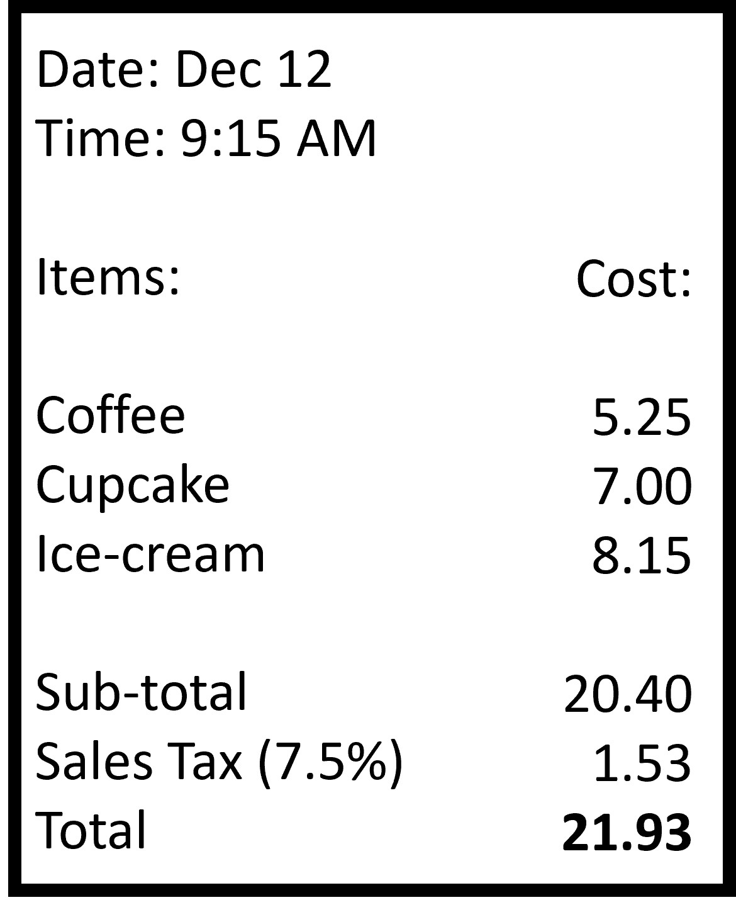

## Percentage contexts Part I : Sales Tax and Tip

We have already seen multiple real life examples of percentages already. They are pretty abundant everywhere (like in your report card). In this chapter and the next few ones, we will look at some specific real life percentage contexts that will come in handy in your everyday life!

### Sales Tax

Let's start with sales tax.

The state of Florida charges a sales tax of 6% to any item bought within the state. 
If a customer buys a pair of shoes marked 15.50 dollars, what is the final price that they pay?

This tells us that 6% of the original price is the additional price that needs to be paid. 

6% of 15.25 = 0.93 dollars or 93 cents

This is the extra sales tax that needs to be paid in addition to the marked price of 15.50 dollars. If asked the sales price, we simply find the percent of original like we just did, but if asked for the total price, we add this sales tax amount and the original to find the overall price, 15.50 + 0.93 = 16.43 dollars! We can think of this as a percent increase.

So what exactly is sales tax? A sales tax is an amount of money that a government agency collects on the sale of certain items. 6% mentioned above in the case of Florida. It could be any percent based on the decision made by the government body. 

The tax is given as the percentage of the original cost of the item. Like how the 6% tax was applied to the cost of the shoes, 15.50 dollars. This means that higher the cost of an item, more is the sales tax. Quite a bummer right? 

If say a state has a sales tax of 2.5%. You buy a TV for 750 dollars and a t-shirt for 25 dollars. 

Sales tax on TV = 2.5% of 750 = 2/100 x 750 = 18.75 dollars
Sales tax on t-shirt = 2.5% of 25 = 0.625 dollars

The difference is huge! So, higher the cost of an item, more is the sales tax. It isn't like all items have the same sales tax of say 5 dollars. It clearly depends on the cost of the item, as seen. 

To summarize:
Sales tax is added to the cost of items.
It is a percentage of the cost of an item.
It is paid by the customer.
It goes to the government.

### Tip

Ever gone to a restaurant and left a tip or seen someone else do it? Why do we do that? And what is it?

Melina went to a cafe and ordered a cupcake, coffee and ice cream. Her total bill is given as shown (with the service tax of 7.5% added).

Melina gets a total of 21.93 dollars as her final amount to be paid to the cafe. She decides to leave a 10% tip to the cafe. How much did she pay overall?

We already have her final amount. We simply need to add the tip amount of 10%. But 10% of what exactly? Probably the final amount right? 

So, using this, the final amount Melina pays is 21.93 + 10% of 21.93.

21.93 + 2.193 = 24.123 dollars! 
2.193 dollars is the tip amount paid by Melina. 

A tip is essentially an amount of money that a person (usually a customer) gives someone who provides a service. Here, Melina is receiving a service from the server and the cafe. 

It is common in many restaurants (usually in western countries) to give a tip to the server that is between 10% and 20% of the cost of the meal. This is why we took 10% of Melina’s final cost in the cafe. The final cost is simply (100% + tip percent (say 15%) ) of the final cost shown in the bill. Or simply 115% of the cost shown in the bill. 

To summarize:

1. Tip is added to the cost of the service received (usually the meal).
2. It is a percentage of the total cost of service. 
3. It is paid by the customer.
4. It goes to the server/establishment.

Let’s get more familiar with the idea of tip and sales tax with a few questions!

## Percentage contexts Part II: Markup and Markdown

### Markups

Moving on to other types of percentage problems, we will now look at markups and markdowns. 

A car dealership sells a vehicle at a price of $12,000. The dealership also wants to make a 32% profit on this amount. How much do you think is the marked price and the final price of the vehicle?

The dealership wants to make a 32% profit, but where do we apply this percentage to?
The profit is earned on the price marked for the item, the vehicle in this case. 
So, the profit the dealership ears or the marked up price = 32% of Price of vehicle
= 32% x 12000
= 32/100 x 12000
= 3840 dollars!!

That is a large amount of marked up price/profit earned on a vehicle. Imagine selling 10 of these with the same marked up percent, you will earn 38,400 dollars in just profit!
The total cost of the vehicle will now be the original price added to the markup roce, 12000 + 3840 = 15840 dollars, which needs to be paid by the customer. We see that a markup problem is a percent increase problem. 

So, a markup is simply an increased value added to the price of an item so that the dealer can earn a profit on selling the item. It is a certain percentage of the cost of the item and is paid by the customer and goes to the seller. 

### Markdowns

Let’s expand the example to understand markdown.

During the holiday season, the dealership offers a 10% discount off of the retail price of the vehicle. How much discount was provided for the vehicle? After the discount, how much will a customer pay for this vehicle?

You’re already familiar with discounts right? It is probably the most common example of percentage being used in everyday life. 

To find the discount value, we simply use the discount percent. It is 10% of the sales price, which we found to be 15840 dollars. 
Discount amount = 10% x 15840 
= 10/100 x 15840
= 1580 dollars

A pretty decent amount (but much lower than the profit gained!)

The amount that needs to be paid by the customer is the price of the vehicle minus the discount amount, 15840 - 1584 = 14256 dollars. We thus see that a markdown or discount problem is simply a percent decrease problem! Easy right?

So, a markdown/discount is simply a decreased value subtracted from the price of an item so that the customer is incentivized to buy it. It is a certain percentage of the cost of the item and is provided to the customer, meaning they get this percent as the reduced price from the item. This means that the seller has to bear the amount or the loss. 

In both cases, keep in mind to either add or subtract the markup and markdown values if asked for the final price in the question. Just the percent of cost price will not be the final price of the item. 

## Percentage contexts Part III: Interest

Let’s now look at another common use of percentage - simple interest!

To understand this, we first need to understand how a bank works. 

A bank is a financial institution that is included in lending and borrowing money (in simple terms). A customer deposits money in the bank because the bank gives the customer some amount in return. This is because the bank is now able to use this deposited money to give out loans to other people. What you keep in the bank is the ‘deposit’ and what you take from the bank is the ‘loan’. Why does the bank give out loans? The same reason a customer deposits! They also get some money in addition to the loaned out money from the customer who took out the loan. 

You can see this in the animation given below.

How does the bank decide to give the extra money to the depositor? It is some percentage of the original amount deposited. This deposited amount is the principal amount and the extra money that is the percent of the principal is the interest. 

The same applies to loans. The amount taken out as loan is the principal and the bank charges some interest, which is the percent of the principal loan amount. 

Example: The bank gives an interest of 5% to anyone who deposits money in the bank for 1 year. If Sarah deposits $500 dollars, how much interest does she get after a year?

Interest = 5% of 500 = 0.05 x 500 = 25 dollars

The total amount she gets back is 500 + 25 = 525 dollars.

If she deposited the money for 5 years, we would simply multiply the interest by 5 to get (5% of 500) x 5 = 25 x 5 = $125.

## Percentage contexts Part IV: Commision 

Say you are a salesperson in a car showroom. Your job is to be able to sell cars to customers. You get your monthly income for the job, but your showroom also provides an additional incentive. 

For every car you manage to sell, you get some money which is the percent of the cost of the car. This amount is called the commission that you get for selling each new car. 

Many companies do this to ensure that the employees are selling as many units of product as possible. 

Say you managed to sell 5 cars in the month of January. Each car cost about $45000. You have been told that for every car sold, you get 5% of the cost of the car as your commission. 

How much commission did you get?

Simply find the percent of the cost of the car and multiply by 5 (for 5 cars) -> (5% of 45000) x 5 = 0.05 x 45000 x 5 = $11250.