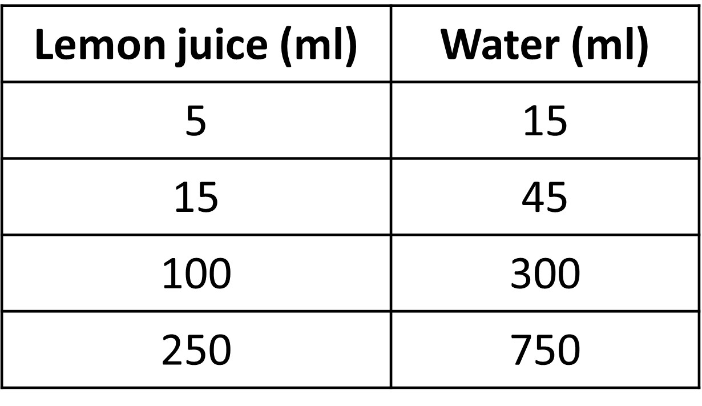
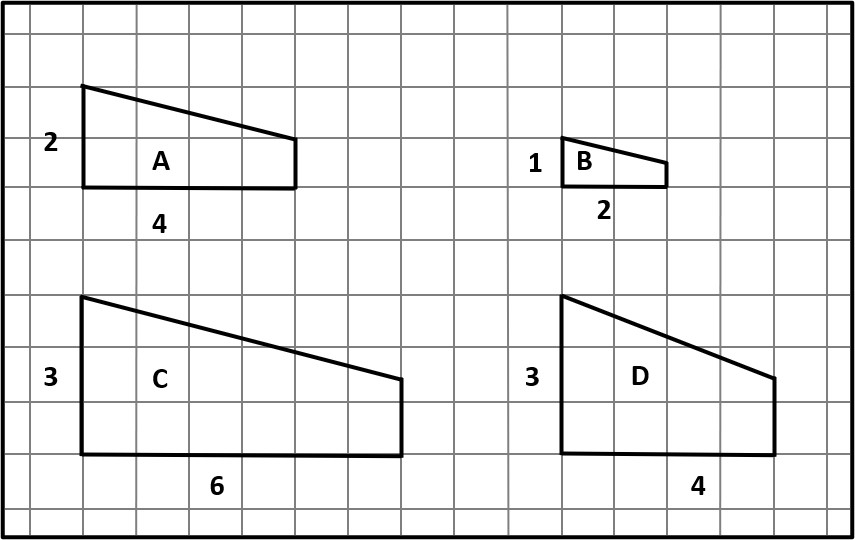
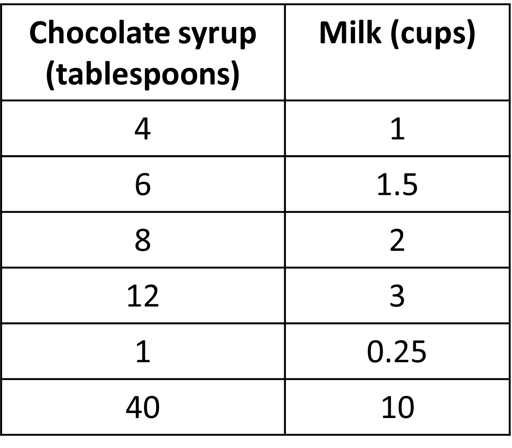
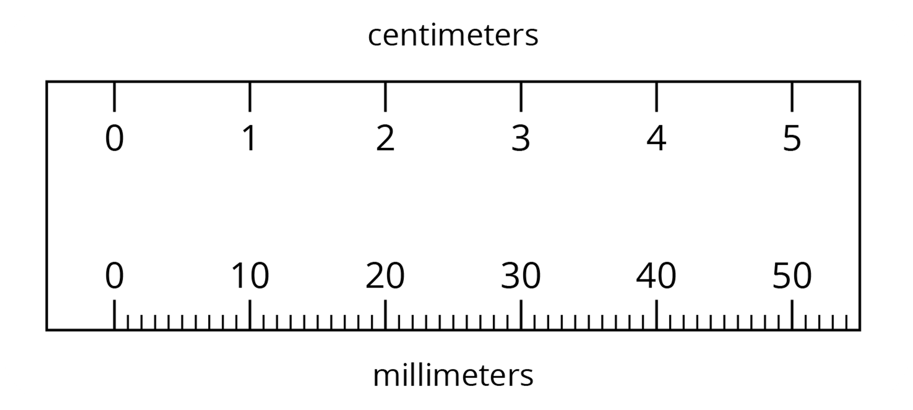
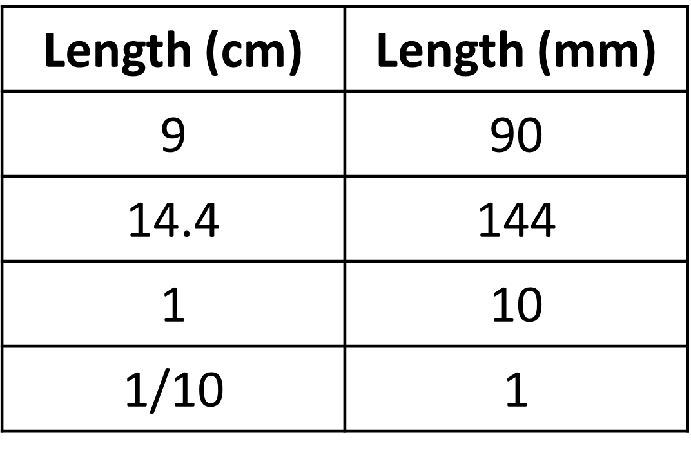

## What is proportionality

In grade 6, we have already gotten familiar with the idea of equivalent ratios. They are simply ratios between two or more quantities that give us the same relationship. We get one equivalent ratio from the other by simply multiplying all quantities included in the ratio by the same number. For example, 2:3 when multiplied by 4 gives us the ratio 8:12, which is equivalent to 2:3. Here, we multiplied both 2 and 3 by 4. 

An example of equivalent ratios in real life is that of a recipe. If you use lemon juice and water to make a certain taste of lemonade, then the taste will continue to remain the same as long as the ratios of lemon juice to water are equivalent for all recipes. All ratios in the given table are equivalent and will give the same taste of lemonade.

If we had a ratio, say 15:40, the taste would not be the same as this ratio is not equivalent to all the ratios given above.

Let’s look at one more example of equivalent ratios before we move on to a new idea regarding equivalent ratios. 

Look at the four images given in a grid below.

If we take the ratio of length to the height of each of these, we see that the ratios of length to height of A, B, and C are equivalent. When we have images like these, we call them scaled copies. This will be more important when we study similar figures in geometry. Image D is not a scaled copy of the others since the ratio of length to breadth is not equivalent. 

Moving on, we have seen how equivalent ratios means that the two situations have something in common, and have the same relationship between quantities. If we have infinite such ratios and they are all equivalent, meaning that the ratio between the quantities is always equivalent, the relationship is called a proportional relationship. Let’s look at an example to understand this better. 

The given table gives different amounts of milk and chocolate syrup to make hot chocolate. 

While each row gives a different amount of hot chocolate, the taste in each case is the same. 

If the relationships between the syrup and milk remains the same throughout, we can describe this in multiple ways:

+ The relationship between the amount of chocolate syrup and the amount of milk is proportional.
+ The table represents a proportional relationship between the amount of chocolate syrup and amount of milk.
+ The amount of milk is proportional to the amount of chocolate syrup.
+ The amount of chocolate syrup is proportional to the amount of milk.

To get the amount of milk, we can multiply the amount of chocolate syrup by ¼. Similarly, to get the amount of syrup, we can multiply the amount of milk by 4. ¼ and 4 are both unit rates. ¼ is the unit rate because ¼ cups of milk is required for 1 tablespoon of syrup and 4 is the unit rate because 4 is the tablespoons of syrup needed for 1 cup of milk. Unit rate is simply one quantity when the other is taken to be 1. 

This unit rate is also known as the constant of proportionality, since this value is constant for all cases. We have two of these here, ¼ and 4, and will learn more about them later. 

One final thing to remember is that in case of proportional relationships, increasing one increases the other quantity as well and in the increase is the same amount. Similarly, decreasing one quantity by, say 4 means that you decrease the other by the same amount. You can see this in the image below. Gif 39

Let’s move on to the two constants of proportionality that we saw earlier for the same case of equivalent ratios. We will take an example of unit conversion between centimeter and millimeter for this. 

We know that there is a proportional relationship between lengths measures in cm and the same length measured in mm. 

Given is the table with some values missing. Using the idea of proportional relationship, we can easily fill it up.

To find the value of 9 cm in mm, we can first find how much a length is in mm when length is 1 cm. This is the unit fraction which gives us the value of mm for every cm. We know that it is 1cm:10mm. So, for every cm measured, the same measurement is 10 mm. Using this, we can find that 9 cm is 9 x 10 mm = 90 mm. 

Now, to find the value in cm for 144 mm, we can find the unit rate for length in cm when length is 1mm. We know that it is 1/10 or 0.1 cm. This gives us the value of 144 mm in cm as 144 x 0.1 = 14.4 cm. 

To conclude, conversion of centimeters to millimeters has a unit rate or constant of proportionality of 10 while conversion of millimeters to centimeters has a unit rate or constant of proportionality of 1/10. We see that the two are reciprocals or inverses of each other. Why? 
One way to explain why this is the case is as follows: Start with a measurement in centimeters, 15 cm for example. When we convert to millimeters we multiply by 10 -> 15 cm = 15 x 10 = 150 mm. If we convert the measurement in millimeters back to centimeters, we know it will be 15, which we get by multiplying by 1/10, the inverse of 10!

Let’s look at more questions in different contexts to make things more clear and get familiar with the idea of proportionality.

