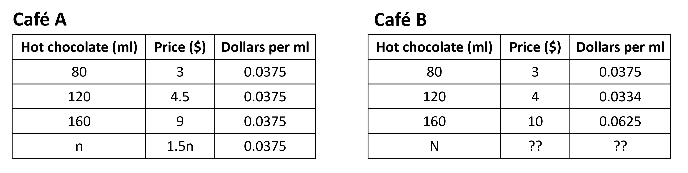
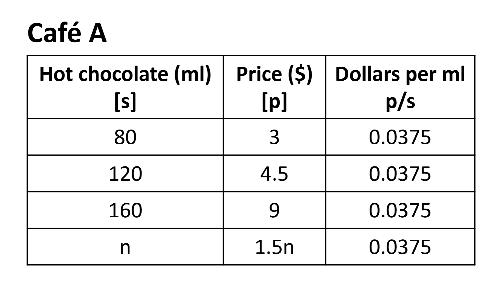
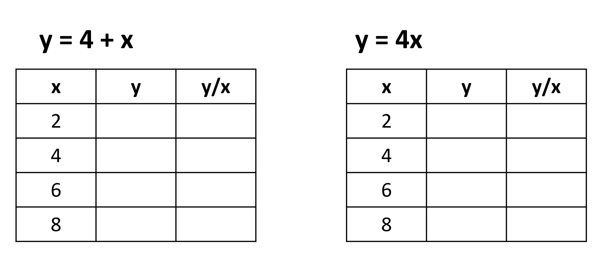
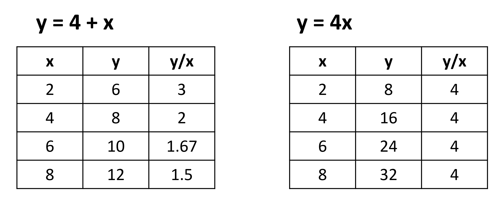
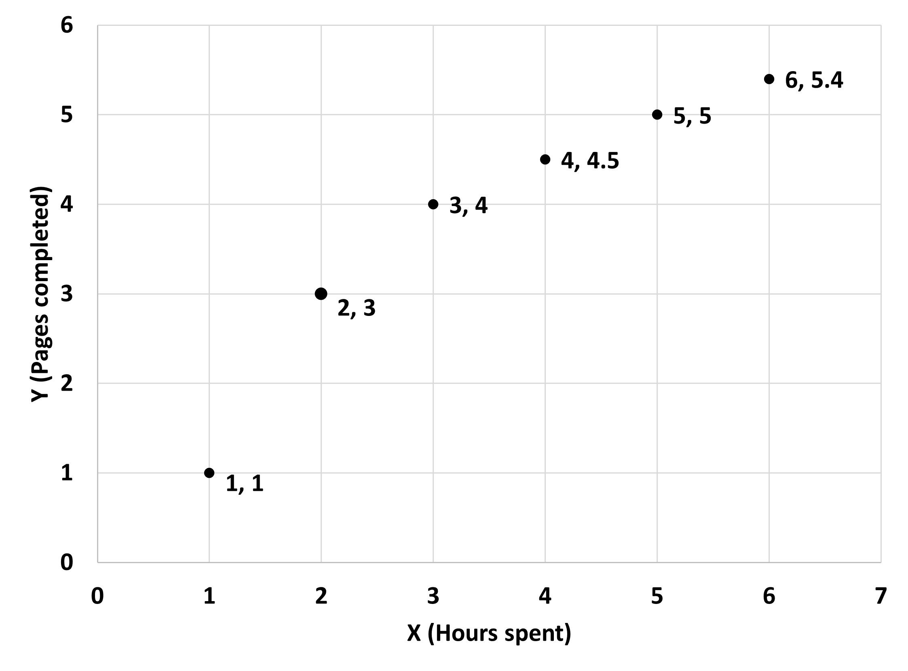

## Are all relationships proportional?

Now that we are familiar (and maybe even experts) with the idea of proportional relationships, let;s look at examples or situations where relationships might not be proportional and how they different from proportional ones. 
Let’s start with an example. 
Given are two tables howling different prices for hot chocolate at two different cafes. 

In the case of Cafe A, we see that hot chocolate costs $0.0375 per ml no matter which size we buy. If this continues, we can say that there is a proportional relationship between drink size and its price. With the help of this unit rate, we can write an equation for this as p = 0.0375s, where s is the size in ml and p is the price of drink in dollars. Note that if even one drink size on the menu does not have the same unit rate, the whole situation will not be proportional. Since we are considering only the value given in the table, we will assume it is proportional and applicable for all sizes. The equation applies to all cases, hence it ensures that the relationship is proportional.

Moving on to Cafe B, the cost per ml is different for each size of drink mentioned. One equation cannot generalize this situation and the different unit rates mean that the relationship between drink size and price is definitely not proportional.

In general, two quantities in a proportional relationship will always have the same quotient, which are the two unit rates or constants of proportionality. We know that this means that they have a proportional relationship. But how do we express this and check for it?

Let’s look at Cafe A’s table again, this time with a slight change.

The unit rates (one of the unit rates) can be found by dividing the price by the amount of hot chocolate as seen in the third column. This gives us the same value in each case here. 

We can write this as p/s = 0.0375 which can be converted into our original equation of p = 0.0375s and the other form as well. So, if the amount of hot chocolate and its price are always proportional, then the value of p/s will also always be the same. We know this value to be the constant of proportionality or the unit rate. Note that s cannot be 0. 
So, to generalize, if y/x is always equal to one number, k then y is proportional to x. 

y/x = k or y = kx

If you have a table with x values and an equation, you can easily find y. After this, find value for y/x in all cases. If they all are the same, then y and x are proportional!

Let's look at one example to check which of the two tables are proportional or not. 

Using the equations given, let’s fill out the value for y in each table as follows and then find the value for y/x as well.

This tells us that the first case where the equation is y = 4 + x is not proportional! The values of y/x are not the same in any of the rations provided for x:y in this case. So, an additive relationship is not proportional. (Remember how we discussed that a ratio is not an additive relationship?)

Let’s look at a graph and see if it is proportional or not.
The following graph gives the number of copies of homework finished by Sammy after different hours spent on it. 

 
We have some ratios from the graph as follows: 1:1, 2:3, 3:4, 4:4.5, 5:5, etc. 

They do not have the same relationships between the hours spent and the work finished. If it takes 1 hour to finish 1 page, it should take 2 hours to finding 2 pages for the relationships to be proportional and for the ratios to be equivalent. We could have easily concluded that the relationship between hours spent and pages completed is not proportional since connecting the dots does not give a straight line. 