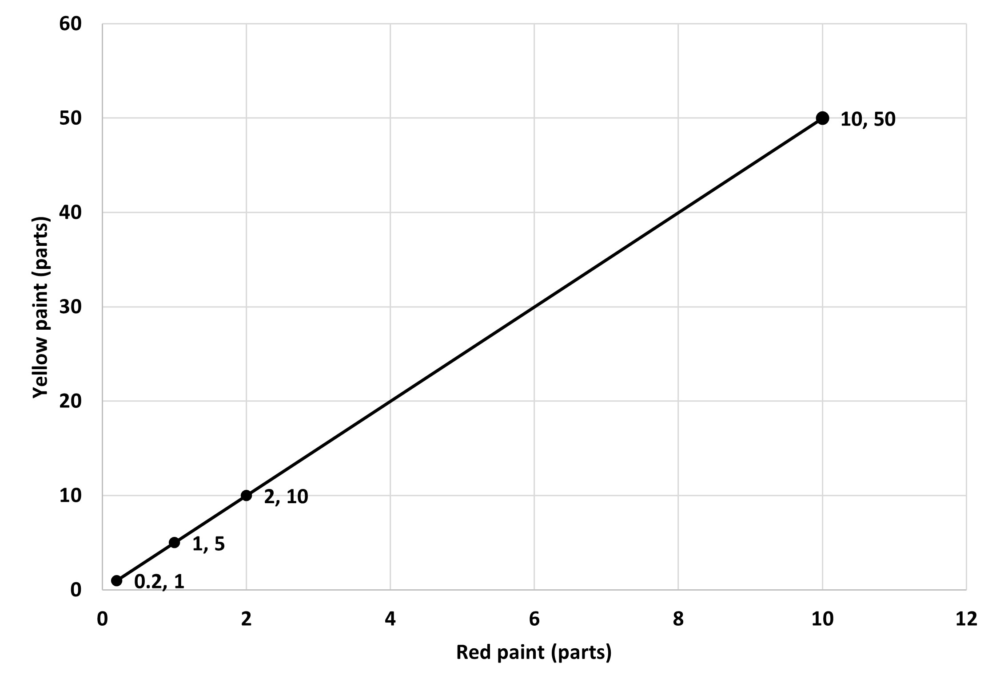

Let’s get more familiar with a graph of proportional relations and see how it can help us further. 

We have already seen that a graph of a proportional relationship is a straight; line that passes through the origin. Going back to the previous example of red and yellow paint, we have red paint on the x axis and yellow paint on the y axis, so their quantities are the x and y coordinates. Let’s look at the table and graph below:

The equation for this is y = 5r.

For this table and graph, we can say that y is proportional to x (we determine y using the value of x (x is taken as the independent variable in this case), even though the opposite is true as well). From the table, we can find the constant of proportionality as y/x = 10/2 = 5. The same is true through the equation y =5r as well. What about the graph? Shouldn't we be able to find the same using just the graph?

Based on our previous knowledge of what constant of proportionality is, we know that it is the y value when the x value is 1 (or the x value when y is 1, but we are not talking about that now). So, looking at the graph, the y value when the x value is 1 is 5, or yellow paint needed is 5 parts when the red paint is 1 parts. This is how we find the constant of proportionality from a graph. Pretty similar to other ways right? They have to be, since they are all connected.

Do we always have to have one of the quantities on the x axis as the independent value, like red paint in this case? Would the graph work if we make yellow paint the x-axis? 

Let’s use another example to understand this.

A tap in your house is leaking water. You check the time and the amount of water that leaks and find that every 2 minutes 12 milliliters of water leaks from the tap. Since there are no irregularities, there is a proportional relationship between the volume of water leaked and the time elapsed. 

Depending on which value we take as one unit, we can write the relationship in two ways:

The volume of water leaked is proportional to the time elapsed (v is proportional to t). So, the constant of proportionality here is the volume leaked when time elapsed is 1 minute, which is 6 ml. The equation for this is v = 6t. If we compare it to y = kx, v is y, so plotted on the y axis and t is x, plotted on the x axis.

The elapsed time is proportional to the volume of water leaked (t is proportional to v). So, the constant of proportionality here is the time taken to leak 1 ml of water, which is ⅙ minute. The equation for this is t = ⅙v. If we compare this to y = kx, t is y, plotted on the y axis and v is x, plotted on the x axis. 

The two graphs that we get are as follows:

Here, v is proportional to t, meaning we take t as the independent value. 

Here, t is proportional to v, meaning we take v as the independent value. 

Even though the relationship between time and volume is the same, we are making a different choice in each case about which value to view as the independent one, which gives us different looking graphs, but remember that the two quantities have the same relationships in both cases. So, you can choose any of the two to help solve questions and the one that is best suited according to the context.  

One final thing we can use graphs of proportional relationships for is to compare two different relationships. 

Like always, let’s use an example to understand why we need this and how it is helpful.

Look at the following graph that gives the price per pound of oranges in two different stores A and B. You can make the two graphs in the same coordinate plane as shown. 

Which store do you think has a  better offer, meaning the lowest price for the same amount of oranges?

We can easily check this by comparing the prices for the same weight of oranges, like with 3 pounds of oranges. Store A charges 18 dollars (from point (3,18))while store B charges 15 dollars (from point (3,15)) for 3 pounds. So, the better deal is store B!

Another way is to find the constant of proportionality from the graphs, which is simply the cost of 1 pound of oranges. The coordinate (1,6) tells us that the constant for store A is 6 dollars per pound and that for B is 5 dollars per pound from the coordinate (1,5). 

We could do such comparisons using equations and tables as well, whichever one suits your method the best and whoever one is easy for you to understand and carry out. 

