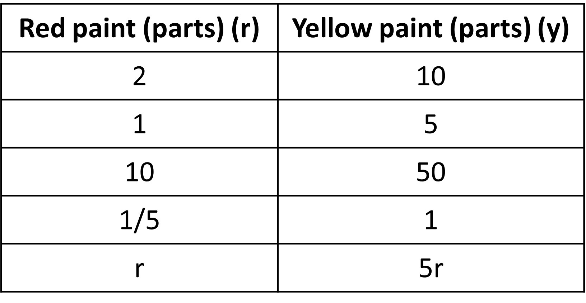
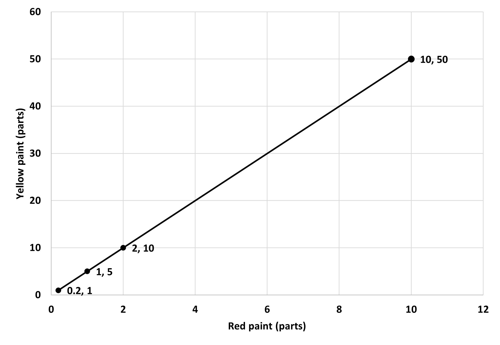
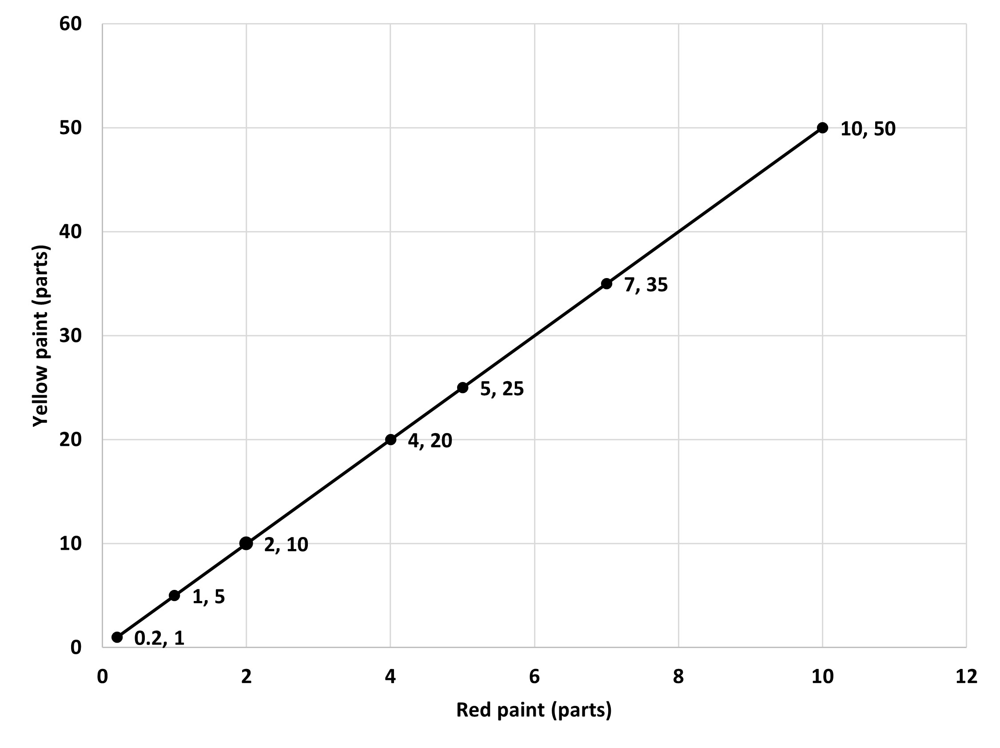
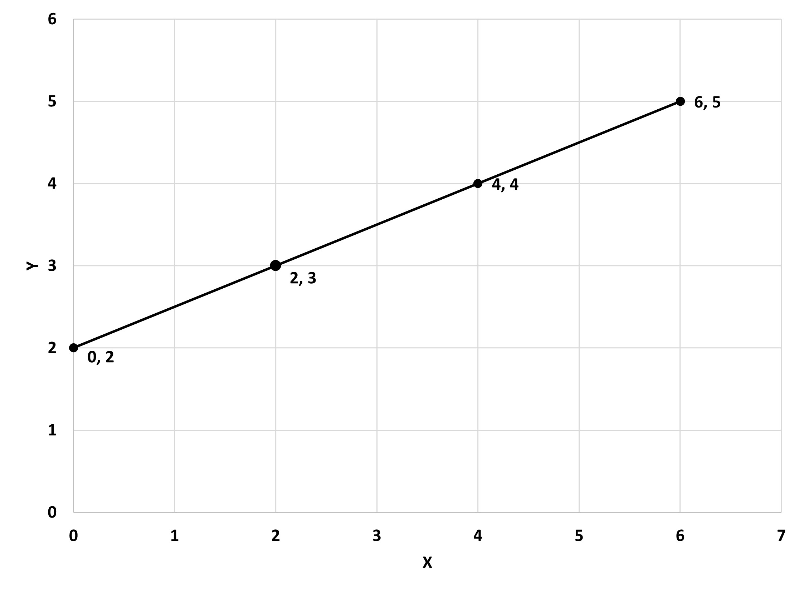

## Equations

Now that we know about proportional relationships, we will look at one of its representations other than a table and a double number line. It is a generalized form which represents all proportional relationships in a given case - equation! You might need to be familiar with the idea of some algebra for this, but we will walk you through the process nonetheless. 

Given is a table that shows the amount of red and yellow paints in parts needed to make a shade of orange paint. 

The amount of red and yellow paint are proportional to each other, so they are all equivalent ratios. Also, we know that we can get one value from the other by multiplying by the same constant, the constant of proportionality. Here, to get the amount of yellow, we can multiply the amount of red by 5 for all cases. This helps us in coming to a general conclusion. For 1 part of red, you need 5 x 1 parts of yellow. For r parts of red, you need 5 x r parts of yellow, as seen in the last row. 

Yellow patient can be denoted by y, so we can write it as y = 5r. 
In this case of the equation, we have taken the unit rate where we first find how much is needed for 1 part red. The statement to be used here is that yellow is proportional to red, implying that the amount of yellow is dependent on red, since 5 times red gives yellow. Since we use 5 for all cases and this is the unit rate as well, this is the constant of proportionality. This is one advantage of using the equation as it shows the constant as well. 

But here, the idea of proportionality is interchangeable since we could determine the amount of red from yellow as well. Meaning red is proportional to yellow. So, we need to write the equation in a way that shows us how we get red when we have yellow. We can easily do that by simply using symbolic transformation on the equation.

y = 5r
Dividing by 5 on both sides,
y/5 = r
r = y/5 
r = ⅕ x y

We are told that the constant of proportionality has to be the number of the coefficient given, which is ⅕ here, which aligns with our precious idea of constants being reciprocals. How about the idea of unit rates? How much red paint is needed for 1 part yellow? We see that it is ⅕, so the equation aligns with all our previous ideas!

Thus, an equation is useful since it helps us understand the idea of two constants of proportionalities as we can easily interchange between the two and align with all the ideas from before as well. 

To generalize, when two quantities x and y are in a proportional relationship, we can write the equation y = kx and say, “y is proportional to x.” (This is because we find y from the value of x given, implying that y is dependent on x). In this case, the number k is the corresponding constant of proportionality (Assuming that k is the unit rate, meaning the value of y when value of x is 1. You can find this by replacing the value of x as 1, which gives us y = k.). We can also write the equation x = 1/k y and say, “x is proportional to y.” In this case, the number 1/k is the corresponding constant of proportionality. Each one can be useful depending on the information we have and the quantity we are trying to figure out.

Finally, equations are also a pretty good way to find missing values when one value is given, which helps us find multiple values to fill in the table. From the previous case, we know  the equation for red and yellow paint os r = ⅕ x y. No, if we know the amount of yellow paint, say 150 parts, which is a pretty big number, we can use the equation to find the amount of red needed. In previous cases, we would have used a number line diagram or tape diagrams, which would have been a hassle since 150 is a big number or draw. 
Using equation r = ⅕ x y, we can simply replace the value of y and find r:
r = ⅕ x 150 = 30. So, 150 parts yellow requires 30 parts red to make the same shade of orange. 

## Proportional graphs 

So far, we have represented proportional relationships or simply equivalent ratios using tables and equations. Using these tables and equations, we can have one more way to represent these relationships. A GRAPH!

Here is a table for the red and yellow paint needed to make a shade or orange from our previous lessons. 

The equation for this is y = 5r.
Using the value for red paint and yellow paint as the two coordinates x and y, we can plot the points on a coordinate plane. Let’s use the first four rows and see how it looks. 

We connect the dots and get a straight line which passes through the origin and continue on. 

Let’s think of a few equivalent ratios to red and yellow paint - 4:20, 5:25, 7:35. Not that the x axis is written as the first term in the ratio. When we plot all these on the graph as well, we see that they too lie on the line we made before. So, the coordinates of any point that lies on this line are all equivalent ratios!

We do not necessarily need to join these points since some points in between, like decimal points may not make sense for some situations like when we’re talking about the number of people. They would still be correct, but would not make sense in the context.

Let’s see an example for a graph that is straight like the one above but does not start or pass from the origin.

Some of the ratios we get are 0:2, 2:3, 4:4, 6:5. We see that they are not equivalent ratios and do not have the same relationship. So, this graph, although straight, does not show a proportional relationship. So, does this mean that not all straight line graphs are proportional? Do we just need to check all the time or sometimes guess which ones could be proportional or not?

There is one difference between the two graphs and it's the fact that the second one does not pass through the origin. This point of ‘passing through the origin’ is a special characteristic of a proportional relationship because both quantities have to start from zero. If one is zero, the other has to be zero as well (since they are dependent on each other), otherwise the relationship is not proportional. So, a straight line graph is only proportional if it passes through the origin. Easy to differentiate, right?

Making a graph from a ratio is pretty easy. You simply find equivalent ratios and plot them or use the equation to find more values of x and y, which are used as coordinates for the graph. Similarly, if you find one quantity on the graph, the other coordinate that lies on the line of the relationships is the missing value. For example, look at the graph below:

If you know the red paint is 8 parts, we can see where 8 lies on the line as the x coordinate and find it corresponding y coordinate on the line, which is 40.

So, the two points about a proportional relationship graph are:
Points that satisfy the relationship, meaning equivalent ratios, lie on a straight line.
The line that they lie on passes through the origin, (0,0) .
