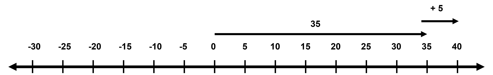
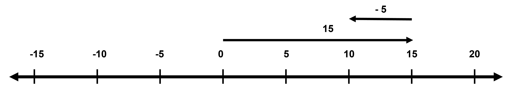
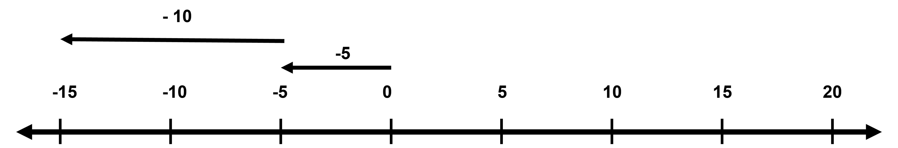
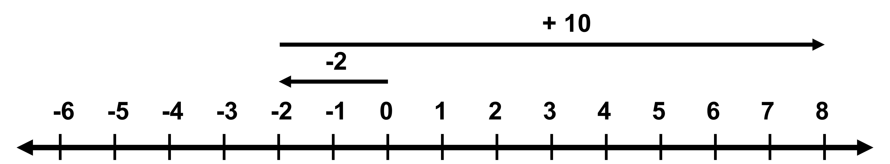

## Addition and Subtraction 

We are by now already familiar with adding or subtracting two numbers (whole numbers, decimals, fractions). But so far, we have only been operating on positive numbers. Now that we have gotten to understand negative numbers better, we will learn how to operate on them as well. 

While this may be confusing at first, the basic mechanism is the same.

Let’s start with adding positive numbers first and seeing what it looks like on the number line.

Let’s take an example of changing temperatures.

1. On a hot day, the highest temperature midday is 35C. The next day’s temperature is expected to be 5 degrees higher. To find the new temperature, we simply add 5 to 35.

35 + 5 = 40 C

In the number line, adding a positive number is simply moving towards the right as shown. Since 35 is also positive, we first start with showing 35 starting from 0 in the positive direction and then move 5 steps in the same direction.
This is basically a normal addition of two normals.

2. On a cold day, the highest temperature midday is 15C. The next day’s temperature is expected to be 5 degrees lower. To find the new temperature, we simply subtract 5 from 15. 

15 - 5 = 10 C

In the number line, we start with 15C as shown. Since we subtract 5 C, we need to move in the opposite direction. Can you think of this in some other way? Removing a positive value of 5 is like adding a negative value of 5. 

So, 15 - 5 can be written as 15 + (-5) = 10C

This makes sense because we can think of a decrease of temperature as a negative value of -5. But note that this works for all numbers and not only when we are talking about temperatures. 

3. On a cold day, the highest temperature midday is -5 C. The next day’s temperature is expected to be 10 degrees lower. To find the new temperature, we simply subtract 10 from -5. 

-5 - 10 = -15 C

In the number line, we start with -5, which is the first arrow that we need to draw going from 0 to left (to -5). This is because we start with a negative temperature itself. A decrease in 10 means subtracting 10 or, as we mentioned before, adding a negative 10 value. This means we further move in the negative direction by 10, giving us -15C.

-5 + (-10) = -15 C

This also tells us that subtracting a negative from a negative gives an even more negative value. (Like how adding a positive to a positive gives an even more positive number). You can also think of this as taking -1 common and adding the remaining:

(-1) (5 + 10) = (-1) (15) = -15 ((Might not be needed here since this uses the idea of multiplication, which has not been taught))

4. On a cold day, the highest temperature midday is -2C. The next day’s temperature is expected to be 10 degrees higher. To find the new temperature, we simply add 10 to -2. 

-2 + 10 = 8 C

Here, we start with the negative direction to 0, at -2. Then an increase in temperature means we move in the direction and reach 8C. 

In such a case where we add a positive number to a negative, we can easily find the answer by switching the two numbers and writing it as 10 + (-2) since addition is associative. This gives us 10 - 2, which is 8!

To make it easier to solve operations involving negative numbers, you can think of different contexts where it makes sense. Temperature is one example we have already seen. You can think of elevation, debt, etc.

This method works for all rational numbers, like fractions, decimals, etc., and not just negative whole numbers. 

What do you think is ⅘ + (-⅕)?
This is like removing ⅕, so we can write it as ⅘ - ⅕, which gives us ⅗ !

What about -6/7 -1/7 ? 
This is  a form of going negative from negative (or adding negative). So the answer is the sum of two magnitudes with a negative sign. The answer is -7/7 or -1!

Could you try doing the same for decimals?
