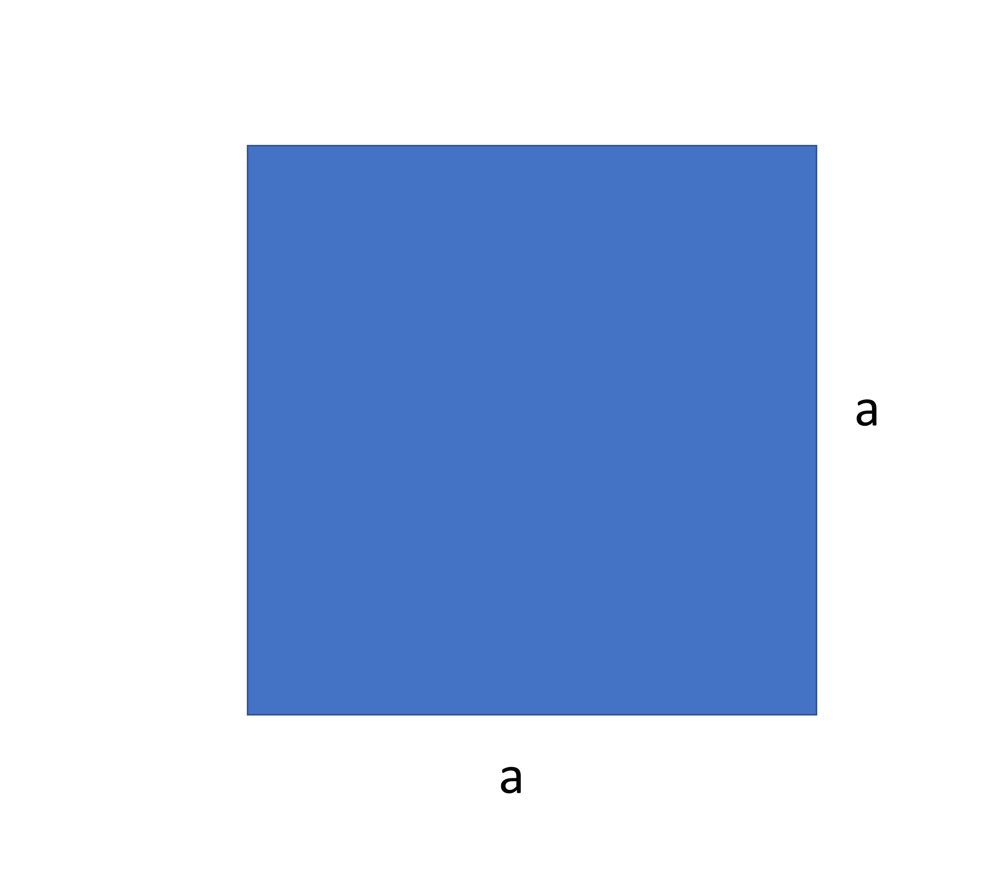
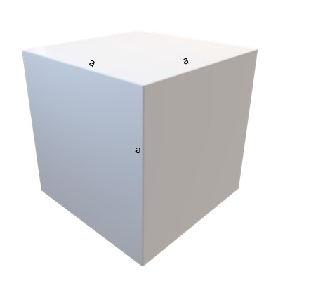

### Repeated multiplication in expressions
In the acronym PEMDAS, E stands for exponents. Let's learn a few things about how to work with exponents. If a number has to be multiplied to itself many times, then exponents are used. 

For example, 25²  means 25 multiplied by itself once, that is, 25 x 25. In the same way, 25³ means 25 multiplied by 25 multiplied by 25 or, 25 x 25 x 25.

The area of a square is given by the square of its length, so the length “a” has to be multiplied twice. The expression a x a can be written as a². 

3.1

Here, 2 is written as an index to show how many times “a” has to be multiplied. The operation between indices follows some rules that are known as the "Laws of indices".
 
In the same manner, the volume of a cube with side length “a” is denoted by a³ which means that the length of the cube has to be multiplied 3 times. 

3.2

The properties of indices are such that (2⋅3)²=2²⋅3² but not (2+3)²=2²+3²

If in an expression multiplication and exponent both are present, then according to PEMDAS, Exponent should be operated first like
6⋅3² = 6 x 9 = 54 
6⋅3² ≠ 18² 

### Exponential expressions
Let's assume there are over 1024 tadpoles in a pond. And each hour, half of them get eaten by the fish left in the pond. As the population of tadpoles gets halved, they become harder to find so lesser tadpoles get eaten but still the trend of the fish population becoming half keeps on continuing. 

After one hour, 1024 x 1/2 tadpoles remain i.e. 512

After two hours, 512 x 1/2 tadpoles remain i.e. 256 which is also 1024 x 1/2 x 1/2

After three hours, 256 x 1/2 tadpoles remain i.e. 128 which is also 1024 x 1/2 x 1/2 x 1/2

What we get here is that the as the number of hours gets increased, the times 1/2 gets multiplied by the initial number gets increased. 

After the first hour, it is multiplied once, after the second it is multiplied twice, after the third its multiplied thrice, and so on. 

What is the number of tadpoles after 5 hours?

It is easy

1024 x 1/2 x 1/2 x 1/2 x 1/2 x 1/2

Also written as 1024⋅(½)⁵

We can solve equations of higher order using the laws learned earlier as well. 
The same laws can be applied to expressions that contain variables with higher power. Such as

𝑥² + 𝑥² = 18

2𝑥² = 18

Or, 𝑥² = 18/2

Or, 𝑥² = 3²

Or, 𝑥 = 3

Exponents are also used to describe very large and very small numbers. That is due to the fact that it is always cumbersome to write numbers that contain too many digits and is especially tiring if the same digit is repeated continuously.
