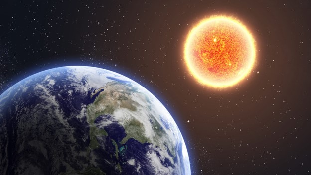
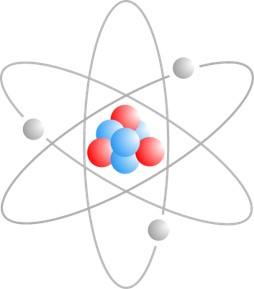
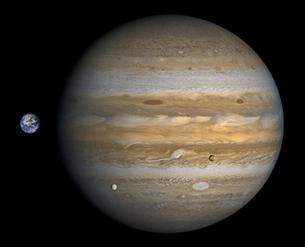

## Scientific notations
What is the distance from the earth to the sun?
We know that the sun is extremely hot but we do not feel that much heat on the earth’s surface. That is due to the long distance between the Earth and the Sun. Numerically the distance is 93,000,000 miles. 

3.3

Does this number seem to be very large? 
Let's take another example. Atom is the smallest building block of any matter. Since it is very small, their number is very large. Do you know how many atoms are there in 1 gm of hydrogen? It's somewhere around 602 billion trillion hydrogen atoms. If we use digits to write the number fully, how many digits would be required? 
The number will be 24 digits long even in integer form. Writing the number, again and again, will be very tedious. 

3.4

A similar case can be felt when working with very small numbers. 

An example of such a number is that if 1 gm of hydrogen has 602 billion trillion atoms, what would be the mass of one atom? 

Obviously, the mass would be very small. They also may have many zeros that are written to the right of the decimal sign. 

What can be done so that we can write very large and small numbers with less number of digits?

To ease working with these types of very large or very small numbers, scientific notations were introduced. They are notations that summarize the numbers with the help of the power of 10. For example, 1000 has three zeros so it is equal to 10³. 60000000 has 7 zeros so it is equal to 6 x 10⁷.

It is understandable that writing zeros can be avoided with the powers of 10 but what about other numbers that do have other digits? 

What if 987451318478912612 has to be written in the same fashion?

We follow the same concept in these kinds of numbers. Scientific notation is concerned with how many digits are there in a particular number rather than what the digits actually are. This is only purposeful in very large and very small numbers.

Let's consider an example from an earlier case. What is the distance between the Earth and the Sun? 

It is 93,000,000 miles. Is it so obvious that the number is exactly a multiple of 10⁶? 

What if the number is 93,000,005 miles or 93,000,007 miles?

The difference isn't that much between the given numbers. It means the digits to the right become less and less significant when the number becomes very large or very small. 

Now let's write the scientific notation for 987451318478912612. 
It would have been ideal to write 9.87451318478912612 x 1017. 
But since we mention that the number is more than 17 digits long and the digits written towards the right are less significant anyways, we don't have to mention all of the digits that were initially.

Generally, rounding off is done up to 2 digits to the right of the decimal which makes the above number 9.87 x 1017. If we want to compare two numbers that require to be written in scientific notation and they are very close to each other then we write more and more digits after that. 

If many digits are the same such as 9.3000005 x 10^7 miles and 9.3000007 x 107 miles then we mention that they are nearly the same. The numbers are so large that the difference between them is of very less significance. 

Also, one important fact, if we shift the decimal point towards the right, the index goes on decreasing in a scientific notation. 
For example

9.253 x 10⁴ 

= 92.53 x 10³ 

= 925.3 x 10² 

= 9253 x 10¹ 

= 92530

How to compare two numbers mentioned through scientific notation?
Let's consider this example for instance. How many times is the diameter of Jupiter more than the diameter of the earth?

3.5 

Here, the question mentions the term “times” thus it means we have to use the operation of division/multiplication to compare the two. Jupiter has a diameter of 139,820 km whereas the earth has a diameter of 12,742 km. If we convert the numbers to scientific notation we get 1.398 x 10⁵ and 1.274 x 10⁴. We have to divide the bigger by smaller because it is asking how many times is it bigger

=(Diameter of Jupiter)/(Diameter of the earth)

=1.398 x 10⁵/ 1.274 x 10⁴

=1.097 x 105 - 4

=1.097 x 10

=10.97

### Laws of indices
Operating on numbers written in scientific notation is much easier. Some rules have to be followed for the indexes written. The power or exponent of a number (generally 10 can be 
Whenever numbers are written in the form of powers, then laws of indices apply to them. Power is also known as index or exponent. Some common laws of indices are

i) 𝑥 -a= 1/𝑥a

1/3 -9= 39

ii) 𝑥a * 𝑥b = 𝑥a+b

For example if 27 x 24 =27+4 = 211

iii) 𝑥a/𝑥b = 𝑥a-b

Example: 59/54 = 59-4 = 55

iv) 𝑥a * ya = (𝑥y)a

Example: 105 x 55 = (10 x 5)5 = 505

v) 𝑥a/ya= (𝑥/y)a

67/27 = (6/2)7 = 37

vi) (𝑥a)b=(𝑥ab)

(64)7 = 628

vii) n√𝑥=(𝑥)1/n

∛7 = 71/3

These laws are useful for operations on numbers written in scientific notation. For example, 
9.27 x 10⁶ + 7.4  x 10⁶
= (9.27 + 7.40) x 10⁶
=16.67 x 10⁶

Another example (5.23 x 10⁸) / (9.453 x 10⁵)
= 5.23/9.453 x 10⁸/10⁵
= 0.5532 x 10⁸⁻⁵
= 0.5532 x 10³
= 5.532 x 10²
The expressions that use variables in their index are known as exponential expressions. These expressions also require laws of indices for operations. 
For example, 4𝑥 x 4y = 4𝑥+y

