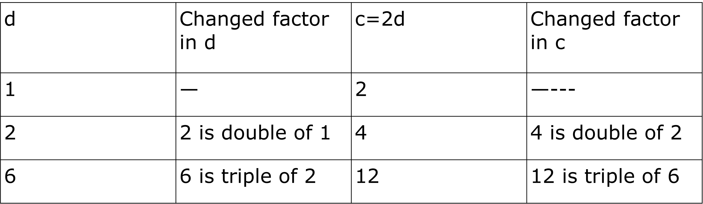
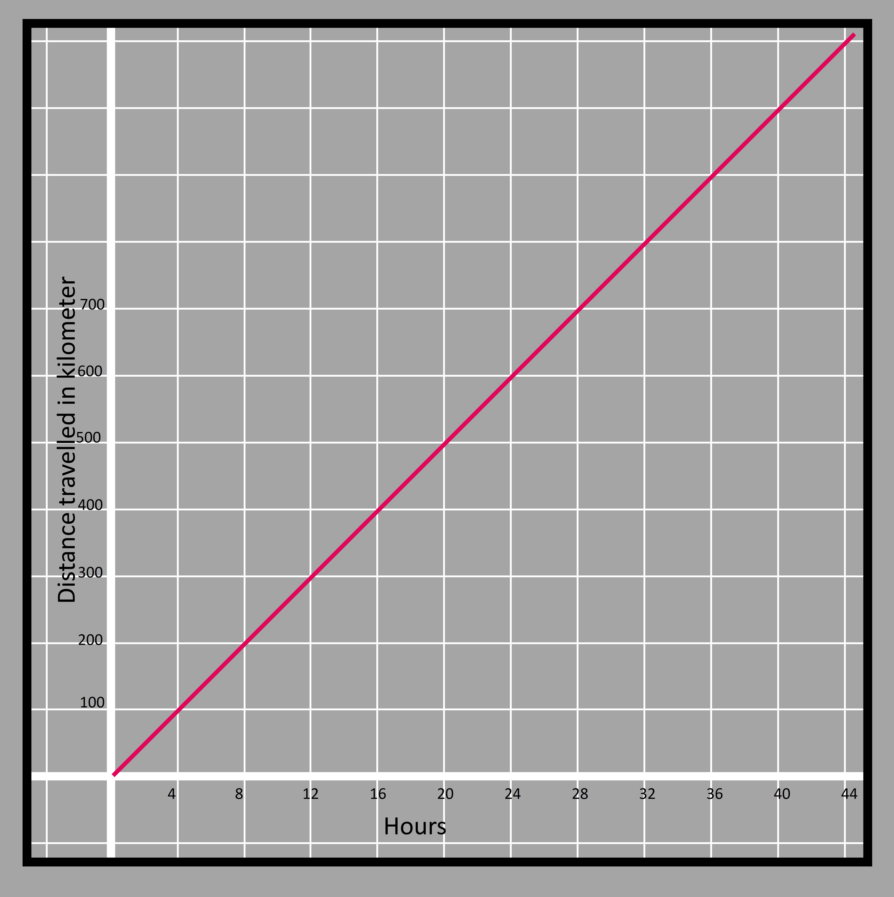

### Equations expressing relation between two quantities
In the previous grades, we had familiarized ourselves with the equation involving a single variable. Single variable equations simply represent one instance of expressions being equal. Notice that we are using the term equal instead of equivalent. 

For example if we have an expression 5𝑥-7, then a linear eqation says that the value of this expression is 48. We know that the value of expression is only found when we replace the variable with some numerical value. Since we have actual output of the expression after the variable has been input/entered/substituted, we have to find what number 𝑥 was replaced with so that we get 48. That is the main point of a single variable equation. 
What happens however when we have more than one variable in the equation? 
The process to solve a single variable equation is that we try and isolate that variable using laws of equality. This process is very effective because the hidden value reveals itself automatically. But when there are more than one variable(consquently more hidden values) we are unable to isolate and find a particular value for them. 

In fact, for any multi-variable equation we see that there are many values that hold the given equation true. lets try and understand that with an example. 

If we have an equation a + b = 5, a and b can be any number. they can be 4 and 1, 3 or 2 or 1 and 4 or even 2.5 and 2.5 respectively. Whatever numbers we may choose, when they are added, they must be equal to 5. 

This creates confusion, how are we supposed to find that single pair of values for a and b then?
There is no definite answer to this question. There are many potential values instead of a particular one with a single variable equation. 
 

### Modelling a situation into an equation
For example, I am 3 years older than my brother. It means if I am 22, he must be 19, if I am 55, then he must be 52 and so on. We may choose to use any of the values but one thing is certain; that the gap between two ages is 3 years and that is it.
However, when we change one of the variables, the other changes too. It is not like I remain 25 years old and his age goes on increasing. We can say this for sure because we have the relation between the ages thus we shouldnt be thinking that the variables are changing because its age and age always changes. 

Let's assume a condition where I eat twice the number of donuts as my brother eats. 

If my brother eats 2, I will eat 4.

If he eats 3, I will eat 6.

If he eats 7, I will eat 14, and so on. 

Even though we know that I eat double of what he eats, we still can't tell what is the actual number of donuts eaten on the basis of given situation alone. We already know that when we are uncertain about the exact value of the quantities, we use a placeholder variable that is generally a letter. But here are two quantities that we have in this case and this means we can use separate variables such as  𝑥 and y or a and b or ∅ and ∆ so on. Any letter of the symbol can be used unless they already denote some constant number. 

Let's take c and d for the donuts eaten by me and my brother respectively. 

Thus c=2d because d is smaller than c and to make the small number equal to the larger number, we multiply d with 2.
Please pay attention that we arent multiplying c with 2 when the question says c is double of d. Its always the opposite. 

After we have decided on the equation, we try to find out the numbers such that one is the double of the other.

Taking into account the relation, 2 and 4, 3 and 6 and 7 and 14 are the some of the pair values of c and d. We say that these values satisfy the given equation and they are the solution to the given equation.

Look at the table below; When d is doubled c is also doubled, when d is tripled, c is also tripled etc. 

3.6

Relationships of these kinds where the value of one variable increases with the same factor as the other variable is known as a proportional relationship. That also means that when one quantity is doubled, another quantity related to it is also doubled. Not only doubel its the same with any factor; 4 times, 5 times, 21000 times etc. 

In such cases, there is a term known as the rate of proportionality. In equation c=2d, the rate of proportionality is 2. That means no matter how big or small the value of d is, c will always be double of that or we can say whatever the value of c is, d will always be half of that. 

Proportional relationships always pass through origin or (0, 0). That means when one quantity is 0, the other is 0 as well. We can also see that when 𝑥 increases by 1, y always increases by 2. This is true for all proportional relationships. 

### Using graph to understand equations
The rate of proportionality is an important factor in the relationship between two quantities. 
Let's take one more example of a similar type.

If your friend is traveling on a scooter at an average speed of 25 miles per hour and you are traveling at 40 miles per hour speed in your bike. How do you compare the distance travelled between the two if both started at the same position?  

For the scooter, it travels 25 miles in the first hour, 50 in two hours, 75 in three hours, etc.
If the time in hours and distance traveled in miles are taken to be two quantities denoted by 𝑥 and y respectively then it can be written as y=25𝑥. We can show the corresponding positions of the bike and scooter and connect them with a line as shown in the figure.

All the corresponding positions of the scooter with respect to time can be shown with the help of a graph as shown below. The distance traveled is shown in the vertical y-axis whereas the horizontal 𝑥-axis shows the time taken to travel that distance.

3.7  

On the other hand, your bike travels an average of 40 miles in the first hour, you will have traveled 80 in two hours, 120 in three hours, and so on. The graph can be shown in blue color as below. In a similar manner, we can find the equation for the bike as y=40𝑥.

3.8

When we show both the relations in one graph, we see that bike will always be ahead of the scooter and travels more distance at the same time because distance is fastly covered by the bike. That is verified by the fact that the two lines go away further and further as the time increases.  

3.9

If there are two relationships just like the above case whose rates have to be compared, then the rate of change is very important. The rate of change for the pink graph is 25 miles per hour whereas it is 40 for the blue graph. 

While writing the relation we get,

Distance traveled = rate x time 

In order to keep the line straight, the rate has to be constant. Furthermore, the time elapsed is the independent variable and the distance traveled is the dependent variable. 

We can also change the positions for the independent and dependent variable when required. For example;
Time = Distance traveled/rate

For example for the scooter

y=25𝑥 if we want to compute the distance traveled.

𝑥=y/25 if we want to compute the time taken

If we compare the time taken in the two cases,
𝑥=y/25
𝑥=y/40

The coefficient of y in the first case is greater (1/25>1/40) thus the scooter will take longer time in comparison to the bike for covering the same distance. 

Also, the common point in both the relations which was the origin (zero distance traveled when time=0) in this comparison can be elsewhere.

y=25𝑥 has an initial value of zero (when 𝑥=0, y=0), y=25𝑥+10 has an initial value of 10 (when 𝑥=0, y=10). The initial value is the point on which the y-axis is cut. 
When the initial values are different, the point of intersection is away from the origin. 

3.10

One of the common forms of depicting the linear relationship is y=m𝑥 + c

comparing y= 25𝑥 + 10 with y=m𝑥 + c, we get 25 in place of m and 10 in place of c. They have been named the rate of change and initial value in this chapter till now. 

The rate of change is known as the slope and the initial value is known as the y-intercept when the relationship is shown in a graph. The rate is called the slope because it gives an idea of how steep a graph is. The more the slope, the steeper the graph is. Then there is the y-intercept which is the point where the graph cuts the y-axis. 
