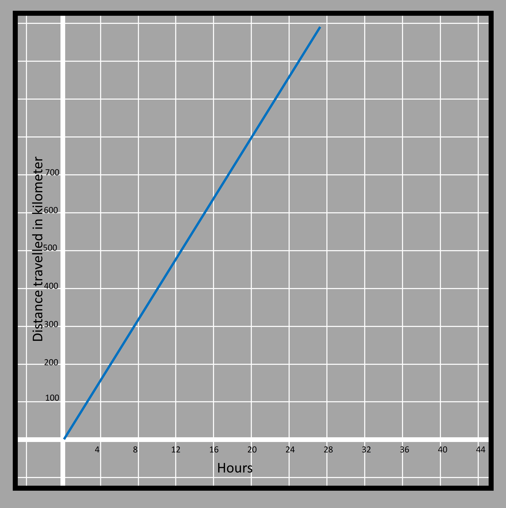

### Equations expressing relation between two quantities
In the previous grades, we had familiarized ourselves with the equation involving a single variable. We learned the different strategies to solve it. Now we will learn about equations that have many variables in them.

Solving equations with many variables is also similar to the process of solving single-variable equations. 

Why do we use more than one variable in the equation?
More than one variable is required in cases when there are more than one quantities that are unknown to us. 

One equation that contains two variables will give the relation between the two variables. That is how the change in one variable affects the other. For example, if I eat donuts twice in number in comparison to my small brother every day; then

If my brother eats 2, I will eat 4. 

If he eats 3, I will eat 6.

If he eats 7, I will eat 14, and so on. 

Even though we know that what I eat is double of what he eats, we still can't tell what is the actual number of donuts eaten. In that case, we can use separate variables such as  𝑥 and y or a and b or ∅ and ∆ so on. Any letter of the symbol can be unless they already denote some constant number. 

Let's take c and d for the donuts eaten by me and my brother respectively. 
Thus c=2d because d is smaller than c and to make the small number equal to the larger number, we multiply d with 2. 

Now when we think about solving an equation, we try to find out what particular values of the variables satisfy both sides of the equation. Here we can see that the two sides can be balanced by using different values.

As said before, 
If my brother eats 2, I will eat 4. That gives c = 4, d = 2
If he eats 3, I will eat 6. That gives c=6, d=3
If he eats 7, I will eat 14, and so on. c=14 and d=7. 
Also what can be seen here is that when d is doubled c is also doubled, when c is tripled, d is also tripled etc. 

3.6

Relationships of these kinds where the value of one variable increases with the same factor as with which the other variable increases is known as proportional relationship. That means when one quantity is doubled, another quantity that is related to that quantity is also doubled. The same is when multiplied by 3, 4, or any number. 
In such cases, there is a term known as the rate of proportionality. In equation c=2d, the rate of proportionality is 2. That means no matter how big or small the value of d is c will always be double of that or we can say whatever the value of c is, d will always be half of that. Proportional relationships always pass through origin or (0, 0). That means in terms of the previous relationship if my brother eats 0 donuts, I also eat 0 donuts because half of 0 is 0.

We can also see that when x increases by 1, y always increases by 2 which is true but this happens in other linear relationships that are not proportional as well. 

### Using graph to understand equations
Let's take one more example of a similar type. 
The rate of proportionality has a huge say due to which the relationship between two quantities can be understood. If your friend is traveling on a scooter at an average speed of 25 miles per hour and you are traveling at 40 miles per hour speed in your bike. Explore the relationship between time and distance traveled in the two instances if you both were to start at the same position. 

For the scooter, it travels 25 miles in the first hour, 50 in two hours, 75 in three hours, etc.
If the time in hours and distance traveled in miles are taken to be two quantities denoted by 𝑥 and y respectively then it can be written as y=25𝑥. All the corresponding positions of the scooter with respect to the time can be shown with the help of a graph as shown below. The distance traveled is shown in the vertical y-axis whereas the horizontal 𝑥-axis shows the time taken to travel that distance.

3.7  

On the other hand, your bike travels an average of 40 miles in the first hour, will have traveled 80 in two hours, and so on. The graph can be shown in blue color as below. A similar equation to that of the scooter is y=80𝑥.

3.8

When we combine the two graphs, we get to see that bike will always be ahead of the scooter or travel more distance at the same time because of the higher rate of covering distance also called the speed. 

3.9

The two are at the same position at the initial position only. 

If there are two relationships just like the above case whose rates have to be compared, then the rate of change is very important. The rate of change for the pink graph was 25 miles per hour whereas it was 40 miles for the blue graph. 

While writing the relation we get,

Distance traveled = rate x time 

Thus the rate of traveling that was 25 and 40 in the previous case is the constant values that multiply by the time elapsed. Here the time elapsed is the independent variable and the distance traveled is the dependent variable. 

The same relation can be written in reverse, but the constant would change in that case. That is normally done for convenience in case we know the value of total distance traveled but do not have the value of time taken. 
The placing of the dependent and independent variables in the equation can be done as per the need. 

For example for the scooter
y=25𝑥 if we want to know about the distance traveled.
𝑥=y/25 if we want to know about the time taken

If we compare the time taken in the two cases,
𝑥=y/25
𝑥=y/40

The coefficient of y in the first case is greater because 1/25>1/40 thus the scooter will take longer time in comparison to the bike for covering the same distance. 

Also, the common point in both the relations which was the origin (zero distance traveled when time=0) in this comparison can be elsewhere. 
y=25𝑥 has an initial value of zero (when 𝑥=0, y=0), y=25𝑥+10 has an initial value of 10 (when 𝑥=0, y=10). The initial value is the point on which the y-axis is cut. 
When the initial values are different, the point of intersection is away from the origin. 

3.10

One of the common forms of depicting the linear relationship is y=m𝑥 + c

In that, comparing y= 25𝑥 + 10 with that, we get 25 in place of m and 10 in place of c. They have been called the rate of change and initial value in this chapter till now. There are more logical terms used especially when the relation is plotted in the graph. The rate of change is known as the slope and the initial value is known as the y-intercept. The rate is called the slope because it gives an idea of how steep a graph is. The more the slope, the steeper the graph is. Then there is the y-intercept which is the point where the graph cuts the y-axis. 
