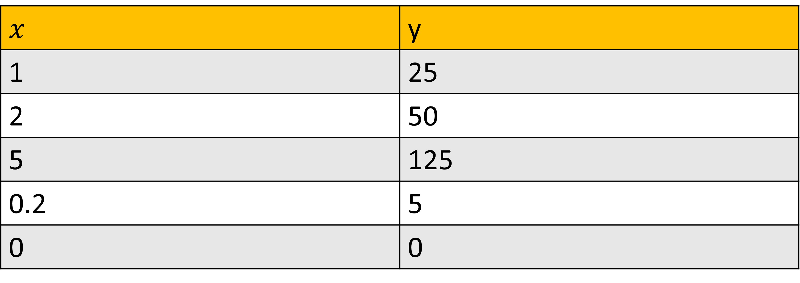
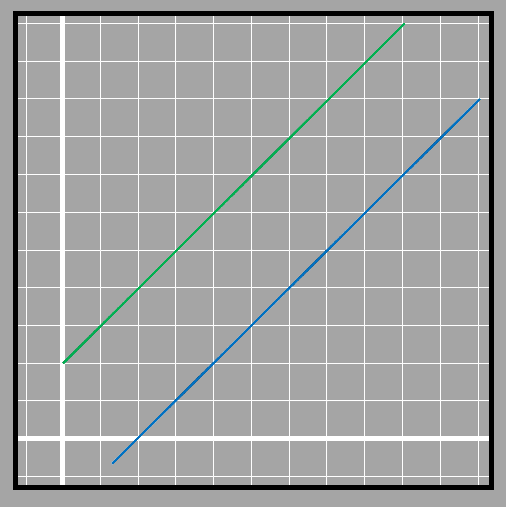
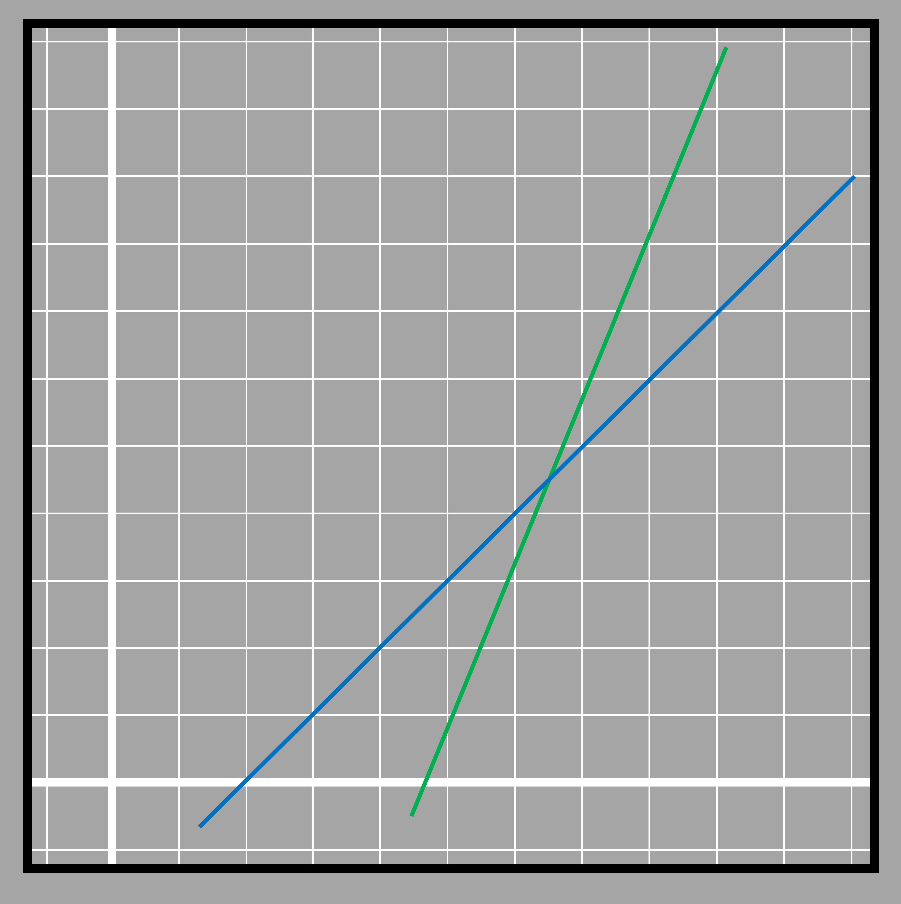

### System of equations
We have already found out that there are many pairs of values that satisfy a two variable equation. lets suppose two relations given as:

𝑥=y/25

𝑥=y/40

We have many values for 𝑥 and y that satisfy 𝑥=y/25 

3.16

Likewise we have many values that satisfy 𝑥=y/40

3.17

We can see that out of the several values that fit in the two equations, we have 0 and 0 (for 𝑥 and y) in both tables. The solution for values of 𝑥 and y in this case is (0,0). It means that when we put the values of 𝑥 and y as 0, both equations will be satisfied. 

0=0/25 ✓

0=0/40 ✓
We are trying more than one equation together, thus they are called simultaneous equation or system of linear equations. The more number of variables are involved, we require the same number of equations if we have to find the common set of variables that satisfy all of the given equations. 

Even though this method of solving two equations seems very logical, it may not be feasible at all times. We have no idea how many solutions we have to find for each equation. We will learn about the more efficient methods later. 

### Types of solutions in a linear system
We arent always sure if we will get a unique pair of values for both 𝑥 and y. According to the nature of the equations, the system of equations may have different types of solution. Let's look at some of the conditions of solutions between different lines.

#### When the equations represent parallel lines- No solution

3.11

If the coefficients of two variables are same but the constant isnt, then in that case, there will be no solution common in between two equations. 
For example if we try to solve two equations 𝑥 + y = 5 and 𝑥 + y = 6, we have to find two numbers when added become 5 and that same number when added becomes 6 as well. Two numbers can be added to get 5 but those same numbers cant be added to get 6. Thus there will be no solution in between the equations. 
If we generate a table with possible values for both the equations and plot the possible values from the table in a graph, we get parallel lines. We already know that parallel lines dont meet or they meet at infinity its said. 
An example of this situation would be if two bikes start traveling at the speed of 20 miles per hour but with the different initial position. The bike that starts ahead will remain ahead for the whole journey since they both will travel the same distance in each hour. 

3.12

Its like saying the cost of an apple fruit is 20 dollars per pc and the price of an apple MacBook is $1300 and their prices grow by $10 each year, will their prices be the same at any point in time? No, because $1300 is already higher than $20 before they start changing at the same rate. If the changing rate for MacBook was lesser than that of fruit, then maybe they could have the same price at some point. 

3.13

#### When the equation represents coincident lines-many solutions

3.14

If the co-efficients of the variables are same and the constant term is same as well, then the two relations will have many pair of values that satisfy both the equations. All values that are solution to one equation are the solution to another equation as well. For example, If the price of an orange and an apple per pc is the same as 2 dollars, then the price of 2 apples and 2 oranges are also the same. The same is with 3 apples and 3 oranges and so on. Thus they will have multiple solutions. 

#### Another conditions-one unique solution

3.15
If the coefficients are different as well as the constant, then the two equations will have different set of solutions for the two equations except one point. The equations when shown in graph represent two lines that intersect at a point. Only one set of values substituted in place of the variables of both equations will be true. The point where the blue and green lines intersect lies on the path of both lines and they don't meet at any other point ahead and beyond that. Not even if we extend the lines! 

### Methods of solving linear equation
There are several methods of solving a system of linear equations. The most simpler in terms of methodology are substitution and elimination methods. 

#####  Substitution method
In the substitution method, the expression of one of the variables is used from one equation to another and then the new equation becomes one-variable equation and can be solved easily. 

For that, we first isolate one of the variables either 𝑥 or y using one of the equation. We substitute that expression generated into the other equation. We can choose to substitute any variable from any of the equations. We must avoid processes like taking the expression for 𝑥 from the first equation and plug it into first equation itself. 

For example, we have to solve the following system of linear equations.

2𝑥 + 7y = 23

𝑥 - 4y = -11

Suppose we decide to substitute 𝑥 from the second equation into the first. 
We get 𝑥 = 4y-11 when isolating 𝑥 in the second equation

Using that expression for 𝑥 in the first equation

2(4y-11) + 7y = 23

or, 8y - 22 + 7y = 23

or, 15y = 23+22

or, 15y = 45

or, y = 45/15 = 3

Putting y=3 in any of the equations, let's take the first equation

or, 2𝑥 + 7 x 3 = 23

or, 2𝑥 = 23-21

or, 𝑥 = 2/2

𝑥 = 1

##### Elimination method
Elimination method, by name itself is the method of eliminating one of the variable to solve the system of equations. 
If the given equations have the coefficient of one of the variables same and of same sign, we subtract one equation from the other such that one of the variables in both equations gets eliminated. If one of the coefficient between the equations for the same variable is same but of opposite sign, then the equations are added. 

For example, if the two equations are 𝑥 - y = 2 and  𝑥 + 2y = -1

The coefficients of 𝑥 in two equations are same magnitude and same sign 
(1)𝑥 +(-1)y = 2 
(1)𝑥 +(2)y = -1

Thus, We have to subtract one from another.
(𝑥 - y) - (𝑥 + 2y) = 2 -(-1)

𝑥 - y - 𝑥 - 2y = 3

-3y = 3

y = -1

Now the value of y is replaced in one of the equations to get to the value of 𝑥 
𝑥-(-1)= 2

𝑥 + 1 = 2

𝑥 = 2-1 = 1

If none of the coefficients of the variables in the equations are same, we cant eliminate one variable just by performing addition or subtraction. 
In that case we first have to multiply one/both equations by different numbers so that we can make one of the coefficients same for one variable in both equations. After that we add/subtract equations according to the need. Is it confusing?

Lets look at one example. Suppose the equations are

5𝑥+2y=1…………………(i)

-3𝑥+7y=4…………………(ii)

Now if we are looking to cancel 𝑥, then 5 and 3 won't get canceled with either subtraction or addition. We multiply each of the equations with some factor and then make the coefficients same. We dont use the additive law of equality because it will add the unnecessary variable terms on both sides. 
If we have to make coefficients 3 and 5 the same number by multiplying then the number must be multiples of both 3 and 5. The smallest of the common multiples is 15. We choose the smallest to make our calculations easier. 5 can be transformed to 15 by multiplying with 3. 3 can be transformed to 15 by multiplying with 5. To maintain the equality, we have to use the same multiplier on both sides. 

Equation (i) has to be multiplied by 3 and Equation (ii) by 5

3[5𝑥+2y=1]

5[-3𝑥+7y=4]

The two equations are transformed into

15𝑥 + 6y = 3………………(iii)

-15𝑥 + 35y = 20……………(iv)

Adding the two equations together, we get

(15𝑥 + 6y) + (-15𝑥 +35y) = 3 + 20

or, 41y = 23

or, y = 23/41 = 0.56

Similarly the value obtained for y can be put in any of the earlier equations to get the value of 𝑥. 

15𝑥 + 6(23/41) = 3

or, 15𝑥 + 3.36 = 3

or, 15𝑥 = 0.36

or, 𝑥 = 0.36/15 = 0.024

Similarly, if we were looking to eliminate y then we have to multiply equation (i) by 7 and equation (ii) by 2 with both coefficients becoming 14 in magnitude. The processes after that is similar to the one shown above.  

