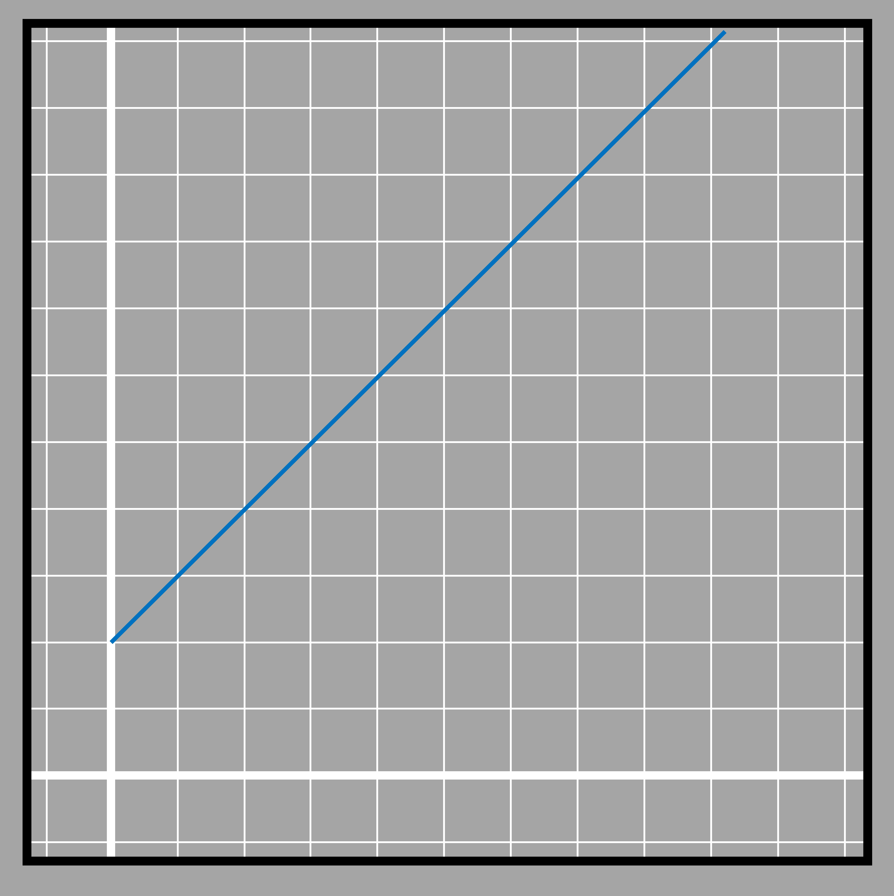

### System of equations
The process of comparing many linear relationships and finding a common solution is known as solving the system of linear equations. The number of variables involved in the system must at least be equal to the number of equations as well. We find out the solution set of all the values for the unknown variables such they satisfy all the relationships. Such as if we had relations such as 

𝑥=y/25

𝑥=y/40

The solution for values of 𝑥 and y in this case is (0,0). It means that when we put the values of 𝑥 and y as 0, both equations will be satisfied. 
0=0/25 ✓

0=0/40 ✓

### Types of solutions in a linear system
While solving a system of linear equations, there are many possibilities. We take a look at some on the basis of the nature of the intersection point through these figures. 

#### When the lines are parallel-No solutions

3.11

If the rate of change of two lines is the same then they move parallel to each other. Parallel lines do not intersect at any point so these relations do not have any solution. An example of this would be if two bikes start traveling at the speed of 20 miles per hour but with the different initial position. The bike that starts ahead will remain ahead for the whole journey since they both will travel the same distance per hour. 

3.12

Its like saying the cost of an apple fruit is 20 dollars per pc and the price of an apple MacBook is 1300 dollars and their prices grow by 10 dollars each year, will their prices be the same at any point in time? No, because 1300 is already higher than 20 before they start changing at the same rate. If the changing rate for MacBook was lesser than that of fruit, then maybe they could have the same price at some point. 

3.13

#### When the lines are coincident-many solutions

3.14

When two relations have the same initial point as well as the same rate of change, then they meet at all points. If the price of an orange and an apple per pc is the same as 20 dollars, then the price of 2 apples and 2 oranges are also the same. The same is with 3 apples and 3 oranges and so on. They will have multiple solutions. 

#### Another conditions-one unique solution

3.15

The third type of condition is generally what we face and that is all other conditions except the two described before. If the rates of change are different, then two equations will have one unique solution. Only one set of values substituted in place of the variables will satisfy both equations. The point where the blue and green lines intersect lies on the path of both lines and they don't meet at any other point ahead and beyond that. Not even if we extend the lines! 

There are several methods of solving a linear system of equations. The most simpler in terms of tools required are substitution and elimination methods.

#####  Substitution method

In the substitution method, the expression of one of the variables is used from one equation to another and then the new equation becomes one variable equation and can be solved easily.
In the elimination method, both equations are operated with each other such that one of the variables gets eliminated either by subtraction or addition and thus there remains only one-variable equation.

For example, we have to solve the following system of linear equations.
2𝑥 + 7y = 23
𝑥 - 4y = -11

If we are to use the substitution method, we substitute the value of 𝑥 or y from the first or second equation into the other equation. 
Suppose we decide to substitute 𝑥 from the second equation into the first. 
We get 𝑥 = 4y-11 when isolating 𝑥 in the second equation

Using that expression for 𝑥 in the first equation

2(4y-11) + 7y = 23

or, 8y-22+7y = 23

or, 15y = 23+22

or, 15y = 45

or, y = 45/15=3

Putting y=3 in any of the equations, let's take the first equation

or, 2𝑥 + 7 x 3 = 23

or, 2𝑥 = 23-21

or, 𝑥 = 2/2

𝑥 = 1

###### Elimination method
The same equation can be solved with elimination method as well. In the method, we add or subtract two equations such that one of the variables in both equations. If the coefficients are of opposite sign, then the equations are added and if the coefficients are of the same sign then one equation is subtracted from the other. 
For example, if the two equations are 𝑥 - y = 2 and  𝑥 + 2y = -1
  We have to subtract one from another because the coefficients of 𝑥 in two equations are same magnitude but of opposite sign. 

(𝑥 - y)- (𝑥 + 2y)= 2 -(-1)

𝑥 - y- 𝑥 - 2y =3

-3y = 3

y=-1

Now the value of y is replaced in one of the equations to get to the value of 𝑥 
𝑥-(-1)=2

𝑥+1=2

𝑥=2-1=1

When the two equations have both variables having different coefficients such that none of the variables gets cancelled then we must find the common number that the coefficients may be multiplied to get to a common number. Confusing isnt it?

Lets look at one example. Suppose the equations are

5𝑥+2y=1…………………..(i)

-3𝑥+7y=4………………….(ii)

Now if we are looking to cancel 𝑥, then 5 and 3 won't get canceled with either subtraction or addition. Thus we make them both equal to one common number which is 15. 15 is the lowest common multiple of 5 and 3. 5 can be made 15 by multiplying with 3. 3 can be made 15 by multiplying with 5. Since multiplication cant be done on only one term because it will affect the equality of the two sides, the whole equations are multiplied by respectively factors.
Equation (i) has to be multiplied by 3 and Equation (ii) by 5

3[5𝑥+2y=1]

5[-3𝑥+7y=4]

The two equations are transformed into

15𝑥 + 6y =3………………(iii)

-15𝑥 +35y=20……………(iv)

Adding the two equations together, we get

(15𝑥 + 6y) + (-15𝑥 +35y) =3 + 20

Or, 41y=23

Or, y =23/41

Similarly the value obtained for y can be put in any of the earlier equations to get the value of 𝑥. 

Similarly, if we were looking to eliminate y then Equation (i) has to be multiplied by 7 and Equation (ii) by 2 with both coefficients becoming 14 in magnitude. The processes after that is similar to the one shown earlier.  

