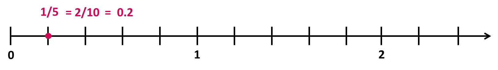
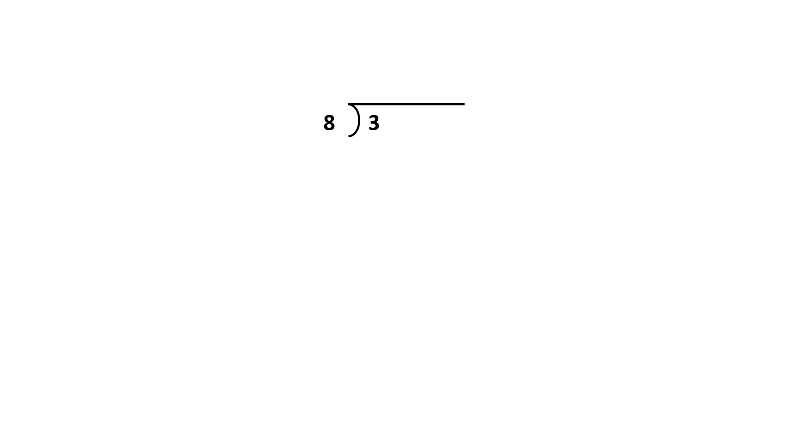
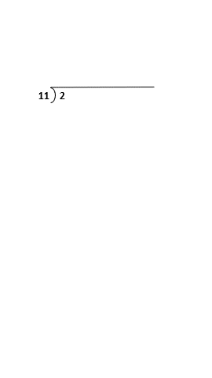
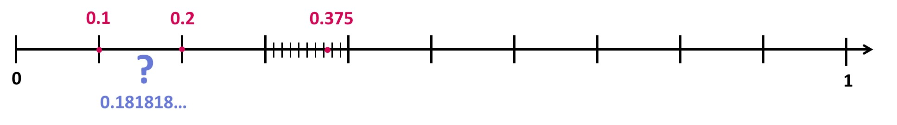
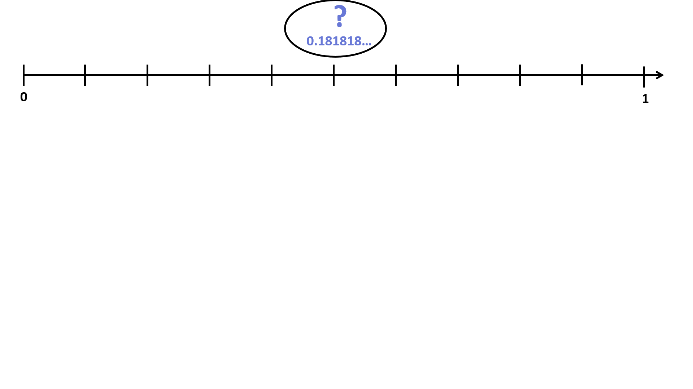
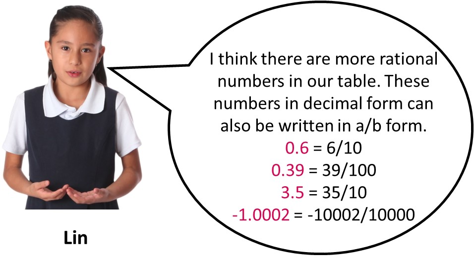
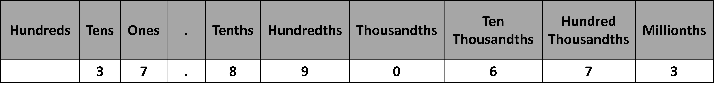
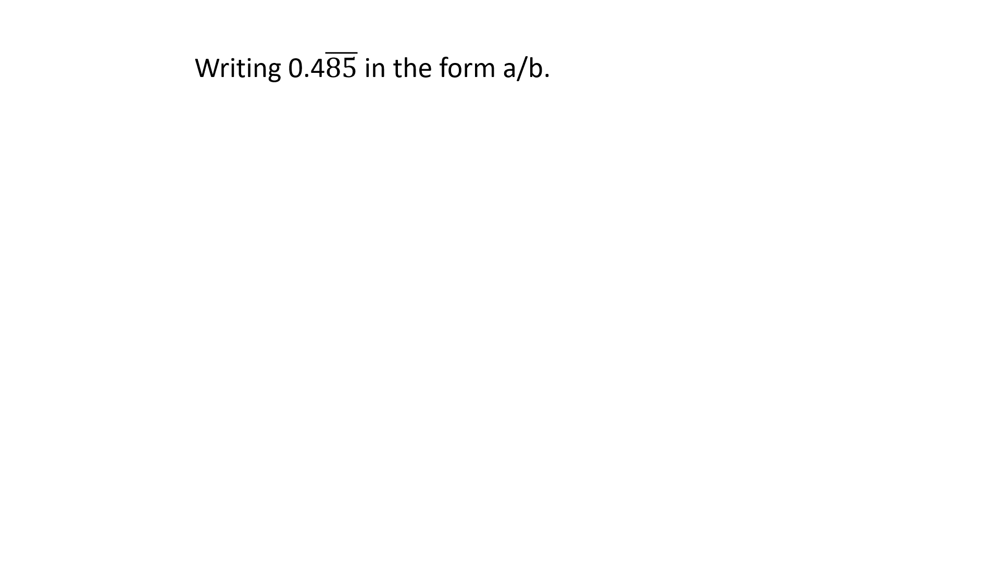

## Decimal Expansion of Rational Numbers

In the previous lesson, we understood that irrespective of the ways of writing a number, any number that can be written in the form a/b (where a and b are integers and b is not equal to zero) is a rational number.

In this lesson, we will learn that it is possible to write all the rational numbers as decimals. In other words, all the rational numbers have decimal expansions. But, what is the need for decimal expansions? There are advantages like comparison, easy visualization of a quantity in number lines and the understanding of precision. 

Let us look at an example. We have a rational number; ⅕. What is the decimal expansion of this number? We have learnt in earlier grades that decimal fractions are fractions with denominator 10 or powers of 10. When possible, we can simply convert the given ratio into a decimal fraction and then into a decimal. 
⅕ x 2/2 = 2/10 (a decimal fraction) = 0.2 

 
Can we do the same for ⅜? Yes, we can. 
⅜ x 125/125 = 375/1000 = 0.375 
It might be a bit time consuming to find out the exact factor to multiply the given fraction to get power of 10 in the denominator. Another way is to find out the decimal expansion through long division.  

These types of decimals that terminate are called terminating decimals. 0.375 and 0.2 are terminating decimals. But, are there decimals that don’t terminate? Do they go on and on without ever stopping? Let’s find out! 
What is the decimal expansion of the number 2/11? We need to perform the long division for this. Look at the following animation. 

If we were to continue the long division, the process would never end. The decimal expansion of 2/11 would be 0.181818… , where the numbers 18 would keep on repeating. This type of decimal is known as non-terminating repeating decimal. 

A repeating decimal has digits that keep going in the same pattern over and over. The repeating digits are marked with a line above them. For example, the decimal representation for 1/3 is 0.3, which means 0.3333333 . . . 
The decimal representation for 25/22 is 1.136  which means 1.136363636 . . .Likewise, the decimal representation for 2/11 is 0.18 which means 0.18181818...

We can easily locate a terminating decimal (like; 0.2 or 0.375) on a number line. But, how can we locate a repeating decimal that never ends? 

 
We can locate a repeating decimal only up to a certain precision. For example: 0.18 should lie between 0.1 and 0.2. If we want to increase our accuracy of our plotting, we need to keep on increasing the decimal digit further. Look at the given animation. 0.181 lies between 0.18 and 0.19. 

Further increasing the precision, 0.1818 lies between 0.181 and 0.182.

We can indefinitely go on zooming in on the number line and locating the decimal with one more decimal digit. But, what would be the point of this? We can locate the repeating decimal up to the precision that we desire and stop there.  

We have seen that rational numbers can have decimal representations that terminate or that eventually repeat. 

This gives us another way of identifying if a number represented in decimal form is rational. 

Also, this begs the question if there are numbers with non-terminating decimal representations that do not repeat. We will be dealing with this when we encounter numbers that are not rational. 

## Converting decimals into the form a/b

We have learnt that all rational numbers have decimal expansions. These decimals either terminate or do not terminate and follow a repetition of a number or a group of numbers. How can we write a given decimal in the a/b form? We will look into that in this lesson. 

As we were reviewing and identifying rational numbers in the previous lesson, we came across some numbers in decimal form. Remember them? 

The decimals Lin converted to the form a/b are all terminating (0.6, 0.39, 3.5 and -1.0002). Look at the conversion. What is happening when we write a decimal in a fractional form? We are just using a different form of representation. 

0.6 means 6 tenths. In fractional form, a tenth is denoted as 1/10. So, 6 tenths means 6/10.

Likewise, 3.5 means 3 ones and 5 tenths, which is also the same as 35 tenths (decomposing 3 ones into 30 tenths). So, it gives us 35/10.
  
Once you understand what is happening, you can simply convert the given decimal into fractions by looking at the place values where the given decimal terminates. Look at the given table if you need reference for place values.  

 
In 0.39, we have numbers up to the hundredths.  
Multiplying this number by 100/100, we get, 
0.39/1 x 100/100 = 39/100 
Likewise, in -1.0002, we have numbers up to ten thousandths. Multiplying the given decimal by 10000/10000, we get, 
-1.0002/1 x 10000/10000 = -10002/10000 
This applies to all the terminating decimals. 

What about the repeating decimals then? How can a decimal that goes on forever be written in the a/b form? Say we have a decimal 0.12, which represents 0.121212…. The number has a two digit repeating pattern (we see that 12 goes on repeating by the bar placed above 12).  
Let us suppose 0.12 is equal to a rational number x.  
x = 0.12  
Since the repeating pattern is 2 digits long, we multiply both sides by 100. We will write out a few digits after the decimal point so that we can still see the pattern. 
Or, 100x = 12.12  
Subtracting x = 0.12 from the given equation, we get,  
Or, 99x = 12 
Dividing both sides by 99, 
Or, x = 12/99 
The same process is repeated in the given animation for clarity.
N02-0.12-bar-in-abyb-form-gif.gif
Let’s convert another decimal, 0.485 into fractional form. 

Here, we have an additional step, when we move from 99x = 48.1 to 990x = 481. We want to write the equation without any decimal numbers. So, we simply multiplied 48.1 by 10 to get 481. As the other side of the equation also needs to be multiplied, we get 990x = 481.  

The process of converting any repeating decimal into fractional form is the same.
