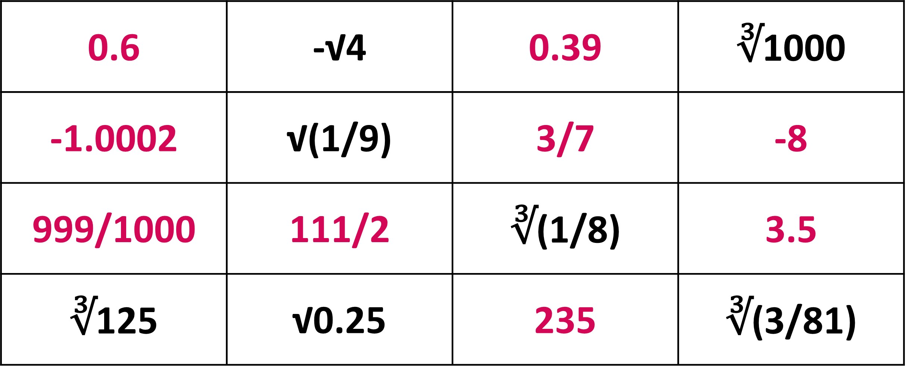

## Defining Square Roots and Cube Roots

You have already learnt about finding the area of squares in Geometry. Can you find out the area of the given square? 

We know,

Area of a square (A) = length2         
                     = 42           
                     = 16 cm2 

It’s simple enough, right! But, can you find the side length of a square when you know the area? Let’s use the given square.

Here, we are given that the area of the square is 25 cm2.

Area of a square (A) = length2  
or, 25 = l2

What next? We are still where we started, with the information that the area of the given square is 25 cm2.  
What is the number that gives 25 when squared? We are well aware that 5 squared gives 25 (52  = 25). Actually, -5 also gives 25 when squared, but let us consider only the positive value here. 
So, we can write; 
     25 = l2  
or, 52  = l2  
or, l = 5 cm 

A square with an area of 25 cm2 has a side length of 5 cm. Here, 5 is the square root of 25, because the square of 5 is 25. In other words, the square root of 25 is 5.  
Symbolically, it is written as √25 = 5. 
The square root of a positive number n is the number whose square is n. It is also the side length of a square whose area is n. We write the square root of n as √n. 
√n = n 
For example, the square root of 16, written as √16, is 4 because 42 is 16.  
√16 is also the side length of a square that has an area of 16.  
√16 = 4 

Now, let us find the volume of the given cube.

We know, 
Volume of a cube (V) = length3  
                     = 33  
                     = 27 cm3 

But, can you find the side length of a cube when you know the volume? You guessed right! We follow a process similar to finding the square root of a given number. Let’s use the given cube.

Here, we are given that the volume of the cube is 8 cm3 . 
 
Volume of a cube (V) = length3 
              or, 8  = l3 
 
What next? What is the number that gives 8 when cubed? We are well aware that 2 cubed gives 8 (23  = 8). 
 
So, we can write;

8  = l3 
 
or, 23 = l3 
 
or, l = 2 cm
 
A cube with a volume of 8 cm3  has a side length of 2 cm. Here, 2 is the cube root of 8, because the cube of 2 is 8. In other words, the cube root of 8 is 2. 
 
Symbolically, it is written as ∛8 = 2.
 
The cube root of a number n is the number whose cube is n. It is also the edge length of a cube with a volume of n. We write the cube root of n as ∛n.
 
For example, the cube root of 64, written as ∛64, is 4 because 43 is 64.
∛64 is also the edge length of a cube that has a volume of 64.

## Reviewing rational numbers

We have already learnt about rational numbers in Grade 6 and 7. Can you tell if a number is rational or not? Let’s find out!
Given here is a list of numbers.  

Here is what Lin has to say about the given numbers. 

Is she correct? Are all the other numbers not rational, then? 
Lin’s definition of rational numbers is absolutely correct. But, she seems to have missed a crucial point and misinterpreted the definition.

“Rational numbers are defined as numbers that can be represented in the form a/b…”. The phrase “can be” has a different meaning from “are”.  

Here, 3/7, 999/1000 and 111/2 are written in the needed form of a/b. But we have yet to check the other numbers. The numbers may be written in different forms when we encounter them, but if they can be written in the form of a/b (where a and b are integers and b is any other number than 0) they are rational numbers. 
 

Which of the numbers can we write in the form a/b? Let’s see what Andre has to say.  

Andre is right on point. All the integers are rational numbers as all of them can be written in the form of n/1. For example: 5 = 5/1, -18798 = -18798/1, 1 = 1/1, etc.  

 
Are there more rational numbers in our table? Here’s what Lin has to add. 
 

Well, Lin is correct! We must see if the given decimals can be written in the form of a/b before deciding. In the next lesson, we will explore more about decimals and rational numbers. 

Now, what about the remaining numbers? Jada has a suggestion for us! 

Let’s simplify the other numbers and see what we get.
 
∛1000 = ∛103 = 10 = 10/1 
√(1/9) = √(⅓)2= ⅓  
∛(1/8) = ∛(½)3 = ½ 
∛125 = ∛53 = 5 = 5/1 
∛(3/81) = ∛(1/27) = ∛(1/3)3 = ⅓  

All of these numbers in the form of square roots and cube roots are rational numbers as well.  
Turns out, all the numbers in our table are rational numbers. It is because we could write all of them in the form a/b, where a and b are integers and the value of b is not zero.  

 
By now, you must have well understood that the numbers written in many different forms (fractional, decimal, cube root, square root) can be rational numbers. But, what types of numbers are not rational numbers? We will be learning this a bit later!

