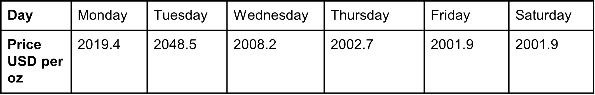
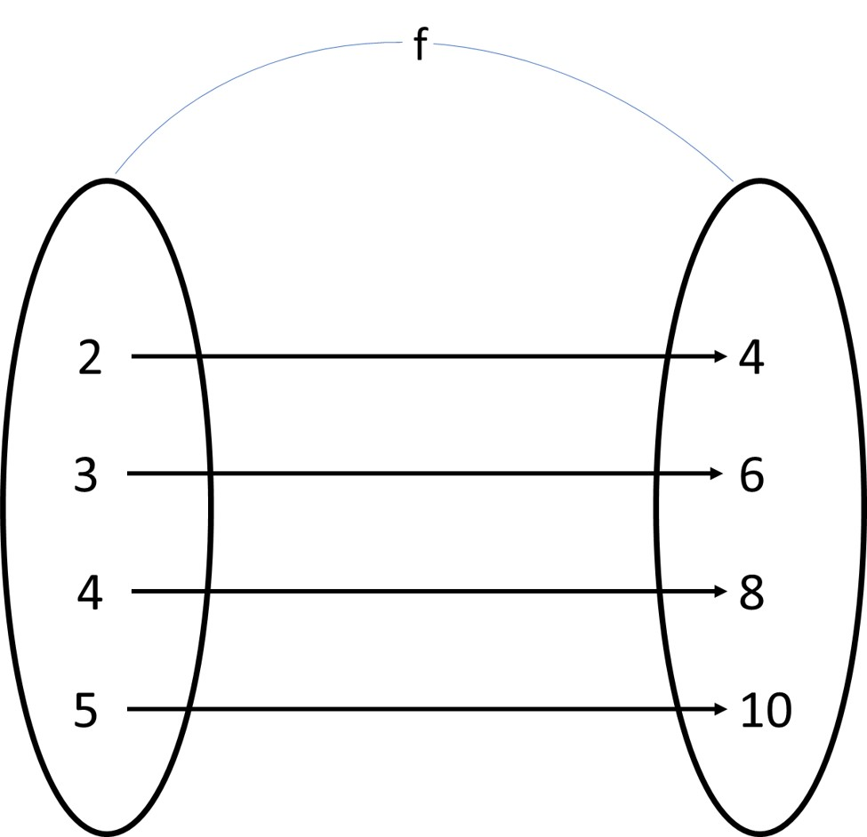
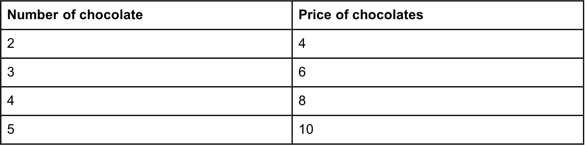
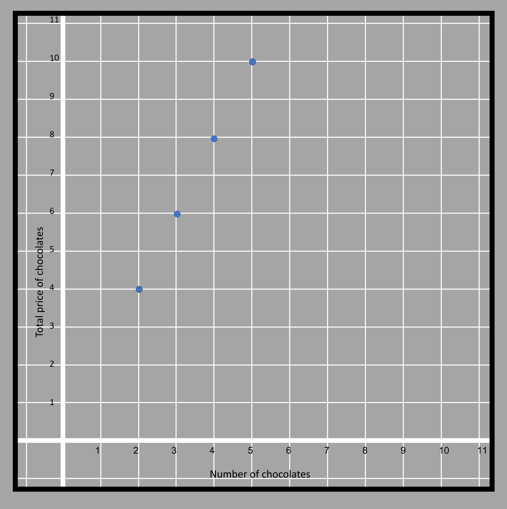
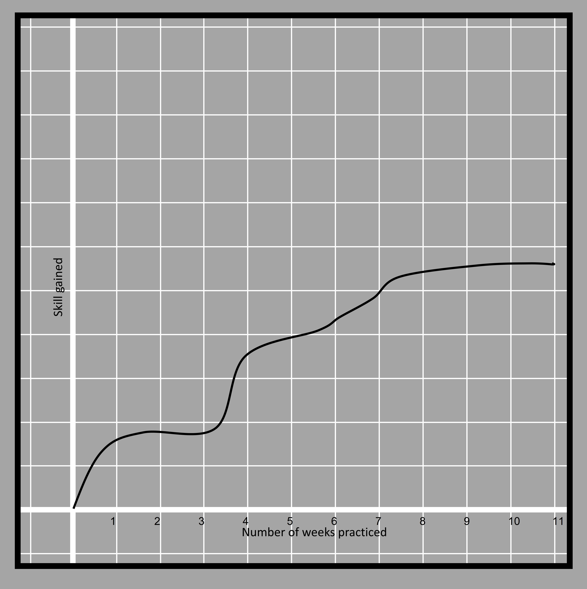
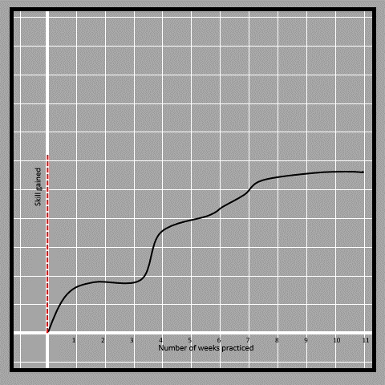

### What are functions?
Functions are the special type of relationships that relates two variables say 𝑥 and y such that there is a unique value of one variable “y” for a specific value of another variable “𝑥” or vice versa. 
We must not understand the meaning of relation as actually related. It may or may not be related. For example, we can define a function between the number of vehicles that enter your school on a particular exam day and the marks that you obtain on that subject. We obviously know that there is no relation between the variables, but they can be shown as a function if, for a specific value of vehicles entering in a day, there is a unique number that represents the marks obtained by you on that day.  
Let’s use an example to understand that. If we are recording the price of gold along with the day of the week.  

4.1

We can see that an ounce of gold costs $2001.9 on both Friday and Saturday. Now if you are asked about the corresponding day of the week when the price of gold is $2001.9, then there are two possible answers. So it is not unique. This shows that day of the week is not a function of the given price. Or in other words (the day of the week isn’t decided by the price of gold). Whereas if we are asked about the corresponding price for a particular day, let's say Friday then there is only one value of $2001.9. What is the corresponding price for Wednesday? It also has only one answer and that is $2008.2 That means that price of gold is a function of the day of the week which means after looking at the table above, we can clearly mention a unique number representing the price of gold by knowing the particular day of the week. 
We can take another example by which we can relate function to a real-life process. 

4.2

This is a vending machine for soft drinks. You insert money into them and choose the soft drink you want by pressing the button, then it provides you with the soft drink you selected (the amount is based on the money you insert). If we analyze the things input into the machine, it is the money and the instruction given by clicking the soft drink type. The output is the drink itself. There are two inputs and they both are required for one output. If you insert the right amount of money and choose Coke as the soft drink, you cant expect Sprite to come out of the machine. Thus the soft drink that comes out of the vending machine is a function of the button that is clicked and the money required. 

The study about what output we will get, based on a particular input, is done by understanding the type of relationship between the variables. We can predict the price of gold based on the day of the week. We can expect the type of soft drink based on the button pressed and money inserted into the machine. Being able to predict is the key to understanding functions. In the example of the vending machine, if once clicking the Coke button, it provides Coke and on the other occasion, it provides Fanta, then there is uncertainty, and that does not represent a function. 

We study functions deeply to understand relations like these so that we can predict the nature of some variables. For that, we need to understand the type of relationships that exist in a function. 
All relationships are functions in which we don't get a different output for the same input in different ocassion.

### Domain and Range
Domain and range are terms that are very important in functions. 
Let's understand their concept with the above example such that a particular button is clicked. It accepts money from you and provides drinks. If money is the input and a type of soft drink is the output. We cant insert just an ordinary paper similar to the shape and size of a dollar bill and get a soft drink as the output. That is why the only paper that has dollar printed on it is the domain and the drink that we get from the machine is its corresponding range. The domain is the set of all possible inputs to a function whereas the range is the set of all possible outputs. 

Functions can be demonstrated in various forms, it may just be in the form of ordered pairs. Pair means two and ordered means of a certain order. 
#### ordered pair
In ordered pair, we cant interchange the position of the two elements in a particular pair. 

For example, (2,4) is not equal to (4, 2).

The function can be demonstrated as a set of ordered pairs. 
For example, a function that doubles a number can be written as 
f={(2, 4), (3, 6), (4, 8), (5, 10)...............}
We can assume the two elements in the given pair are number and price of chocolates that cost $2 each. 
In each pair, the initial number (representing the number of chocolates) is the domain and the latter (representing the price of the chocolates) is the range. 2 chocolates cost $4 in total so 2 is the domain and 4 is the range. We can also write the statement denoting the price of two pens as ‘f(2)’ and it is equal to 4. 
If the corresponding range for 2 is asked, it is represented as f(2) and is equal to 4 because the second element in the pair with 2 as the first element is 4. 

#### Mapping Diagram

Functions are also demonstrated with a mapping diagram such as below. 

4.3

In the mapping diagram, we show the domain and range with two elliptical groupings and write the individual domain and range inside that shape. Each corresponding range for a particular domain is shown with the help of an arrow pointing toward the corresponding range.

#### Tables
The function can also be shown in a tabular form which is very similar to the mapping diagram form. 

4.4

#### Equation and Graph
If the number of chocolates is ‘n’ and the price of chocolates is ‘p’, then the function may also be written the form of an equation

p=2n

Since any relation expressed in the form of an equation can be plotted in the graph, this relation can also be drawn in the graph. 
The number of chocolates is plotted along the horizontal axis whereas the price of chocolates is plotted along the vertical axis. 

4.5

The points seem to fall in a straight line but the line isn't drawn because there aren't enough points to join them end to end.
 
We need to understand that we cant join consecutive points present in the line. That is because we cant have 2.5 chocolates to sell or buy. 

Let’s study a different type of function from the graph. Here is a graph that is drawn between the skill of playing piano and the number of weeks practiced by Anne. The measurement of skill is measured in terms of the number of exercises she is able to complete at the end of a week. 

4.6

First question we must ask ourselves is, does the given graph represent a function? How can we find out?

Normally when we plot a function, we plot the independent variable on the horizontal axis and the dependent on the vertical axis. However it is not mandatory to do so. Thus, the skill gained is dependent on the number of weeks practiced. We check if there are two values of skill for the same number of days. To do that, we can move a vertical line along the horizontal axis and observe if the line crosses the curve at more than one point. That means the skill gained is a function of weeks practiced. 

4.7

Now since the line touches the curve at one unique point throughout the curve, we can say that skill is the function of a number of weeks. 
If we had to check if the number of weeks is a function of skill gained, then we have to check with a horizontal line instead of a vertical line. 

What information can be extracted from the curve other than that?
We can see that with the increase in the number of weeks, the skill is increasing. The amount by which the curve rises gives the amount of skill gained. That amount is not consistent throughout the curve. At some points, the skill gained is sharply increasing whereas at some points the increment is barely noticeable. 
