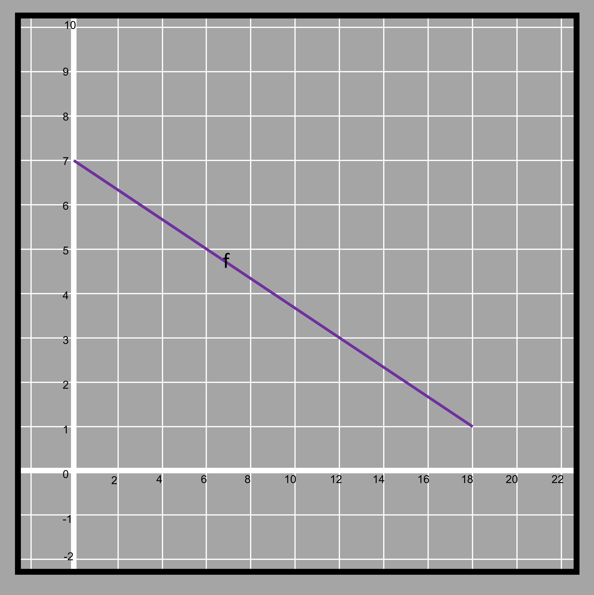
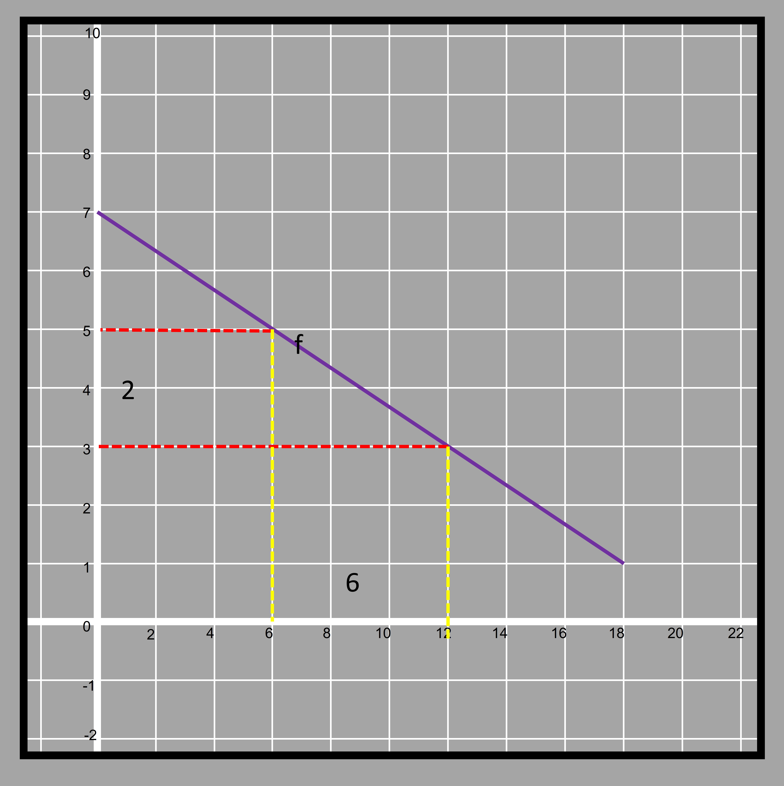
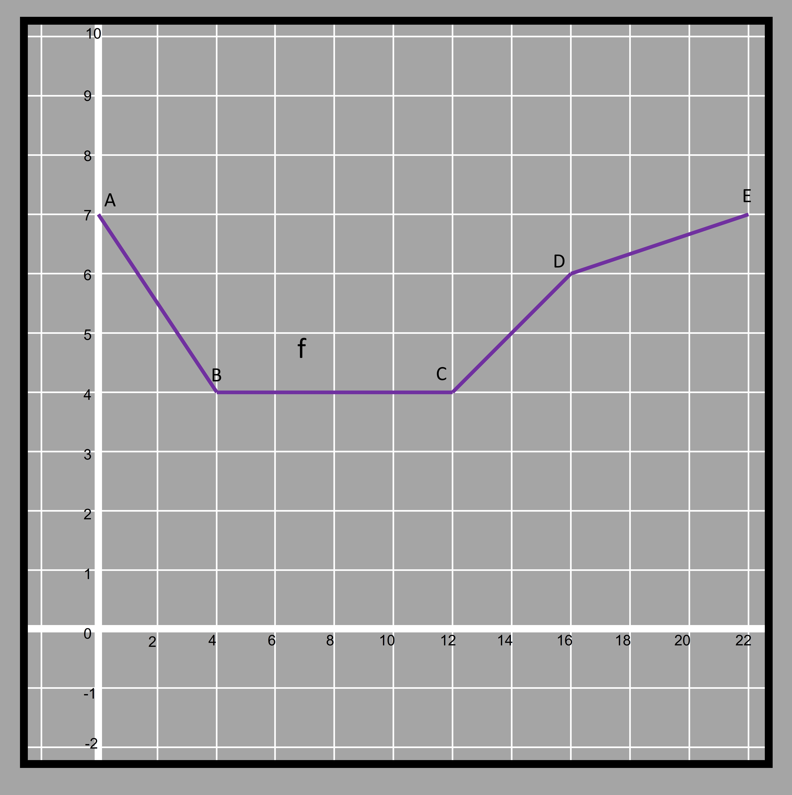
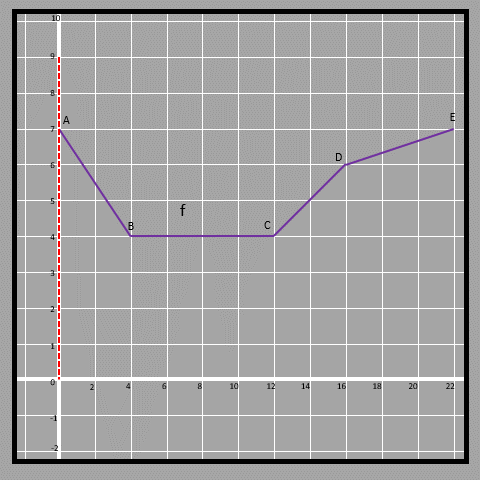
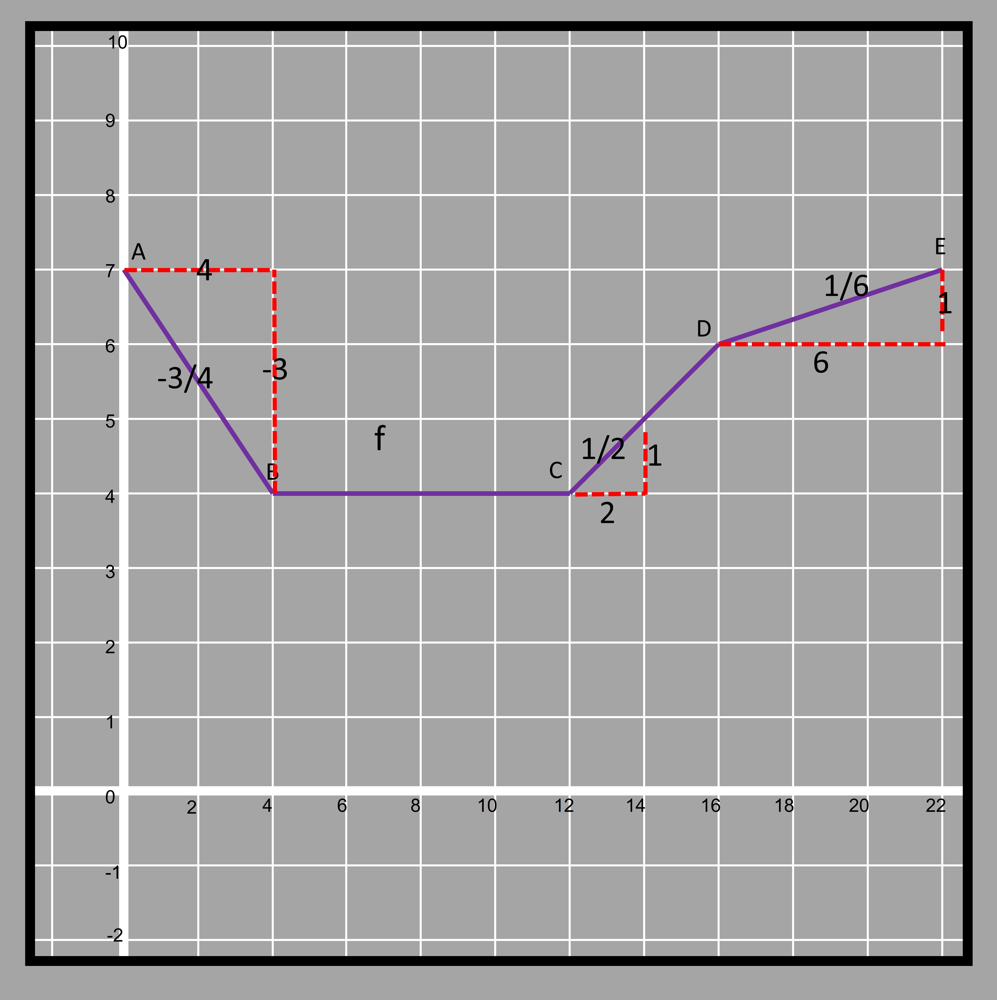
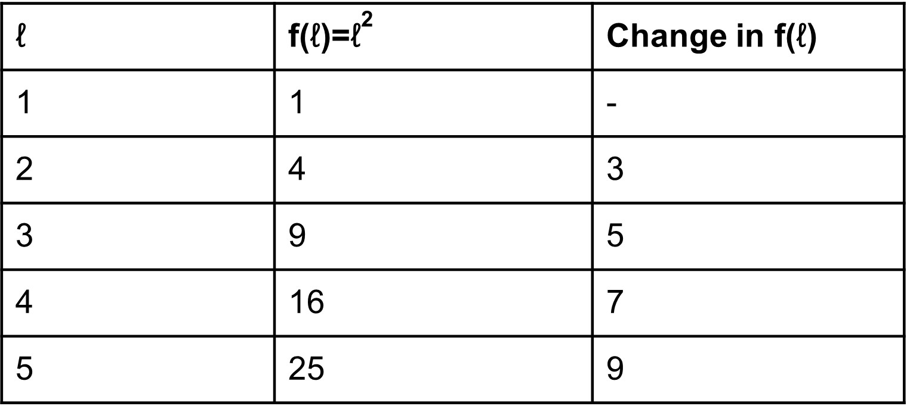
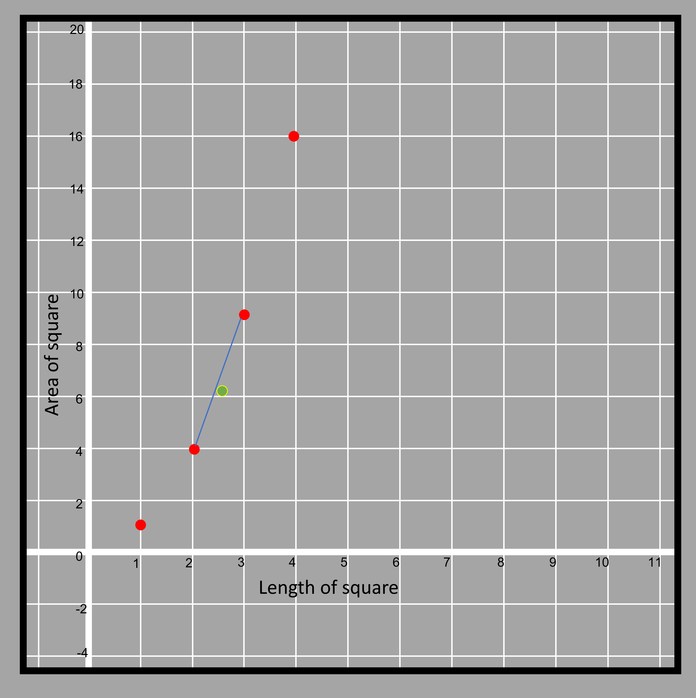
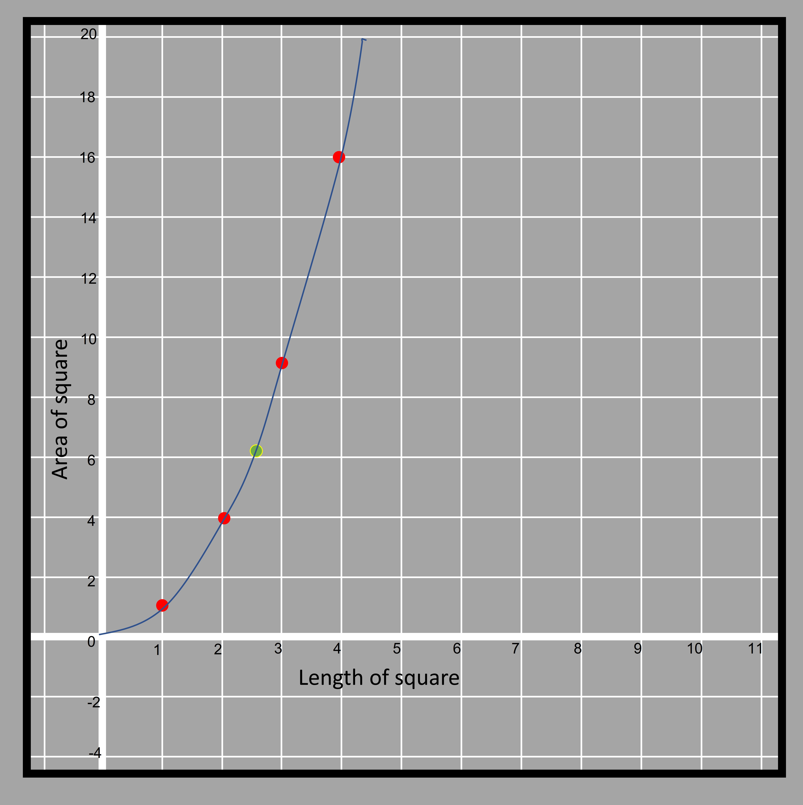

We saw that when a linear function is represented with an equation, both the variables have thier exponent as 1. If the exponent is a number other than 1, then the function is non-linear. There are different type of non-linear function and the rate of change in such functions is not constant. 

Let's take the example of an area of a square ‘A’ being represented by a function of length, l. Here, we are modeling how the area changes when we change the value of l. We know that area is given by ℓ2. So we can write A to be a function of l (A being dependent on l) as A = f(l) = ℓ2. A function of this type is known as quadratic function in which the equation if of degree 2.  

Representing the values in a tabular way, we get the following:

4.21

The rate of change in f(ℓ) isn't found to be constant here. So the area does not change with the same value if we change the length with the same value. The function is clearly not linear in this case.

But, with further calculation, we can see that the difference of the difference in ‘Area’ is actually constant.

4.22

Natalie is a convicted criminal and is running away from the police station covering 98 miles per hour. If she started when she was already 43 miles from the city police station, how far she will have reached after 5 hours?

If we try to denote the distance traveled by Natalie as a function of time then it can be done with the equation expressed in the form of y=m𝑥 + c. 

After each hour the rate of distance traveled increases by 98 miles then the value of m is 98 and the initial value of the function is 43. So, c is equal to 43. 

If the distance traveled is denoted by ‘d(t)’ (it doesn’t always have to be y to denote the dependent variable) then d(t)=98t + 43 where ‘t’ is the time taken in hours. 

How far will she be after 5 hours is given by substituting the value of ‘t’ as 5 in the given equation?
The answer to such questions is given by the functional value from the equation by substituting some number in the equation. ("5" in this case)

d(5)=98x5 + 43

=533 miles

Natalie will be 533 miles ahead of the city police station in 5 hours. 

The table is one of the most useful ways of determining the characteristics of a function. It gives us an idea of the rate of change of the curve and its own pattern. We can take data from any situation and then analyze the trend of the given data so that we can find some pattern in the relation. 

In the cases considered before this, the rate of change were always positive. It means that the functional value increased as we go from left to right (as the value in the horizontal axis decreased). Let's have a look at a linear function in which the rate isnt positive. 

4.23

The blue line represents a function f in which we can see the line is decreasing vertically as the horizontal distance increases from the origin. 

4.24

With every 6 units increase in the horizontal direction, there is a decrease of 2 units in height. 
The functions that have a positive rate of change are known as increasing functions and that have a negative rate of change are known as decreasing functions. 
Functions may have some points where the function is increasing, some points where it is decreasing and some points where it is not changing.
  

Let’s consider a case in which there is a combination of linear sections in a function. 

4.25

Firstly is this graph a function? Let's try and move a vertical line from left to right on the graph to find out if the curve cuts the line at more than one point.

4.26

Yes, the given graph is a function. Since the vertical line intersects exactly at one point in all instances. There are three points in the graph (B, C, and D) where the function changes direction and they are the turning points in the curve. The slope of the line changes at all three turning points.   

Here the function f can be observed in different sections. The nature of the function from A to B, B to C, C to D, and finally from D to E is different. 

If we observe from A to B, we find that the function is decreasing, from B to C the function is neither increasing nor decreasing. Parts of the function after C are increasing but at two different rates. 

The initial value of the function is 7 because it is the point where the curve intersects the y-axis. 

The rate of change of the decreasing part from A to B is -¾. 

The rate of change between B to C becomes 0 because in that part the function neither increases nor decreases. 

Between the two increasing parts of the function at C to D and D to E, we see that the D to E part is less steep than comparing that of C to D. The rate of change of C to D is ½ while in section D to E is ⅙.

4.27

If a line is completely vertical then the slope or rate of change for such functions is infinite or undefined written as ∞. 

Let's try and examine a graph of a nonlinear function that was discussed earlier. 

4.28

If we plot the given points we get the graph as below

4.29

If we have to join the points given, we can’t do that using straight lines because it isn’t a linear function. It can also be proved by the fact that the points between 1 and 2 or 2 and 3 don't lie in the straight line joining the points. 
For example f(2.5)=2.5^2 = 6.25

4.30

The green dot representing (2.5, 6.25) doesnt actually fall if the two points are joined by straight line. That is why while joining the dots lie under a particular function (that is not linear), we use hand-sketched curves.

4.31 

Clearly, the graph is increasing but the rate of increase is not the same at all points. In fact, as we move more and more away from the horizontal, we find the curve becomes steeper and steeper. The function changes its rate of change rapidly as the exponent of independent variable increases.  

How many turning points can we notice in this curve then?
In non-linear functions like these, we can say that there are infinitely many turning points. This is because the slope changes at all points and the direction of the curve rises slightly towards the vertical after that. The initial value of the given function is 0 because the curve touches the y-axis at 0.  It can also be interpreted as the area of a square being 0 if its side length is 0.  
