### Representing a function  
We can represent function in different ways. The form of representation for a particular function is dependent on the context of function and the information required. 

Ordered pair is one such representation in which a domain and its corresponding range is represented with a pair and a function is represented with many such pairs. In such representation, we can see all of the domain and range at once. But when many pairs have same domain or range repeated multiple items, it becomes tedious. 

While the same element being repeated is very tedious with an ordered pair form, it is much easier with a mapping diagram. In a mapping diagram there are two oval shapes for domain and range each and each pair of domain and and range are linked with an arrow. 

With a mapping diagram, we can find out very easily if multiple inputs relate to one output or different outputs. We can also distinguish between the sets of the domain and range better as even when the same element is used multiple times, we dont write it multiple times.

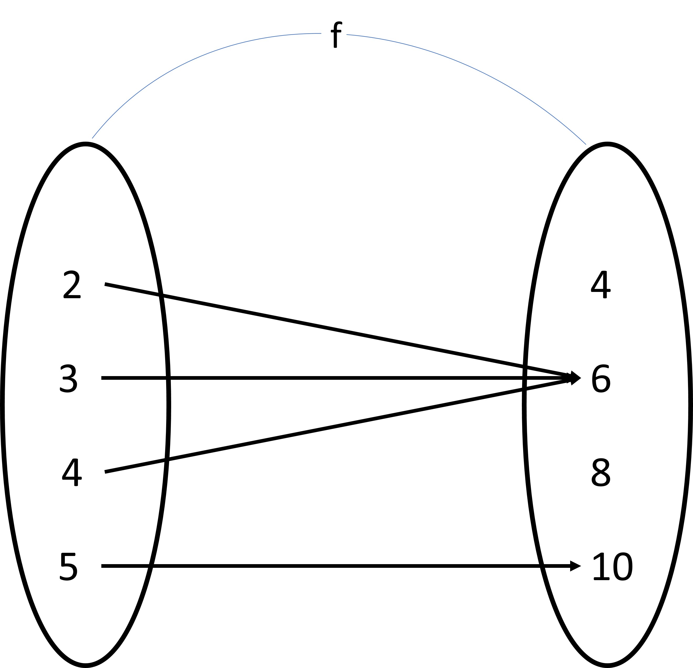
4.32

In the image we can see that 6 is the range for three different domains but we dont write 6 three times. The disadvantage of demonstrating the function with a mapping diagram is similar to that of ordered pair form. If there are many elements in the domain and range set, then the diagram will occupy large area and is cumbersome to draw.  

We can also show a function with a graph. We plot the ordered pairs in the graph. We have a vertical and a horizontal axes in the graph. With a graph, we can visually see if the given variables share some kind of relationship. We get a clear idea of how the dependent variable (range) changes as the independent variable(domain) changes. The disadvantage with the graphical representation is we dont get the true values just by glancing at the graph at once.   

To find the relation between the two quantities representing the domain and range, we need to find the rate of change. The rate of change of a function is a term coined to analyze the changes in the dependent variable(range) with respect to changes in the independent variable(domain). We find the difference between two range and their corresponding domains and dividing the difference of range by that of domain. 

Let’s examine a function from an earlier example. 
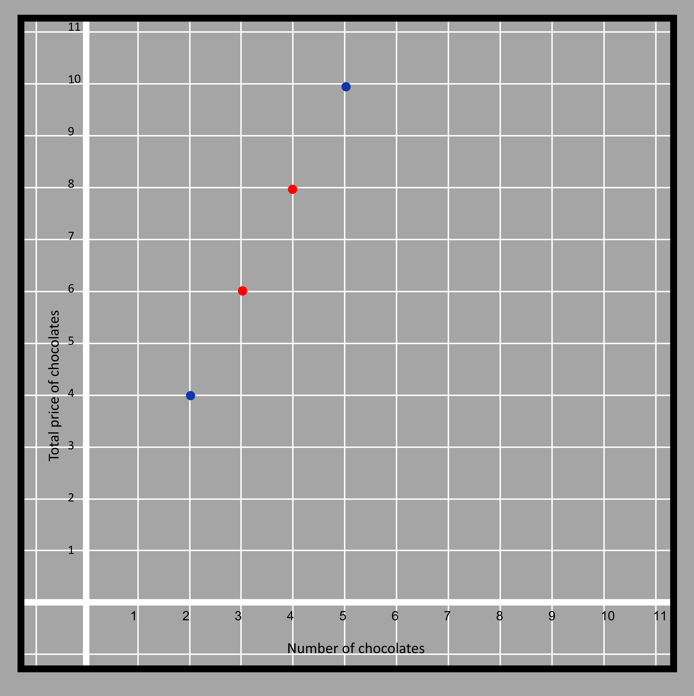
4.8

The kind of function where the rate of change is constant between any two points is a linear function. We choose two random points from the graph because the rate of change is same throughout a linear function (when all the points lie on the same line) and we choose the points marked in red to find the rate of change of price with respect to the number of chocolates. 
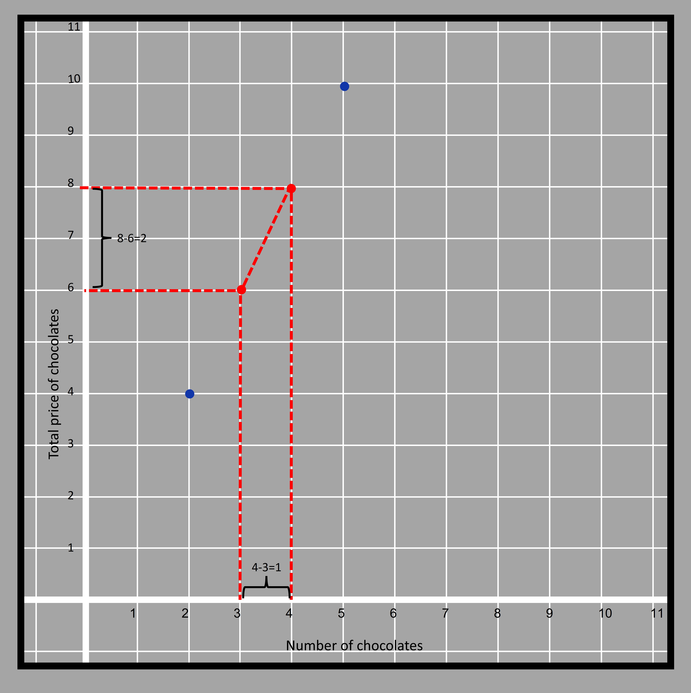
4.9

Rate of change=(8-6)/(4-3)=2

The rate of change can be interpreted as when the number of chocolate increases by 1, the total price of the chocolates increases by $2. It may sound obvious because we started analyzing the context starting with the assumption that each chocolate costs $2. We have described slope in detail in geometry section.  

We also had a look at a function analyzing the piano playing skills with respect to the number of weeks practiced by Anne. The function is nonlinear because the rate of change isn't the same at all times and it changes its direction multiple times. 

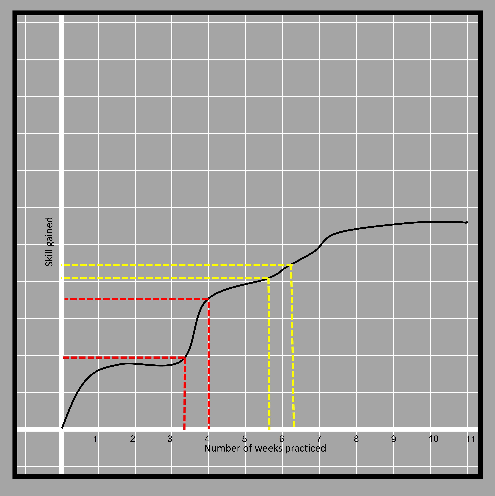
4.10

The sections in the curve shown with yellow and red straight lines can clearly tell that the section shown in yellow is less steep than the one in red and thus the rate of change is less in the red part. It is basically how much the graph has risen for a similar time (of less than one week) in both cases. The yellow part has a lesser change in skill at the same time compared to the red. The way of finding the slope for non-linear functions isnt by the ratio of the differences.

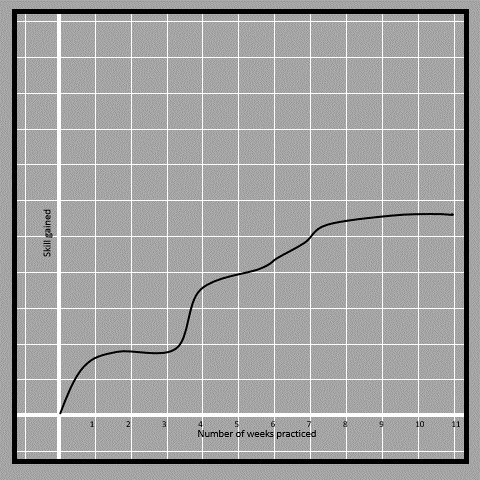
4.11

If the rate of change is different at different sections of the graph, the function is a nonlinear function. There are various kinds of nonlinear functions. Such as Quadratic, cubic, logarithmic, exponential, etc. 

### Comparing two linear functions
Two cars participating in a race, cover distance with respect to the time taken “t” hours given by two functions f(t)=80t and g(t)=100t respectively. 
The two functions can be shown in graph as shown below. 

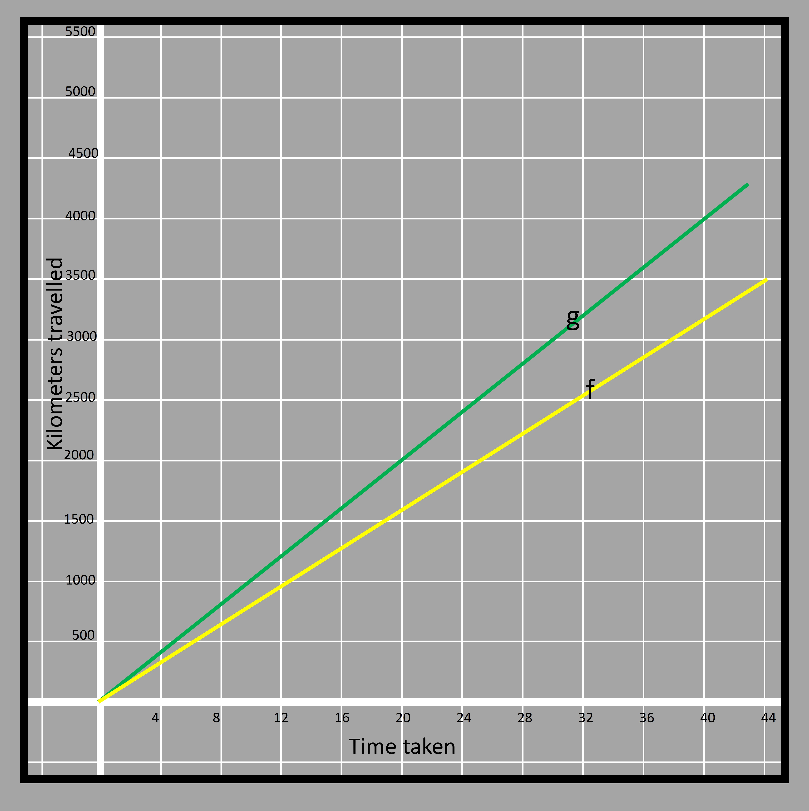
4.12

The yellow line represents function f and the green line represents function g. The values in the vertical axis represent the kilometers traveled by the two cars and the values in the horizontal axis is the time taken in hours. 
The coefficient of the dependent variable ‘t’ in the equation representing the function gives the distance traveled in ‘t’ hours. 
For example, the yellow car travels 80 km in 1 hour, (80x2) km in 2 hours, (80x3) km in 3 hours, and so on. 

Taking t=4, f(t)=80x4=320km
Taking t=8, f(t)=80x8=640km
Taking t=12, f(t)=80x12=960km

Thus the yellow line passes through (4, 320), (8, 640), and (12, 960).

The green car travels 100 km in 1 hour, (100x2) km in 2 hours, (100x3) km in 3 hours, and so on. 
Taking t=4, g(t)=100x4=400km
Taking t=8, g(t)=100x8=800km
Taking t=12, g(t)=100x12=1200km
Thus the green line passes through (4, 400), (8, 800), and (12, 1200).

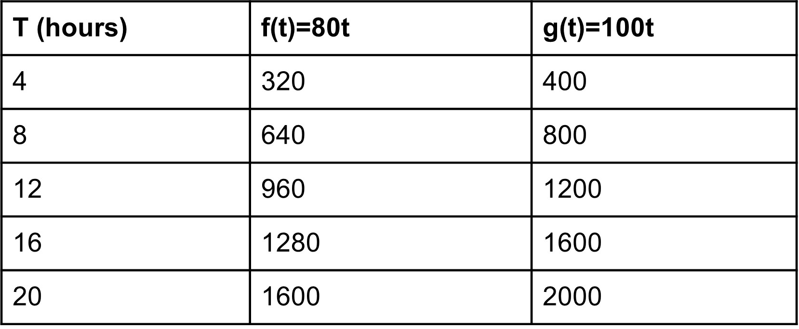
4.13

We can see that in the graph, except at the origin, the function ‘g’ always has higher functional value than ‘f’. We can verify that because we saw larger values for g in the table as well.
That can also be observed by the coefficient of the ‘t’ in the two equations representing functions ‘f’ and ‘g’. 

The two equations start at the origin thus the two functions are said to have their initial value of 0. The equation of such lines can be written in the form of y=m𝑥. The relation is known as a proportional relation. We can multiply one of the variables by a constant number and get another variable. That constant number is the rate of change which we have learnt to calculate. 
If the graph intersects at any other point in the y-axis other than the origin, then the equation is in the form of y=m𝑥 + c. Here ‘c’ is the initial value of the function. 
Suppose the function has an initial value of 400 instead of 0 with the same rate of change 80. 
f(t)=80t+400

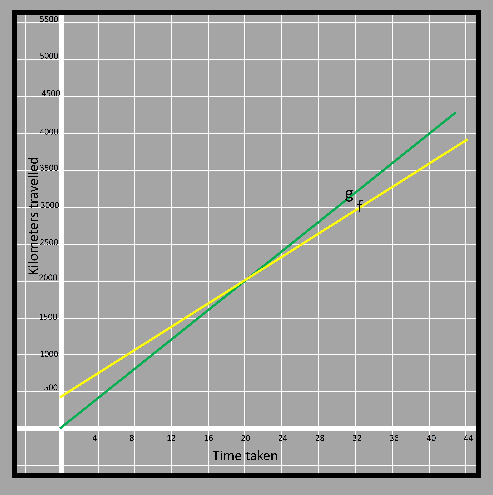
4.14

The initial value of 400 for ‘f’ (yellow car) compared to 0 for ‘g’ (green) means that the yellow car starts 400km ahead of the green car. Even though the yellow car is ahead at the start, the speed of the yellow car is less than that of the green car which is why the green car will catch the yellow car. They will be at the same distance after 20 hours. 

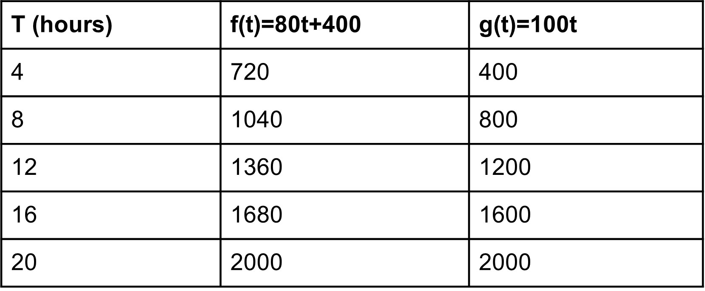
4.15

We can compare two functions that are provided in two different representations. For example, we are given a graph for one function and another function with tabulated values. 
Let's have a look at the graph below representing function ‘f’

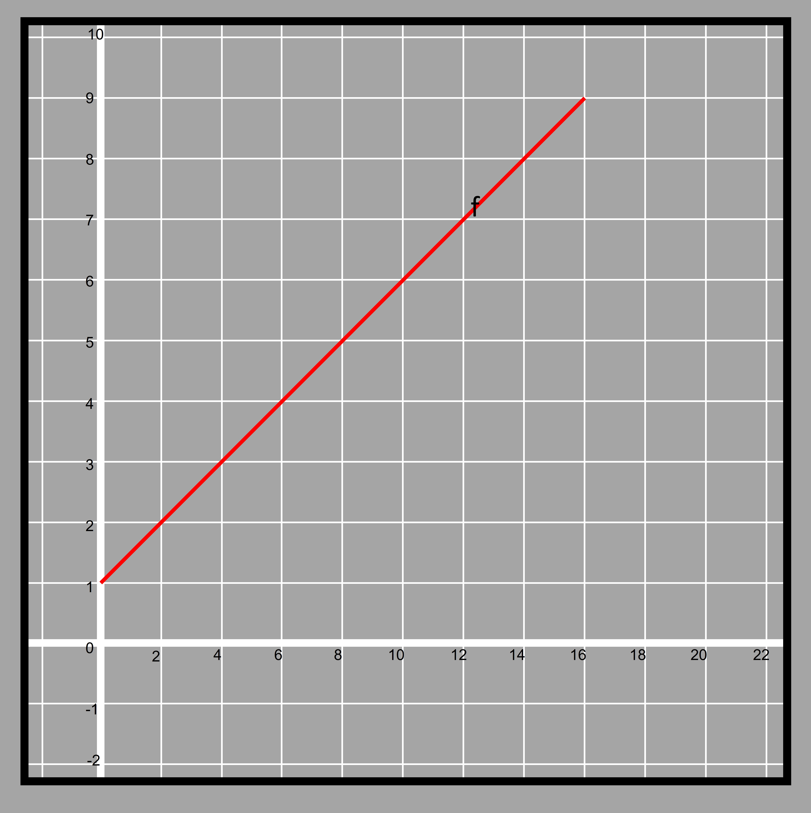
4.16

then there is another function representing function ‘g’ given in the form of tables.

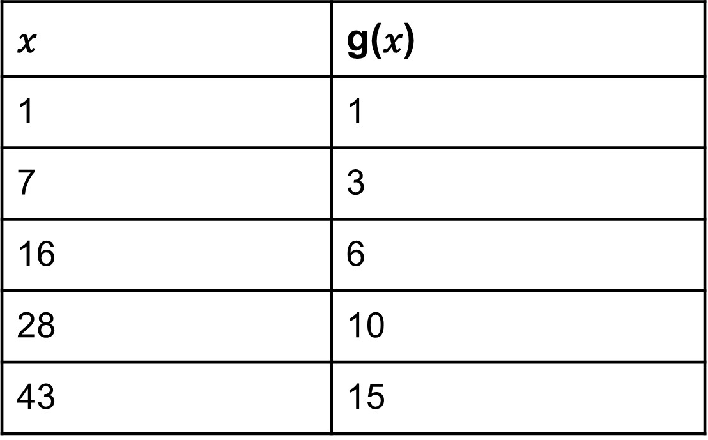
4.17

If we have to compare the function given in the graph and the table, how can we do it?

We can transform the table into a graph and then easily calculate the rate of change between the two. If the main methodology of comparing the functions is based on the rate of change then it can be done very easily.
Lets first do that for the function shown in graph

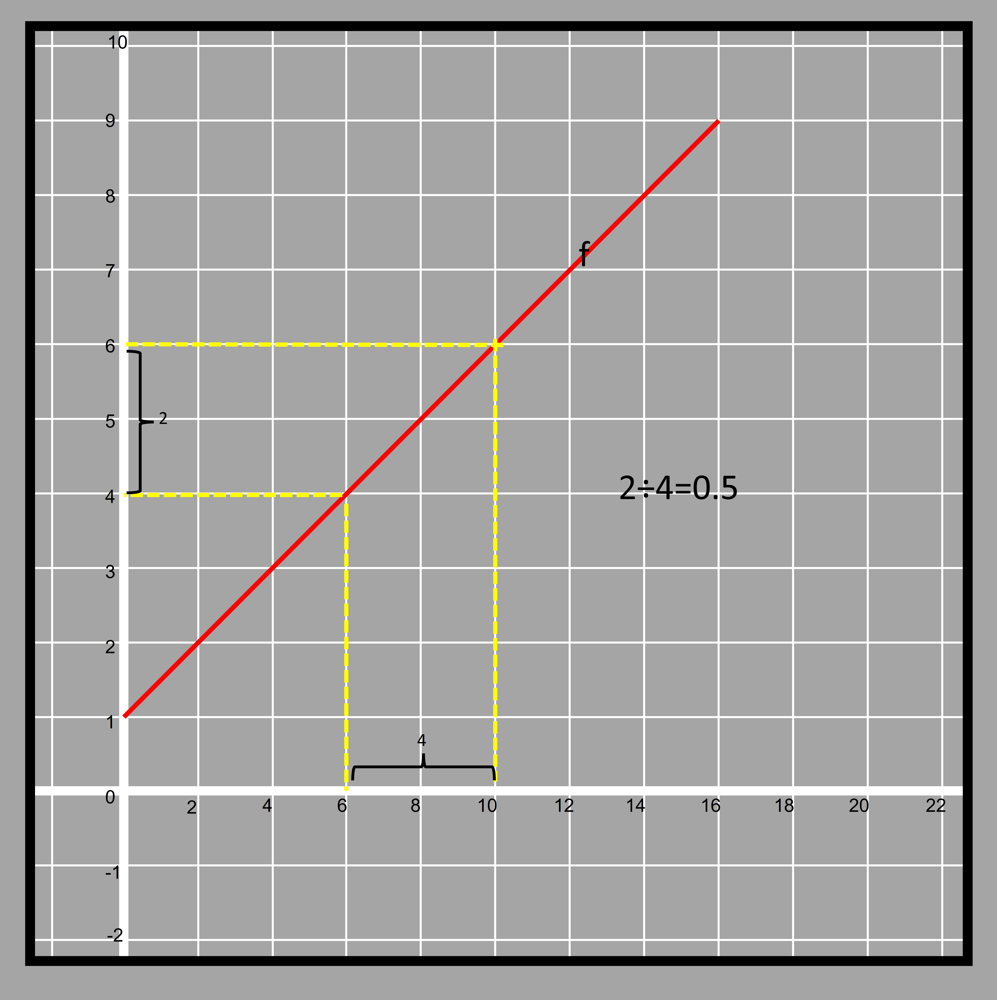
4.18

The line also intersects y-axis at 1. So the initial value of the function is 1. 
Calculating the rate of change for the function given in table

4.19

This shows that the function given in graph has a greater rate of change. We can check that by plotting the values of 

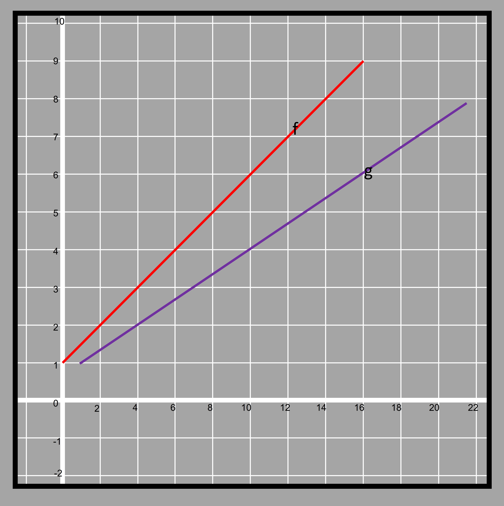
4.20

The blue line is seen to be less steep than the red one. We have already calculated the rate of change for the blue line. 
The standard form of equation used for any straight line is y=m𝑥+c where m is the rate of change and c is the initial value of the function. In geometrical terms, they are known as slope and y-intercept respectively. 
