## Sum of three angles in a triangle is 180 degrees
A closed figure formed with straight sides only is known as a polygon.  How many sides are required to form a closed figure?
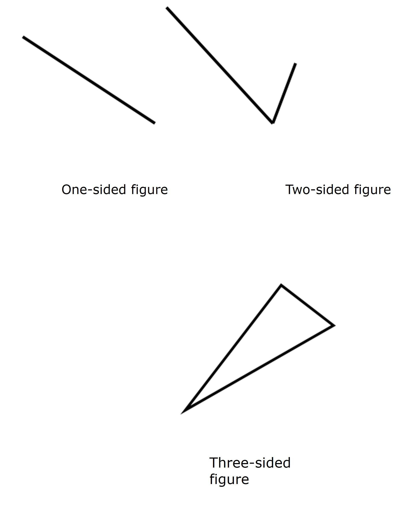
10.6

We need at least 3 sides to form a polygon. If a polygon has 4 sides, then it is known as quadrilateral. If the number of sides in the polygon is 5 sides, then it is known as a pentagon. 
If the polygon has all of its sides equal to each other, then it is known as a regular polygon. A regular polygon has all of its angles equal to each other as well. A regular triangle is known as an equilateral triangle. A regular quadrilateral is known as a square. 
The three angles of a triangle (any triangle) when added are equal to 180° degrees. Let's observe the triangle ABC so we can see that there are three angles 47.5°, 27.5°, and 105° degrees. 

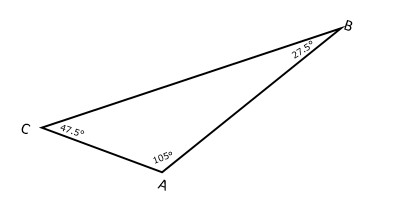
10.7

The angles made at B and C i.e. 27.5° and 47.5° degrees can be rotated to move to vertex A such that they fill up the right and left part of the 105° angle to make a straight line. The angles can be moved because the newly formed angles are alternate angles to angles at B and C respectively.  

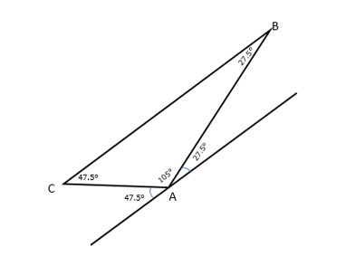
10.8

We know that a straight line is measured as 180° in angle. Thus in the end the three angles of the triangle sum up to 180° degrees as seen in the figure. 

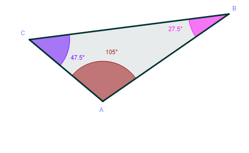
10.9

### Types of triangles
Based on the range of angle size, we can classify triangles into different types:
If all the angles in a triangle are less than 90° degrees, then the triangle is known as an acute-angled triangle.

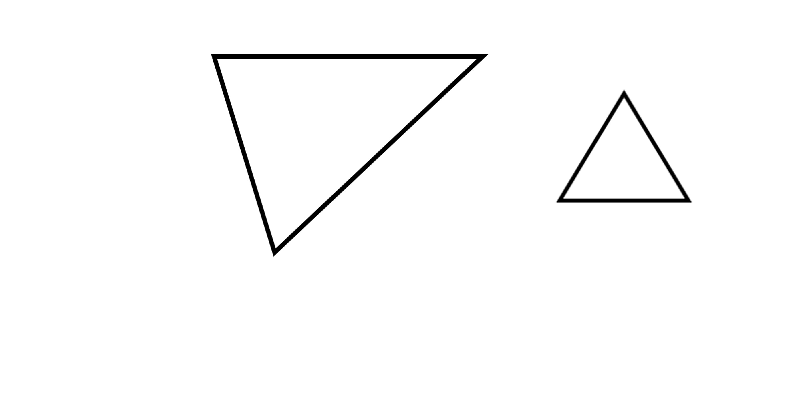
10.10

If one of the angles in a triangle is 90° degrees, then the triangle is known as a right-angled triangle. Here are two examples of right-angled triangles. 

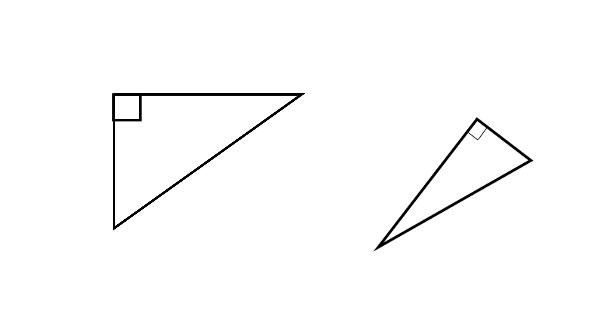
10.11

### Is more than one right angle possible in a triangle?
Theoretically, it is. If two of the three angles are 90° then the sum of those becomes 180°. However, there are three angles in a triangle. If two of the angles in the triangles makes 180° degrees already and the sum of three can't exceed that number, the third must be zero. How must a triangle with 90°, 90°, and 0-degree angles look? We can't construct such a triangle. 
If any of the angles in a triangle is more than 90° then the triangle is an obtuse angled triangle. 

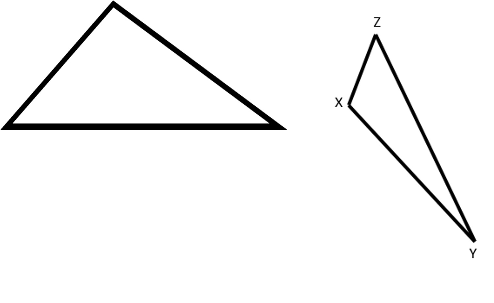
10.12

Triangles can also be divided into three types according to the equality of sides.
If none of the sides are equal to each other, then the triangle is known as a scalene triangle. None of the angles are equal in such a triangle.

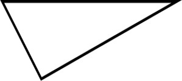
10.13

If two of the sides are equal, then such triangles are known as isosceles triangles. The two angles opposite to the equal sides are known as base angles for isosceles triangles and they are equal. 

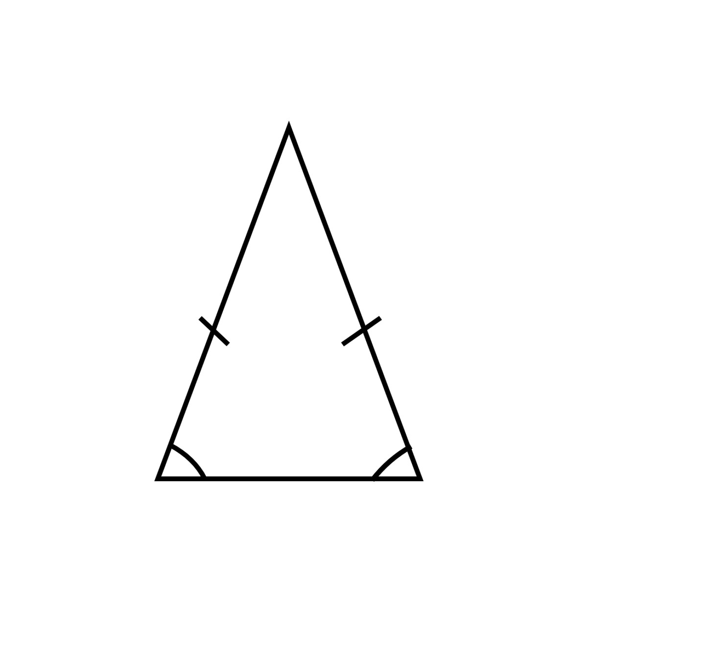
10.14 

If all three sides are equal, then such a triangle is known as an equilateral triangle. Since the sides are equal, each angle opposite to them will also be equal in magnitude. 

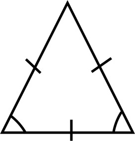
10.15 

We also know that the sum of the three angles in all kinds of triangles is 180°. If one of the angles is supposed to be 'p', all of the angles will be 'p'.
p + p + p = 180°
or, 3p =180°
or, p =180°/3 =60° degrees
Therefore, in all equilateral triangles, the internal angles are 60° degrees each. 

### Exterior angle of a triangle
Suppose we have a triangle BAD as shown in the figure. 
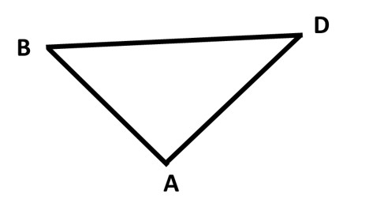
10.16

Then according to recent learnings, the angles formed at the three vertices; A, B, and D are summed to get 180° degrees. Let's extend line BD to C. 
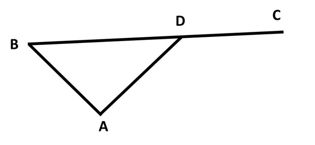
10.17

There are two angles formed at point D, one is ∠ADC and the other is ∠ADB. The sum of the two is also 180° degrees because both angles are formed in a straight line, making them supplementary angles. We have two equations as follows:
∠ADC + ∠ADB =180 and (∠ABD + ∠BAD) + ∠ADB = 180°
When we compare the two equations, we get, 
∠ADC = ∠ABD + ∠BAD (They need to be equal since ∠ADB and 180° are equal in both equations.)
This can be translated into a theorem that says that the exterior angle (∠ADC) of a triangle is equal to the sum of two opposite interior angles (∠ABD + ∠BAD). This is true for lines extended from any side, just keep in mind that they need to be an extension on one of the sides (Like DC is extended from BC).

### Quadrilaterals
After learning about the triangle, we move on to the polygon made with four sides. A polygon with 4 sides is a quadrilateral. Based on different relations and specialties among the dimensions of the quadrilateral, it is of different types. 
Parallelogram, rhombus, rectangle, kite, trapezium, and square are all types of quadrilaterals. They are called quadrilaterals because they possess 4 sides. 
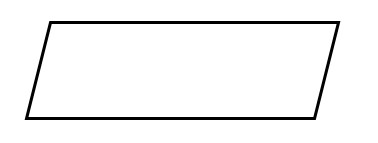
10.18

Quadrilaterals with opposite sides that are parallel are parallelograms. In such cases the opposite sides are equal as well. The figure above is a parallelogram. 
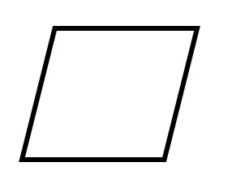
10.19

When in a parallelogram, all of the four sides are equal with each other, it is called a rhombus. The figure given above is of a rhombus. 
If a parallelogram has all of its angles 90 degrees or right angles, then such shape is known as a rectangle. Just like in parallelogram, the opposite sides are equal as well as parallel to each other. The figure below is of a rectangle. 
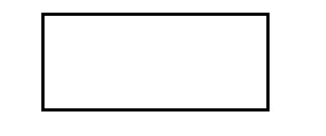
10.20

If in a rectangle, all the sides are equal to each other then the shape is a square. A square is given below. 
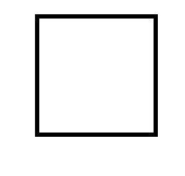
10.21

Squares are the most symmetrical quadrilateral with all of the sides equal. They possess all the properties possessed by parallelograms, rhombi, and rectangles. 

The total sum of angles in a triangle is 180. What about a quadrilateral?
A quadrilateral can be divided into two triangles when any two of the opposite corners are joined with a diagonal. 
The sum of angles in both the triangles is 180 and two triangles mean that the total sum of all the angles in the quadrilateral is 2 x 180°=360° degrees. 
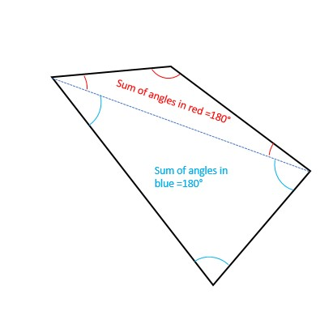
10.22

Since there are two opposite corners to form a diagonal, a polygon of ‘n’ sides will have ‘n-2’ triangles possible to form inside it. Thus the sum of all its internal angles is (n-2) x 180°. 
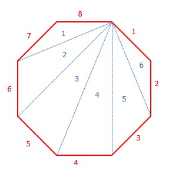
10.5

Eight sides and six triangles in an octagon

If we know the number of sides of a regular polygon, we can easily find the measure of the interior angle. 
Now that we are sure that there are ‘n-2’ triangles in polygon containing ‘n’ sides. 
Total sum of n angles in the polygon = 180° + 180° + 180° + 180° + 180° …….. (n-2) times
=(n-2) x 180°
There are ‘n’ angles in a n-sided polygon. If the polygon is regular as well, then all of the angles are equal to each other. Therefore, each internal angle in an n-sided regular polygon is [(n-2)/n] x 180°. 
In a regular pentagon, each internal angle measures,
(5-2)/5 x 180° = ⅗ x 180° = 108°
In a regular hexagon, each internal angle measures,
(6-2)/6 x 180° = ⅔ x 180° = 120°
