## Dilation: the non-rigid transformation
The transformations we have studied so far are all examples of rigid transformations, where the shape and size of the object remain unchanged. Now, we move on to a non-rigid transformation - Dilation.
Dilation is the only form of transformation that does not preserve the congruency of the figure. Dilation is the process in which the shape of the object remains the same while the size of the object changes (increases or decreases). Think of using a microscope or magnifying glass to look at small objects. They look big, right? Or maybe think of google earth; all images there are shown there are actually bigger in the real world while they easily fit on a small computer screen. 
If you have a square of size 2 units and you decide to double each side, you get a new square, now with a side of 4 units. The new square is the scaled-up image of the original square. Similarly, if you had halved the original square, the new square would have been the scaled-down image of the original with each side measuring 1 unit.
They have both been dilated! Such images are formed and the original object is similar in shape. Just have a look below.

9.1

### What is meant by a similar shape then?
As we can see, the angles between the different lines are the same. The parallel lines remain parallel, the perpendicular lines remain perpendicular. Basically, all angles remain the same
The other important requirement for dilation is the center. This is the point, with respect to which an object has to be dilated to get the image. The object/image seems to vanish at the center. The value of the scale factor gives how far the image will be from the center when compared with the distance of the object from the same center. Basically, the ratio of the distance from the center to the image and the center to the object gives us the scale factor. 
In the same way as rotation, all objects (vertices) and their respective images can be joined with a line all passing through the center.  
The given figure is an example of dilation, in which the object has been dilated with a scale factor of 3 from the center O shown. 
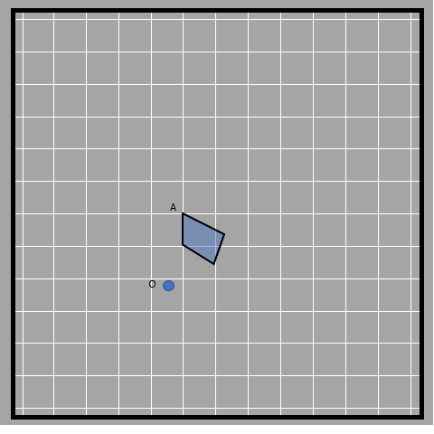
9.2

The scale factor is the ratio of the distance of the image from the center to the distance from the object to the center (you can measure the distance of just one point for this). We get this as 3 for this case. 
OA'/OA=3 
The same ratio is maintained by all of the points of the image and object. The sides of the larger quadrilateral are three times larger than that of the smaller quadrilateral. 
The scale factor is also the number of times the image is bigger or smaller than the object. 
Think of proportional relationships where all quantities are multiplied by the same amount to get essentially the same relationship (equivalent ratios). 7 ÷ 14 is also 0.5, 6 ÷ 12 is also 0.5, 49 ÷ 98 is also 0.5.  
These scaled copies also have proportional relationships between corresponding sides (the original side and its scaled side). In the case of the quadrilateral above, the image is 3 times bigger than the object, for all measurements. This means that the ratio of corresponding sides of the object and image maintains a constant value, 3. This applies to all dilated figures for all points. The scale factor basically is the dimension of the image divided by the corresponding dimension of the object. 
If the ratio is higher than 1, then the given object has been magnified in the image. If it is less than 1, the object gets diminished in the image and if the scale factor is 1 then the object and image are of the same size. 
Some more examples of similar shapes with different centers used:
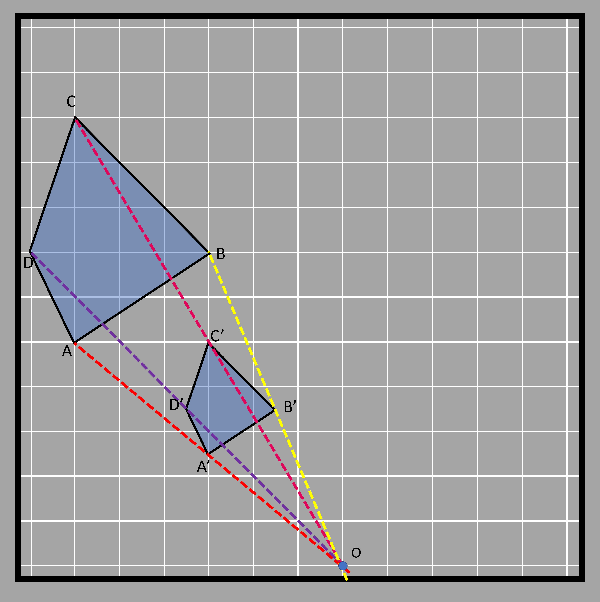

9.3 9.4

The different colored lines join the object and their respective images whereas the point at which the lines intersect is in the center of dilation.
### Dilation with circular grid
It's easy to understand dilation with a circular grid. Let's assume we have a triangle to dilate that is situated in a circular grid as shown in the figure.  
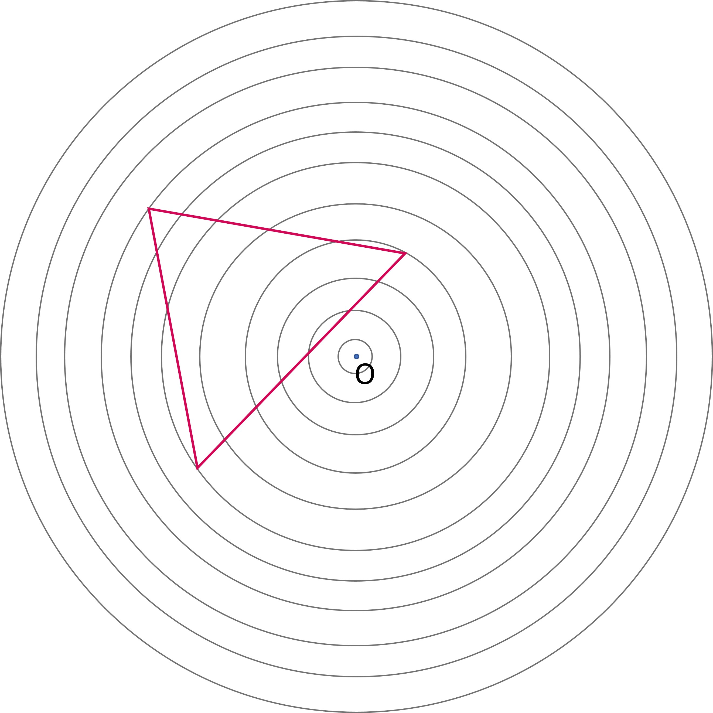
9.5

We are given the task of dilating the triangle by a 1/2 scale factor. It means that the sides of the triangle formed will be half of the original triangle. That is achieved by locating the three vertices of the triangle first and halving it after that. 
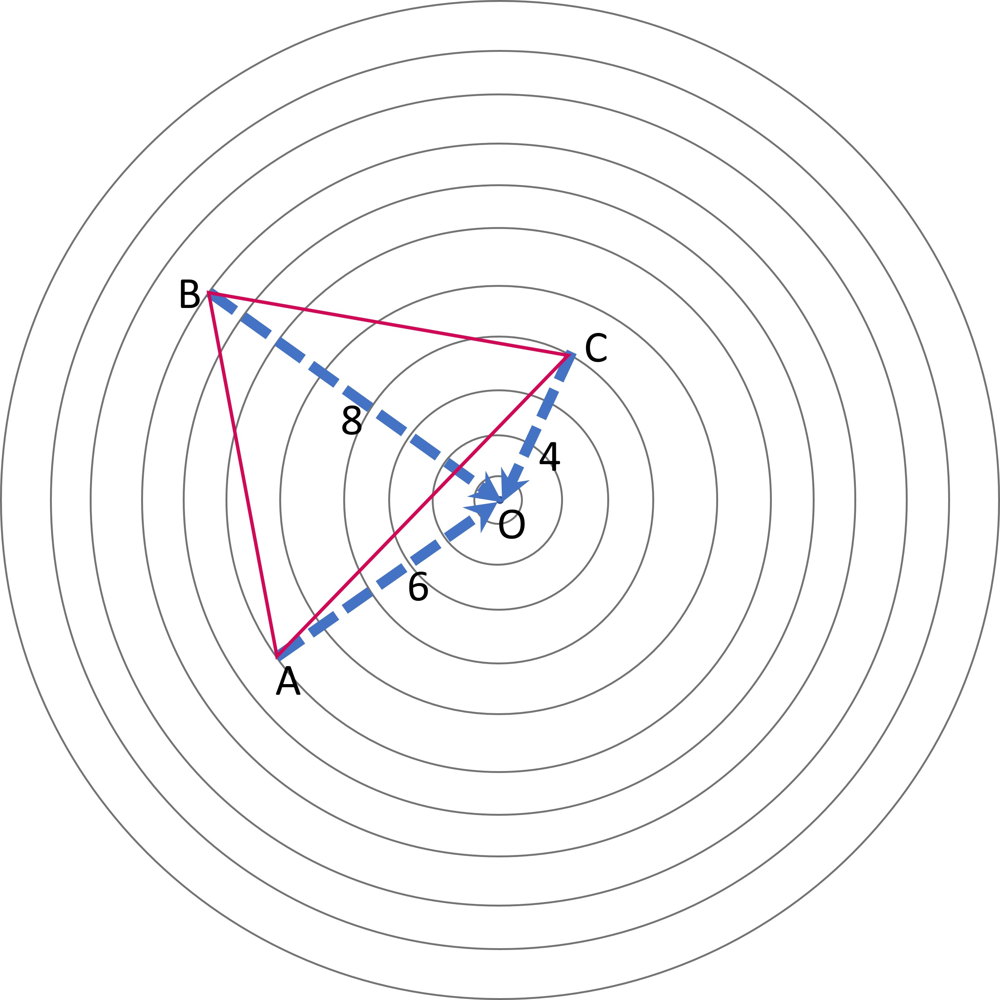
9.6

The points are 8, 6, and 4 units far from the origin respectively. Thus the points after transformation will be 8/2, 6/2, and 4/2 units from the origin. The image points will also be in the same line that joins the vertices and origin. Since the object covers 8 rings, the image will be at the 4th ring as it is half of the object. 
The image triangle is shown in the diagram below in blue. 
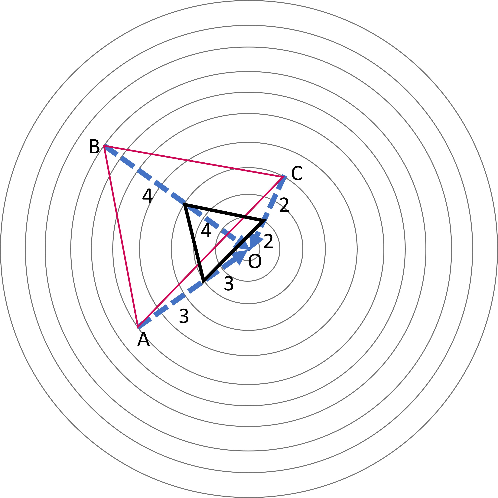
9.7

Thus the dilated triangle formed is DEF which has its sides half that of triangle ABC. 

9.8

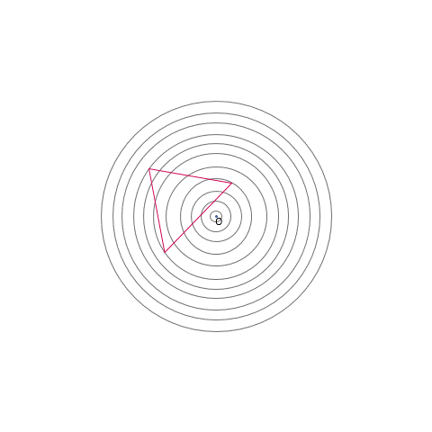
9.9

### Dilation in a rectangular grid
Let's observe a similar example to understand how it's done in a rectangular grid. 

9.10

If the given rectangle was to be dilated with the scale factor of 2, we need to locate where the center of dilation is.
It is located 2 units downwards and upwards on the top and bottom sides respectively. It's 2 units towards the right from the left side and 3 units towards the left from the right side. 
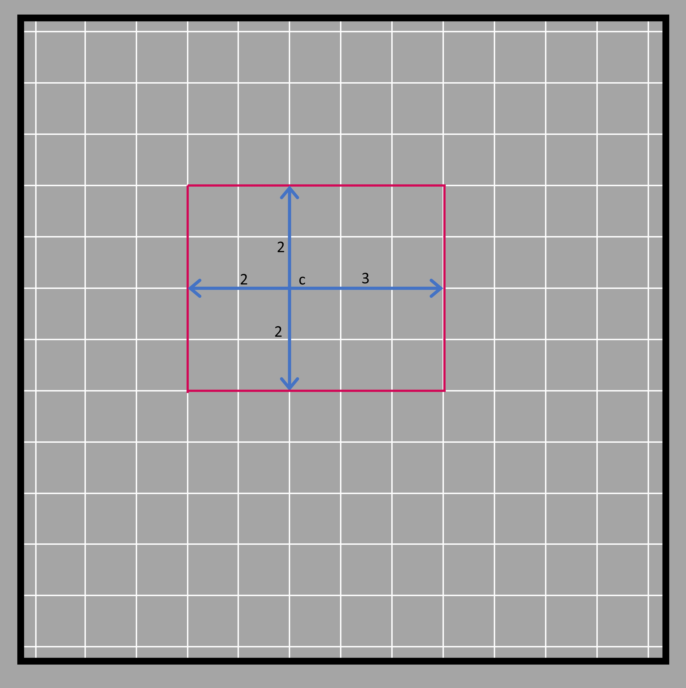
9.11

Since the scale factor is 2, we must understand the distance of the center between the sides will be doubled. That means the four sides of the rectangle will be pushed even further (at a double distance) from the center. The left side that was 2 units away is pushed 2 units further making it 4 units far from the center. The same is done with other sides too.
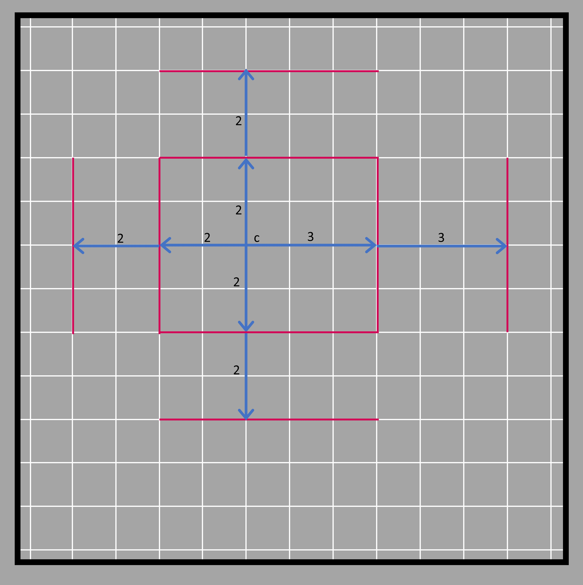
9.12

After that, the sides are produced and joined together. 
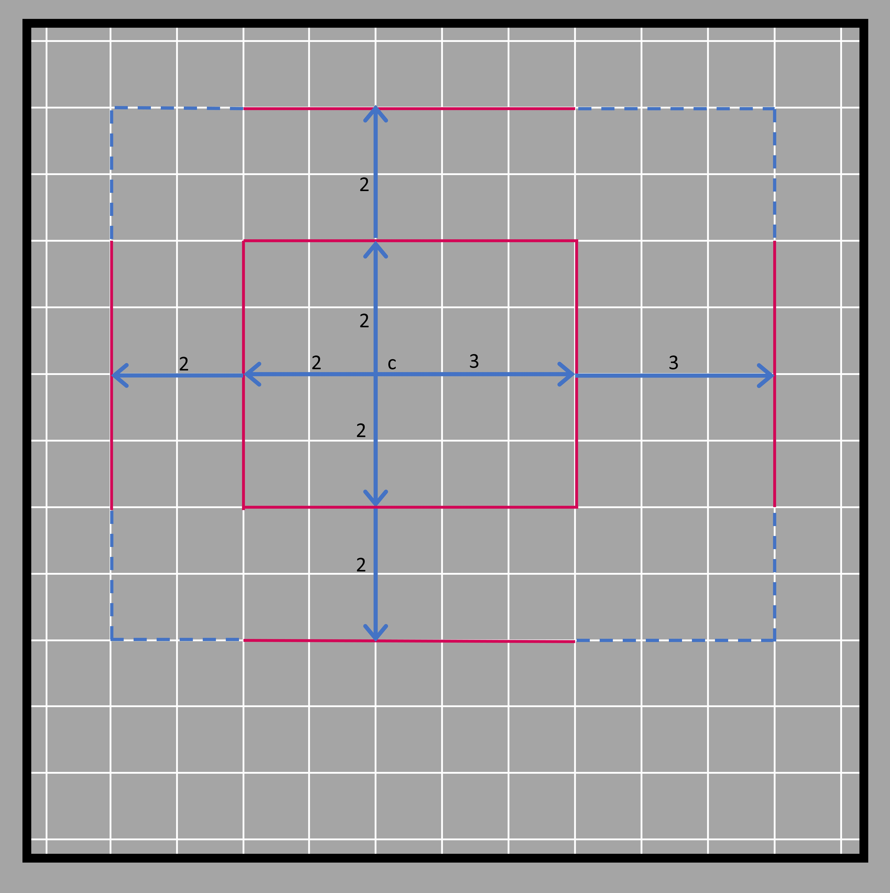
9.13

The rectangle we get at the end is as shown in the figure below in dark blue. 
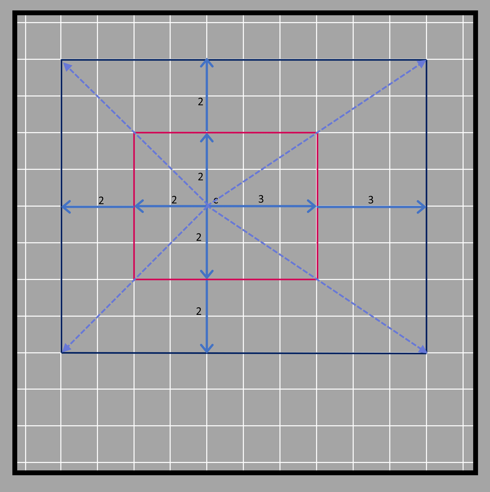
9.14

All the steps described above are shown step by step in the diagram below.
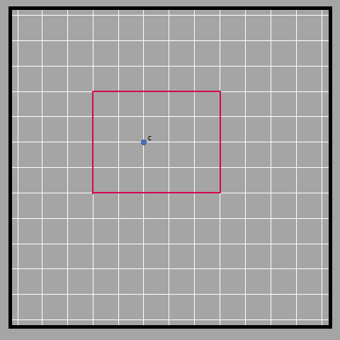
9.15
 
We know that the new rectangle formed is four times the size of the current rectangle. That is because while scaling, the length is scaled to double, and the width is scaled to double. The sides of the image formed are always parallel to the corresponding sides of the object. 
